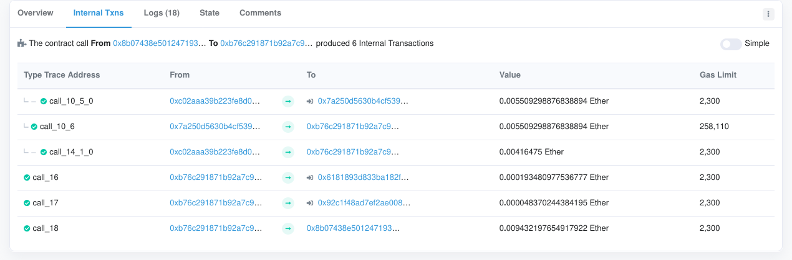

# Analysing the effects of EIP-2929

On a few ACD calls, there has been a discussion on what the impacts of EIP-2929 are, and 
whether there's any truth to the theory that certain contract-flows will become broken. 

## Background

Theory: 

1. There exists contracts which can only send ether using solidity `transfer`. 
  - The `transfer` mechanism does not send along any gas, so the base `2300` is all that the recipient gets.
2.  Such a contract 'deposits' to recipient which e.g. accesses a storage slot, which will then fail under EIP-2929 rules. 

This means that regardless of how much gas is supplied from the outside, there's a gas-bottleneck which makes the contract flow fail. 

I did a previous analysis using a few Goerli-blocks, which can be found [here](https://github.com/holiman/gasreprice). That time, it showed that all calls which were affected negatively (broken) by
EIP-2929 could actually be 'rescued' if the EOA caller had just provided more gas from the outside. 

This repository contains a new analysis, this time performed on blocks `11354948` to `11358853` (`3905` blocks) on mainnet. 

The analysis was made using a [modified go-ethereum](https://github.com/holiman/go-ethereum/tree/yolov2_analysis). 

## The analysis

The modified geth client added a new RPC endoint, [`debug_analyse2929Block`](https://github.com/ethereum/go-ethereum/compare/master...holiman:yolov2_analysis#diff-fa406a35f903f7a2826290aba52257315413fda284257e152f9a9b0fcecef91aR417), 
which, for a given block, for each transcation

1. Ran the transcation using `EIP-2929` rules (`tx2929`), and counted the number of executed steps,
2. Ran the transcation (`tx2929b`) using `EIP-2929` rules (`tx2929`), but with quadruple[1] the gas amount, and counted the number of executed steps, 
3. Ran the transaction (`txbase`) using mainnet rules (`tx2929`), and counted the steps. 

And then it dumped the data to a json-file, per block. 

```
> var a = 11354948; var end = eth.getBlock("latest").number; for( var i = a; i < end; i++){ debug.analyse2929Block(i)}
```

We can then check, 

- Does the `txbase` exit with error? 
  - If so, consider it _not affected_
- Does the number of steps in `tx2929` equal the steps in `txbase`?
  - If so, consider it _not affected_
- Does the number of steps in `tx2929b` equal the steps in `txbase`?
  - If so, consider it salvageable without EIP-2930 (more EOA gas pushes it through). 
- For remaining transactions, these might be not salvageable without 2930, and require more (manual) analysis. 

Along the way, we can also dump out some statistics on how EIP2929 generally affects transcaction gas usage. 

[1] In the first attempt, I merely doubled it. It turned that wasn't sufficient, for certain transactions that were very heavy on SLOAD. 

Example of contract which didn't work with 2x gas is the [HEX Token](https://etherscan.io/address/0x2b591e99afe9f32eaa6214f7b7629768c40eeb39#code) when `stakeEnd` was called in
this [transaction](https://etherscan.io/tx/0x4930308d13b9ac5b49214971412f115339e7e88480b420bb04b42631d49ad9a4), 
It required `848557`gas instead of `404757`, which is `>100%` more gas.  

### First result

Number of blocks: `3905`
 - number of empty (ignored) blocks: `85`
Number of transactions: `652726`

Number of unaffected transactions: `612773`
- broken on mainnet already: `19733`
Number of salvageable transactions: `38388`
Number of broken transactions: `1565`

Gas usage for mainnet vs yolo: `36483904116` vs `36652378852`
The gas usage with yolo rules is `0.46 %`

Largest EIP-2929 gas difference 2913785 (from `961802` to `3875587`).

Upon further inspection, it turned out that a lot of these actually went through _more_ steps on Yolov2 rules, and still exited without error. This indicates that 
some internal gas-checking mechanism is at play, and they keep executing until the come close to out-of-gas. 

### Removing some false positives

If we further limit the check, to only consider it a 'true positive' if the number of steps taken are lower (_and_ it did not exit with an error), then we get a better result. 

### Second result

Number of blocks: `3905`
 - number of empty (ignored) blocks: `85`
Number of transactions: `652726`

Number of unaffected transactions: `613102`
- broken on mainnet already: `19733`
Number of salvageable transactions: `38440`
Number of broken transactions: `1184`

Gas usage for mainnet vs yolo: `36553344321` vs `36747664270`
The gas usage with yolo rules is `0.53 %`

Largest EIP-2929 gas difference 9537484 (from `3168292` to `12705776`).

The number of 'broken' went from `1565` to `1184`. 

## Summary

Out of `652726` transactions on Mainnet these last couple of days, this analysis found ~`1184` (roughly `0.18%`) transactions that indicate a 'broken flow', which would have 
needed EIP-2930 to salvage it. 

Gas usage wise, an extra `0.53%` gas was used, however, this does not take into account the intrinsic gas, at least `21K` per transaction, so the real number is even lower.  

## Example 

Checking one of those:

This [transaction](https://etherscan.io/tx/0xbb4c8a275df0cc947fb7ab58e7035295c32574467d6375517b793adb1571c64a#internal) causes several `2300` sends to go out:


## Dump of some affected transcations

For the readers perusal, here is a list of transactions which seemingly would fail with EIP-2929 rules, if EIP-2930 was not implemented along with it. 

<details><summary>List of borked transactions</summary>
```
tx txbase-steps: 11907, tx2929-steps: 11378, tx2929b-steps: 11378, tx2929b-Error: true, block:block_11354951-0x7d3e53be-analysis-801029285,  txHash: 0x8fa3a4b82ba4cc86407d0b50fa0ff788a2ec5693ad984b3d6f43618d0368864f
tx txbase-steps: 17827, tx2929-steps: 17699, tx2929b-steps: 17699, tx2929b-Error: false, block:block_11354953-0xe4a65ce4-analysis-864236575,  txHash: 0x78cc16ad2a2ed2217370442db0c5b20d9b586f839b984d7b0954eddebd3cd7ca
tx txbase-steps: 1925, tx2929-steps: 1088, tx2929b-steps: 1088, tx2929b-Error: false, block:block_11354960-0xcdc438a1-analysis-413621608,  txHash: 0x5e9f54a23b7eef0632731fc78fc27aa9a437376cf675408d792b84b09a572cd1
tx txbase-steps: 25939, tx2929-steps: 25106, tx2929b-steps: 25106, tx2929b-Error: true, block:block_11354963-0x448dc253-analysis-870947441,  txHash: 0xbb4c8a275df0cc947fb7ab58e7035295c32574467d6375517b793adb1571c64a
tx txbase-steps: 3616, tx2929-steps: 2420, tx2929b-steps: 2420, tx2929b-Error: false, block:block_11354972-0x7426ff8e-analysis-446186052,  txHash: 0x9cc55e1a99aee4a2b8f338a93ac547004f13f57716cdd755f72cf2d621b6afa3
tx txbase-steps: 7890, tx2929-steps: 7843, tx2929b-steps: 7843, tx2929b-Error: true, block:block_11354974-0x297ac8b9-analysis-081623062,  txHash: 0x75697f1f5b95af6b2e6f88251eb5875faeaa49ad1c9a7ff041dc70767965e3aa
tx txbase-steps: 2757, tx2929-steps: 169, tx2929b-steps: 169, tx2929b-Error: true, block:block_11354975-0x81088820-analysis-314739325,  txHash: 0xc315120deb575425753b6bd67c0fd9f606f55bbd933e58a7c55124e649e39cc6
tx txbase-steps: 13292, tx2929-steps: 13164, tx2929b-steps: 13164, tx2929b-Error: false, block:block_11354982-0x92c9de7a-analysis-907275902,  txHash: 0x629e707b78f0171068f3824e2b09159539a756e447904f3cb88bb4bf4c4c2e68
tx txbase-steps: 15447, tx2929-steps: 15191, tx2929b-steps: 15191, tx2929b-Error: false, block:block_11354987-0xac0fe222-analysis-374596809,  txHash: 0xae7aefe98d9dba5cdbdba2e35c4589ac9a9d339a4c37d9a317060bfd539374aa
tx txbase-steps: 18454, tx2929-steps: 18326, tx2929b-steps: 18326, tx2929b-Error: false, block:block_11354992-0x43ebe3b7-analysis-655934472,  txHash: 0x61c1f09d5f3ce4337ff315f31de326811f2122aaad347b34a71676db56b64033
tx txbase-steps: 14695, tx2929-steps: 14567, tx2929b-steps: 14567, tx2929b-Error: false, block:block_11354993-0xa62664bb-analysis-834061767,  txHash: 0x2d64227071da095e56be132a6f273149b2ed411851c24bf7d06f43af70274401
tx txbase-steps: 11128, tx2929-steps: 11000, tx2929b-steps: 11000, tx2929b-Error: false, block:block_11355009-0x09eab7a8-analysis-542364119,  txHash: 0x98ed2629372e4d4b283bcc3659194283d6cd74aace31f215802a6c21336eafcb
tx txbase-steps: 47847, tx2929-steps: 43796, tx2929b-steps: 47318, tx2929b-Error: true, block:block_11355019-0x5c72de45-analysis-106566633,  txHash: 0xed9c500c7c61338651ba1efc5cb8fe2dff261f0f82ff2feaf80a5225c2e550cc
tx txbase-steps: 9606, tx2929-steps: 9572, tx2929b-steps: 9572, tx2929b-Error: false, block:block_11355031-0x07d8ecfe-analysis-731864181,  txHash: 0x7e20290bce4c814f5e27078b65db580c5bc4b12f89e98388c3ba2a210bb340af
tx txbase-steps: 12118, tx2929-steps: 11736, tx2929b-steps: 11736, tx2929b-Error: true, block:block_11355038-0xcfe90759-analysis-091906902,  txHash: 0x781a12256a058619544c4c03bf8ea84057e04716bc253229c12d0e525bce491b
tx txbase-steps: 3214, tx2929-steps: 2854, tx2929b-steps: 3062, tx2929b-Error: true, block:block_11355039-0xd3b0a0f3-analysis-952874685,  txHash: 0x3c9c698e7eed1b9a6aab16c34512f85161e02cda9aab4be2c216a26a7976b993
tx txbase-steps: 10585, tx2929-steps: 10538, tx2929b-steps: 10538, tx2929b-Error: true, block:block_11355047-0x0f35e539-analysis-355009029,  txHash: 0xadd33d076aac0313defd3ee0d11216992a67283c3ec4a757c4671bde00738ca0
tx txbase-steps: 1145, tx2929-steps: 336, tx2929b-steps: 336, tx2929b-Error: true, block:block_11355049-0x86526e98-analysis-761523327,  txHash: 0xe0b10c47346ba2a7ec5be45dbe4eb176ea59df574a65cb9b215ff3960121fb3c
tx txbase-steps: 7076, tx2929-steps: 7072, tx2929b-steps: 7072, tx2929b-Error: false, block:block_11355054-0x62853c2a-analysis-731044134,  txHash: 0x35a0ef7c748b6471700f7809d2fe1d1dd5d5cda5eb769fd5205a04e0260b3442
tx txbase-steps: 22635, tx2929-steps: 22588, tx2929b-steps: 22588, tx2929b-Error: true, block:block_11355054-0x62853c2a-analysis-731044134,  txHash: 0x9101d72b9088ca671205134822aa855725dada22834498a58a89ea120dd29117
tx txbase-steps: 8556, tx2929-steps: 8428, tx2929b-steps: 8428, tx2929b-Error: false, block:block_11355055-0xe9a645db-analysis-080716365,  txHash: 0x5cbfa3e6fbd52a6e1676649eee087005c4ce315fee3e58df728425eefebddf88
tx txbase-steps: 32975, tx2929-steps: 32719, tx2929b-steps: 32719, tx2929b-Error: false, block:block_11355055-0xe9a645db-analysis-080716365,  txHash: 0x13e1fd031170da0c77bd49ee89735a50466d37049ab642df96f81d5fde0eff23
tx txbase-steps: 13225, tx2929-steps: 13097, tx2929b-steps: 13097, tx2929b-Error: false, block:block_11355057-0x6d6281ac-analysis-123233799,  txHash: 0x6a3cd55e8fafe734c61bc646f1d056516235637ccd1a2047b4c9a95ec73876d4
tx txbase-steps: 8237, tx2929-steps: 8203, tx2929b-steps: 8203, tx2929b-Error: false, block:block_11355061-0xfbcfa123-analysis-796845099,  txHash: 0x5c49e241ca9ca6d072df1f47dcc8afe34dafa97a7af66374dabdf2a0c082f692
tx txbase-steps: 6297, tx2929-steps: 6250, tx2929b-steps: 6250, tx2929b-Error: true, block:block_11355061-0xfbcfa123-analysis-796845099,  txHash: 0x431183046bfeb99a681999bb446a7d32d929943633009d04c8031cf20dc7648e
tx txbase-steps: 8360, tx2929-steps: 8326, tx2929b-steps: 8326, tx2929b-Error: false, block:block_11355062-0xb8f824c4-analysis-305468302,  txHash: 0x3fabdcafd941f728643682585ac37a657b0361b2868265219d06e81a298d2744
tx txbase-steps: 7410, tx2929-steps: 77, tx2929b-steps: 77, tx2929b-Error: true, block:block_11355063-0x5befbb71-analysis-144488341,  txHash: 0x26e59718ff8f64dd74e2dc846b30b7ef574fadf42af7190772122f2024a10db4
tx txbase-steps: 11707, tx2929-steps: 11660, tx2929b-steps: 11660, tx2929b-Error: true, block:block_11355090-0x45f978b4-analysis-596343130,  txHash: 0x7c5de2b05d66ba156cd5cf470413118ee71e4b146ebb7ab7006840ab67286097
tx txbase-steps: 7076, tx2929-steps: 7072, tx2929b-steps: 7072, tx2929b-Error: false, block:block_11355091-0x5a0e402f-analysis-990719729,  txHash: 0x2df1bb6fb800b1f948cefab1f730de6f36edefa84aa3d3875384ffa418b2c8fc
tx txbase-steps: 10243, tx2929-steps: 10196, tx2929b-steps: 10196, tx2929b-Error: true, block:block_11355100-0x32cb74f1-analysis-167293124,  txHash: 0x534e0fe498255e6356c9f9f23e3f307e4850d6744d2d4e4504994b9a253d78c7
tx txbase-steps: 10252, tx2929-steps: 10205, tx2929b-steps: 10205, tx2929b-Error: true, block:block_11355100-0x32cb74f1-analysis-167293124,  txHash: 0x7bcdddd1f6a1a59d435a9271c2b6fd3d3ba438ebc6a62e8b9667fe53f552122e
tx txbase-steps: 10310, tx2929-steps: 10263, tx2929b-steps: 10263, tx2929b-Error: true, block:block_11355100-0x32cb74f1-analysis-167293124,  txHash: 0xcfda13a33f0425936c010195f5accd18a06a5eac380cd6b9e0e80a5d7672ba08
tx txbase-steps: 11899, tx2929-steps: 11370, tx2929b-steps: 11370, tx2929b-Error: true, block:block_11355109-0x395df1c5-analysis-730613083,  txHash: 0x981c682e7d28fdfaa50d5bd66ee134817672520bccc35afce79570ef94d64511
tx txbase-steps: 30484, tx2929-steps: 30356, tx2929b-steps: 30356, tx2929b-Error: false, block:block_11355113-0x79fbfdbf-analysis-421971135,  txHash: 0x46ada7f0649be8929226406b2e15883944d1493adce6e685489a98a37f232313
tx txbase-steps: 5464, tx2929-steps: 5417, tx2929b-steps: 5417, tx2929b-Error: true, block:block_11355119-0xfa01a940-analysis-504129677,  txHash: 0xe7cb4985fcc77ebfc27866bffc47883e1b59433cd23ab0f20040d7ac4d0c3818
tx txbase-steps: 14718, tx2929-steps: 14590, tx2929b-steps: 14590, tx2929b-Error: false, block:block_11355120-0xea167345-analysis-934089352,  txHash: 0x4a698da5d567559b254f5ce2577d8436bafd3956edfc7c9d2c5a91d52e2710c0
tx txbase-steps: 11783, tx2929-steps: 11736, tx2929b-steps: 11736, tx2929b-Error: true, block:block_11355126-0xaa846a06-analysis-864151758,  txHash: 0xcbca8c684c3f42c300bda9e91ac7c89f65c60bbcad54fa06d42a70110e760392
tx txbase-steps: 6297, tx2929-steps: 6250, tx2929b-steps: 6250, tx2929b-Error: true, block:block_11355126-0xaa846a06-analysis-864151758,  txHash: 0x4f0196de0eb848be0d49dba68fe58db326325a9f7e294011607ae4600d486f1c
tx txbase-steps: 11437, tx2929-steps: 11390, tx2929b-steps: 11390, tx2929b-Error: true, block:block_11355129-0xb2e859ee-analysis-339706575,  txHash: 0x0e705485f876da9da9cd4ae3ddd6390501508081bff0ffa0bac193989eb8c482
tx txbase-steps: 47907, tx2929-steps: 33236, tx2929b-steps: 33236, tx2929b-Error: false, block:block_11355131-0xe03792de-analysis-928142297,  txHash: 0x1a152b3c116df58e2b6e7602fd980ca66977a63e20f2c0b0130db2f28c5febc6
tx txbase-steps: 5575, tx2929-steps: 5528, tx2929b-steps: 5528, tx2929b-Error: true, block:block_11355134-0x410de525-analysis-701915702,  txHash: 0x310d2b6cf335fecbe21c22037bc2941c5e775cc6f8bf286af851ae015ec27566
tx txbase-steps: 141870, tx2929-steps: 141358, tx2929b-steps: 141358, tx2929b-Error: false, block:block_11355141-0x111c4ed2-analysis-904017787,  txHash: 0xab16b6e1ee768284e5b0c2f73a35a40980ce79d04b4ff95c7f3fdc185e542d67
tx txbase-steps: 18095, tx2929-steps: 18030, tx2929b-steps: 18030, tx2929b-Error: false, block:block_11355144-0xd7ed6368-analysis-118871936,  txHash: 0xb2fb35451dddfaf08d94b93d69eb4792da35c65e8a206c1666ebe4dc4c533de3
tx txbase-steps: 193135, tx2929-steps: 192879, tx2929b-steps: 192879, tx2929b-Error: false, block:block_11355147-0xc8335049-analysis-376043113,  txHash: 0x41ef0d345d9f6b737b7ff9ee7ff3820aa28aadc228401a891dbf5e1d34ab9a86
tx txbase-steps: 2889, tx2929-steps: 1708, tx2929b-steps: 1708, tx2929b-Error: true, block:block_11355147-0xc8335049-analysis-376043113,  txHash: 0x23a88fc0fe205694e6564f659657ca2cb1cc6f9229fb981a17da975bd492e10b
tx txbase-steps: 11092, tx2929-steps: 11058, tx2929b-steps: 11058, tx2929b-Error: false, block:block_11355148-0xc6eb7a0f-analysis-822720692,  txHash: 0x3c350cc6722c657ddbf1405cfc580cdef592a584f4062639b68b5792af8ab42d
tx txbase-steps: 59226, tx2929-steps: 58393, tx2929b-steps: 58393, tx2929b-Error: true, block:block_11355153-0x875e9132-analysis-027591783,  txHash: 0x84c65dcc57dc4a342973140e50b9ba97d8f8bec8c7719749f034151c0b1c2118
tx txbase-steps: 17646, tx2929-steps: 17518, tx2929b-steps: 17518, tx2929b-Error: false, block:block_11355168-0x2ee80e22-analysis-231750520,  txHash: 0xf1955f4d0a0b19139a69635b002ef821f922094b78b608cc7284da6b903af0f8
tx txbase-steps: 16308, tx2929-steps: 16180, tx2929b-steps: 16180, tx2929b-Error: false, block:block_11355175-0xa4bf131b-analysis-159544453,  txHash: 0x587ae2d930aaa6df2ce606f63e6a99f233c6807670d5076271352d14a5cb937c
tx txbase-steps: 10482, tx2929-steps: 10435, tx2929b-steps: 10435, tx2929b-Error: true, block:block_11355177-0xbd20c0fa-analysis-170801919,  txHash: 0xf6c663c8b837a4deb826504a5658af8d1421914812788732ff2d2e63a2a0dc49
tx txbase-steps: 2653, tx2929-steps: 77, tx2929b-steps: 77, tx2929b-Error: true, block:block_11355180-0x318ff433-analysis-964996948,  txHash: 0xb6b2442e51738473bcb43e6a0409f992a33a409fac9dba9e434f8f9896e59213
tx txbase-steps: 7971, tx2929-steps: 7967, tx2929b-steps: 7967, tx2929b-Error: false, block:block_11355180-0x318ff433-analysis-964996948,  txHash: 0xd087ecd507c25651c41d9950c2b77e8da0fcf03858d9052eab5c49efababa9b3
tx txbase-steps: 8293, tx2929-steps: 145, tx2929b-steps: 145, tx2929b-Error: true, block:block_11355181-0x0ead0fca-analysis-293645987,  txHash: 0xa945a62ed15d0efff0aa1ba37ada4dd06bbdcae4a579486c88c07c7f4552e515
tx txbase-steps: 11522, tx2929-steps: 11169, tx2929b-steps: 11169, tx2929b-Error: true, block:block_11355184-0x44d5af41-analysis-649637320,  txHash: 0x8678d5053b5c22d94c3cc912921b9a3c0a859d1f131e6672430286343ff39e0f
tx txbase-steps: 570, tx2929-steps: 496, tx2929b-steps: 496, tx2929b-Error: true, block:block_11355207-0x6501f711-analysis-288877477,  txHash: 0x6c3800826dff374763b1259046d887feac24ed45b404f723a0c818f548a7258d
tx txbase-steps: 19025, tx2929-steps: 17811, tx2929b-steps: 17811, tx2929b-Error: true, block:block_11355220-0x2c6b6272-analysis-619587612,  txHash: 0xf7bd4688bdd309506dcd8f1eef63ba01588fd2954c38d1ff15219b1fc163f9b8
tx txbase-steps: 7250, tx2929-steps: 7122, tx2929b-steps: 7122, tx2929b-Error: false, block:block_11355223-0xdaf1821f-analysis-838297397,  txHash: 0xf16eeb3a9da7dc30063425a74383aeb6a1af26ff26c64471794b32d7ed7cbb96
tx txbase-steps: 6431, tx2929-steps: 6212, tx2929b-steps: 6212, tx2929b-Error: false, block:block_11355224-0x3575e866-analysis-833651984,  txHash: 0x6b9cdea33cf5e0af91143a22fbcd1999670ac461cd26970052f01e9e40ed6323
tx txbase-steps: 9089, tx2929-steps: 9055, tx2929b-steps: 9056, tx2929b-Error: false, block:block_11355247-0xab3dab64-analysis-830232333,  txHash: 0xc4d1976a11b08501b219235fa67f395b2c6c3742394dc86b14f95cdb8f5d8de6
tx txbase-steps: 14576, tx2929-steps: 14448, tx2929b-steps: 14448, tx2929b-Error: false, block:block_11355252-0xc0de6483-analysis-176698556,  txHash: 0x12b9603f495bc16a402974973f7fd09f76448c69281f19d40cd0a30255e0dccf
tx txbase-steps: 6168, tx2929-steps: 6121, tx2929b-steps: 6121, tx2929b-Error: true, block:block_11355253-0x9e31c17e-analysis-025934571,  txHash: 0xb531d4619c08512a1473ec55fbb011f70774adc2ad2f3839496f17596f3b146c
tx txbase-steps: 10536, tx2929-steps: 10489, tx2929b-steps: 10489, tx2929b-Error: true, block:block_11355253-0x9e31c17e-analysis-025934571,  txHash: 0x599754ed2ae6ddedb1b7e63c8877019051d05aafc65b2505a20a25705f5449d8
tx txbase-steps: 7251, tx2929-steps: 7204, tx2929b-steps: 7204, tx2929b-Error: true, block:block_11355253-0x9e31c17e-analysis-025934571,  txHash: 0x4b02b4b6f9696261720777c1bd460c52c5942772224546febaceb0657b03917e
tx txbase-steps: 11153, tx2929-steps: 11106, tx2929b-steps: 11106, tx2929b-Error: true, block:block_11355253-0x9e31c17e-analysis-025934571,  txHash: 0x8a91cee974c2c18f35c13b5cb302dd5e1da5c852bd0b24890456c90ada3b8545
tx txbase-steps: 7304, tx2929-steps: 7176, tx2929b-steps: 7176, tx2929b-Error: false, block:block_11355253-0x9e31c17e-analysis-025934571,  txHash: 0x1f53b47be96f75fa577763401b0b2a69b287c35c9019f6cc906488d76797d901
tx txbase-steps: 11802, tx2929-steps: 10588, tx2929b-steps: 10588, tx2929b-Error: true, block:block_11355254-0xff3f5dc0-analysis-413439822,  txHash: 0x025f55ca07fd9f7a05cd471c80a5b03dce8a1edfacc507c33483bcb479588492
tx txbase-steps: 9944, tx2929-steps: 9816, tx2929b-steps: 9816, tx2929b-Error: false, block:block_11355260-0x3734f7b0-analysis-793083876,  txHash: 0x2bc9b0b957d2eedd6d4952c0b9845efa184ef49e358c4b28e73e307cf3954701
tx txbase-steps: 11819, tx2929-steps: 11785, tx2929b-steps: 11785, tx2929b-Error: false, block:block_11355260-0x3734f7b0-analysis-793083876,  txHash: 0xf7f8e8a877c8a0c65a2da30899a9a20181000a5f51f0b330f6bb8ce5c64d6879
tx txbase-steps: 13666, tx2929-steps: 13662, tx2929b-steps: 13662, tx2929b-Error: false, block:block_11355264-0x206e5db8-analysis-272520536,  txHash: 0x0a66d9ff0fe8a3e39aaedbe60c585eb0ccccac6b891daed02822ca3ce19402bc
tx txbase-steps: 17704, tx2929-steps: 17658, tx2929b-steps: 17659, tx2929b-Error: false, block:block_11355266-0x4571706a-analysis-307628618,  txHash: 0x8efa081e08cfb3682ef56ecf04534ee08ecc26b3eb7c7def8a45f4c020012274
tx txbase-steps: 11907, tx2929-steps: 11378, tx2929b-steps: 11378, tx2929b-Error: true, block:block_11355272-0xfec02877-analysis-776448512,  txHash: 0x21fa378018e0153af221ef8a76792b51f1b370f17eebd201a8a71ba2531f25eb
tx txbase-steps: 19362, tx2929-steps: 19234, tx2929b-steps: 19234, tx2929b-Error: false, block:block_11355275-0x8bd451cf-analysis-596095209,  txHash: 0xdf3c45a8eb296fc5a4e93ec8b8c7a177f733ca5f4f5c0cab25ef78cf72b5a691
tx txbase-steps: 34158, tx2929-steps: 34111, tx2929b-steps: 34111, tx2929b-Error: true, block:block_11355275-0x8bd451cf-analysis-596095209,  txHash: 0xbe6547992f3e87680abff85311905e2d064ee6fe35663ed60ea04d7c02dec832
tx txbase-steps: 12250, tx2929-steps: 11721, tx2929b-steps: 11721, tx2929b-Error: true, block:block_11355276-0x18cee227-analysis-471378228,  txHash: 0xbc7b5fafa02df8bfcce01ac7a1f249b7b7b79e87c5cbdc73da8cba86fceb90ba
tx txbase-steps: 668, tx2929-steps: 594, tx2929b-steps: 594, tx2929b-Error: true, block:block_11355280-0xb6029d30-analysis-577735080,  txHash: 0x672a0e3ae4949cf6ab1f60b3b7907754c3cefd4f083f5f8b345680d822b94a64
tx txbase-steps: 17933, tx2929-steps: 17886, tx2929b-steps: 17886, tx2929b-Error: true, block:block_11355287-0x4f440a0d-analysis-072576373,  txHash: 0x76de85c31de6fbe627e4b0327b21ea5afd363e62dbd16aae08087e01d8e05f9f
tx txbase-steps: 17046, tx2929-steps: 16999, tx2929b-steps: 16999, tx2929b-Error: true, block:block_11355287-0x4f440a0d-analysis-072576373,  txHash: 0x00a8bc64f59c5e88e57fd0332aa5d820b654bfb25c1c16598cf93d5c5ebedc08
tx txbase-steps: 6058, tx2929-steps: 63, tx2929b-steps: 63, tx2929b-Error: true, block:block_11355289-0xd480116d-analysis-963567471,  txHash: 0x1a1414da27187b7828ed9dbc70ed395b51f1c2a022198cb547c33406780510f3
tx txbase-steps: 7242, tx2929-steps: 7195, tx2929b-steps: 7195, tx2929b-Error: true, block:block_11355303-0x0bc6d663-analysis-660582661,  txHash: 0x66427ede6a8b0f1fe24d277351d96e1712f4ea18bb3988496c7247e36801eb42
tx txbase-steps: 37786, tx2929-steps: 37658, tx2929b-steps: 37658, tx2929b-Error: false, block:block_11355309-0x32a0611c-analysis-066479907,  txHash: 0x24a4f1262c0eeaf59828369d6886a1ac36b2c4e199c9a1ec7dd86d757795e22f
tx txbase-steps: 91125, tx2929-steps: 39839, tx2929b-steps: 39839, tx2929b-Error: false, block:block_11355321-0x25472f6e-analysis-493271951,  txHash: 0xcf856f274f17ff6011fb4457b1a7c0833cd75c93e37fd80aec44ade20d248c47
tx txbase-steps: 27764, tx2929-steps: 27718, tx2929b-steps: 27718, tx2929b-Error: false, block:block_11355323-0xaaf3164a-analysis-077318809,  txHash: 0xf0c592d30f260edd5572c2e3c00694b28e79128591124c1ab2bf697cfb90d4a8
tx txbase-steps: 32430, tx2929-steps: 28029, tx2929b-steps: 28029, tx2929b-Error: true, block:block_11355328-0xc9e922cc-analysis-897092248,  txHash: 0x6e3c5b7b6000fdd647626957422ae46dda72e99199cad36beb7bf00dd768e76f
tx txbase-steps: 14862, tx2929-steps: 14734, tx2929b-steps: 14734, tx2929b-Error: false, block:block_11355330-0x76240f67-analysis-740419978,  txHash: 0x2a1d39690ff78db98c20aa3e6e89b92c036f78d033fed33a3f45806667e09c6e
tx txbase-steps: 252309, tx2929-steps: 251669, tx2929b-steps: 251669, tx2929b-Error: false, block:block_11355348-0x7612962b-analysis-324462748,  txHash: 0xf42664614c6f03dc2d80a2f8473a605111232cb1a906e71e42cb90329e3972f2
tx txbase-steps: 2986, tx2929-steps: 1650, tx2929b-steps: 1650, tx2929b-Error: true, block:block_11355353-0xbb858a90-analysis-561648559,  txHash: 0x36ca5453ca5d54c34870213a87c5e18afa097cec23a372f22cd797669dcca6f0
tx txbase-steps: 2944, tx2929-steps: 1606, tx2929b-steps: 1606, tx2929b-Error: true, block:block_11355368-0xa8482667-analysis-615043040,  txHash: 0xf0aa69e60911e7797047e8f1898d349cbf69392abfa374f826d5e849199a2169
tx txbase-steps: 11579, tx2929-steps: 11545, tx2929b-steps: 11545, tx2929b-Error: false, block:block_11355373-0x4e03accb-analysis-660996451,  txHash: 0x779214b99af3cdcb439a99396727a816b02a6dbfa47d129d54cd5a6d66685f4e
tx txbase-steps: 30961, tx2929-steps: 30833, tx2929b-steps: 30833, tx2929b-Error: false, block:block_11355374-0x131326e9-analysis-898821990,  txHash: 0x318d39274cfb0436d077243c255b727e59587ca6ebc8b3a6a4bb88f4d1f8b805
tx txbase-steps: 33378, tx2929-steps: 33250, tx2929b-steps: 33250, tx2929b-Error: false, block:block_11355374-0x131326e9-analysis-898821990,  txHash: 0xd8bd035a0a52ff140b49c0750a9604a59a529c32d4fadb6f6ca4a208b078018d
tx txbase-steps: 2777, tx2929-steps: 2329, tx2929b-steps: 2329, tx2929b-Error: true, block:block_11355374-0x131326e9-analysis-898821990,  txHash: 0xed50f4c1332ef1908da252b9da7da21f0c455b8c2509aa3aafb2507c48812fe6
tx txbase-steps: 7987, tx2929-steps: 7983, tx2929b-steps: 7983, tx2929b-Error: false, block:block_11355388-0x73a51c14-analysis-968778852,  txHash: 0x523984875c1a45b1c96f701d421baf81bd96523a0c2803e5490fe547329b6538
tx txbase-steps: 7987, tx2929-steps: 7983, tx2929b-steps: 7983, tx2929b-Error: false, block:block_11355388-0x73a51c14-analysis-968778852,  txHash: 0x3d4b3c5607ab48ff786851365a6bec5ea2eae1a2545ae38a40b5a181a7b56658
tx txbase-steps: 41986, tx2929-steps: 41940, tx2929b-steps: 41940, tx2929b-Error: false, block:block_11355388-0x73a51c14-analysis-968778852,  txHash: 0xc8548431d32977bf9d989b5946bd02d3a070cb24ca7271f9729b7bc0289950af
tx txbase-steps: 7987, tx2929-steps: 7983, tx2929b-steps: 7983, tx2929b-Error: false, block:block_11355401-0xd6e83d5c-analysis-492734431,  txHash: 0xe3f94b4489106016116eefcf8c0236c9bd12ec59460d1965dc6e45941fefa575
tx txbase-steps: 18215, tx2929-steps: 18087, tx2929b-steps: 18087, tx2929b-Error: false, block:block_11355402-0xe103fef1-analysis-837820338,  txHash: 0x84aaa0b6cf46a5715ba65515442ae351906ee04dad23e060484ef48d20f30ddf
tx txbase-steps: 9357, tx2929-steps: 9310, tx2929b-steps: 9310, tx2929b-Error: true, block:block_11355405-0xd7b509f7-analysis-844098947,  txHash: 0xe11a1f19cf3fce95338e7762826b364347f53249d72bfa80ff6203faceac74f3
tx txbase-steps: 13127, tx2929-steps: 13081, tx2929b-steps: 13081, tx2929b-Error: false, block:block_11355407-0xdedf8286-analysis-151712429,  txHash: 0xe677a48d46d57a288a7c0196658be074818728d7add7421460f6d67040fb1ca3
tx txbase-steps: 9689, tx2929-steps: 9561, tx2929b-steps: 9561, tx2929b-Error: false, block:block_11355423-0xad225d4e-analysis-664634941,  txHash: 0xbad912c1ad3e85bb1a71158d9a86f2d16ceed8627dd0ab8269755be11a613550
tx txbase-steps: 7493, tx2929-steps: 5051, tx2929b-steps: 5051, tx2929b-Error: true, block:block_11355423-0xad225d4e-analysis-664634941,  txHash: 0xb9ebe67f203c2298548f08282fa6b388e43745106e1ee5a833abf430236bf5a8
tx txbase-steps: 2986, tx2929-steps: 1650, tx2929b-steps: 1650, tx2929b-Error: true, block:block_11355435-0x6af7ac55-analysis-291615881,  txHash: 0x0c7089032e0c138bcf6001a2f309c1f86eeed2ec09f762552f2d75da6a9fb112
tx txbase-steps: 30803, tx2929-steps: 30274, tx2929b-steps: 30274, tx2929b-Error: true, block:block_11355439-0x91cd35b7-analysis-766014413,  txHash: 0x6d8cc4286be7e77c8b227670ec0a3cddbdafcd948404c131cd7bf52042796924
tx txbase-steps: 7890, tx2929-steps: 7843, tx2929b-steps: 7843, tx2929b-Error: true, block:block_11355441-0x94729c31-analysis-143195015,  txHash: 0x99afedfa43b39782242eddbc5caf83cffe18905d88b4e4774495886a09f8f31d
tx txbase-steps: 16853, tx2929-steps: 16819, tx2929b-steps: 16819, tx2929b-Error: false, block:block_11355443-0x6a3c3ce6-analysis-252702545,  txHash: 0xf626955e88cc93aca1414d3a302cbb3a84e034e0719e50124d3d259cb94d2f0e
tx txbase-steps: 14327, tx2929-steps: 14259, tx2929b-steps: 14259, tx2929b-Error: false, block:block_11355443-0x6a3c3ce6-analysis-252702545,  txHash: 0xc40c7894de6c3209c259063ef5ed38311e30d14c261de3412cc9ae17b47a7737
tx txbase-steps: 10062, tx2929-steps: 9934, tx2929b-steps: 9934, tx2929b-Error: false, block:block_11355449-0x180681d5-analysis-200306191,  txHash: 0xd0ecfc707b0bb3cfe99f53bc0c501aa738ee495b7ef9cab930dd38d8d6d330e3
tx txbase-steps: 36085, tx2929-steps: 35957, tx2929b-steps: 35957, tx2929b-Error: false, block:block_11355455-0xf4948c1b-analysis-733630301,  txHash: 0x31fc3e949ce232badbff06c7060f352da2583ecf72f4e5cba281063f4e28e92b
tx txbase-steps: 7771, tx2929-steps: 7724, tx2929b-steps: 7724, tx2929b-Error: true, block:block_11355461-0x5031c791-analysis-186457275,  txHash: 0x38e807cb8e074a148c84b5a7cdc2ecdeea42a21a6b1c83d72bfcf7f488913716
tx txbase-steps: 36600, tx2929-steps: 36472, tx2929b-steps: 36472, tx2929b-Error: false, block:block_11355486-0x834eebc8-analysis-499596310,  txHash: 0x26308553b23b1cddf26959b7e9f0acd23db9a72d6dbf26d869ebb4980c40da85
tx txbase-steps: 3074, tx2929-steps: 3039, tx2929b-steps: 3039, tx2929b-Error: false, block:block_11355497-0x8d207d15-analysis-469833279,  txHash: 0x83fb298816ae2f6d27bc4ee61c6434c669e156207b7ae6a7c9e47e9b9d148e2d
tx txbase-steps: 19870, tx2929-steps: 19742, tx2929b-steps: 19742, tx2929b-Error: false, block:block_11355498-0x32bc0cb7-analysis-341074066,  txHash: 0xf49c50d8033e87a8cba7346cbd2c75ae97954706670641526860df24402b200a
tx txbase-steps: 11053, tx2929-steps: 11006, tx2929b-steps: 11006, tx2929b-Error: true, block:block_11355500-0xf8718d98-analysis-536969620,  txHash: 0x010d171af583235223b24acfc78c4c26d6ce5b22e7048253dab40723304d1e10
tx txbase-steps: 8481, tx2929-steps: 145, tx2929b-steps: 145, tx2929b-Error: true, block:block_11355510-0x4e093107-analysis-854993486,  txHash: 0x6e1e1cf9240cc8f0760584754da10effcf4977f9f2cddd1111174db9476be45d
tx txbase-steps: 12412, tx2929-steps: 12378, tx2929b-steps: 12378, tx2929b-Error: false, block:block_11355516-0x0da5efe4-analysis-055306980,  txHash: 0x66e6c8feaffc2d8906375fd274cf17cfb050c6cfdfff7a1b8dfb84b6fdbe9462
tx txbase-steps: 26936, tx2929-steps: 26889, tx2929b-steps: 26889, tx2929b-Error: true, block:block_11355534-0x6e844097-analysis-179796358,  txHash: 0x9bd5f3cc7578f2936e60d404eb120001e310408891877d68e5b933fcd182b05b
tx txbase-steps: 11080, tx2929-steps: 11046, tx2929b-steps: 11046, tx2929b-Error: false, block:block_11355552-0x9a2d6228-analysis-669745912,  txHash: 0x99c271dcc5c4244c1ecbc08f5518ae708cc1ad9626482de68096fc21eb13e6fc
tx txbase-steps: 8940, tx2929-steps: 8906, tx2929b-steps: 8907, tx2929b-Error: false, block:block_11355552-0x9a2d6228-analysis-669745912,  txHash: 0xd31ba9ef279377b76ab109eeec3961369021c56333c2d5587b84ae5f1b543603
tx txbase-steps: 7699, tx2929-steps: 7652, tx2929b-steps: 7652, tx2929b-Error: true, block:block_11355555-0xba17524f-analysis-484222785,  txHash: 0xa60851943a66a7ee7a57c4ec8bc12ecbcaa1b5226b97b748900967bcb3aebbd5
tx txbase-steps: 21546, tx2929-steps: 21290, tx2929b-steps: 21290, tx2929b-Error: false, block:block_11355558-0xea5671f7-analysis-648267198,  txHash: 0xa3b86c2ab3e91238d1cb08909e74f2b0fccd4fcd76929aa8b29cfc730d581899
tx txbase-steps: 31913, tx2929-steps: 31156, tx2929b-steps: 31156, tx2929b-Error: true, block:block_11355564-0xe286af6f-analysis-840394964,  txHash: 0x42f72e231191b2baa430f5d66b964b24e18e674541319aeae226a0f52be3acc3
tx txbase-steps: 13573, tx2929-steps: 13526, tx2929b-steps: 13526, tx2929b-Error: true, block:block_11355564-0xe286af6f-analysis-840394964,  txHash: 0x644543042123150aacaf301aa5612dca9e49db6c71e41b64a15a12dd4493818d
tx txbase-steps: 8751, tx2929-steps: 8717, tx2929b-steps: 8717, tx2929b-Error: false, block:block_11355569-0x1d2322df-analysis-675520007,  txHash: 0x48f6d17239637c959452a5e4ab1f8eb63d22670966db0c435bbcb92e775387f1
tx txbase-steps: 8645, tx2929-steps: 8517, tx2929b-steps: 8517, tx2929b-Error: false, block:block_11355569-0x1d2322df-analysis-675520007,  txHash: 0xcac35e603726c541c95da963139796d1035209a04f4789c2271ddcb5fcc6c2cc
tx txbase-steps: 34348, tx2929-steps: 34092, tx2929b-steps: 34092, tx2929b-Error: false, block:block_11355572-0xe743c0a0-analysis-276139772,  txHash: 0xff568e99d2dcb17f2b5059efae644d7dec91d212a1640cf26f9b93721c6e2c34
tx txbase-steps: 10902, tx2929-steps: 10774, tx2929b-steps: 10774, tx2929b-Error: false, block:block_11355576-0x847df150-analysis-032319472,  txHash: 0x295fd5c96d79093d31634f0677732bf6efd1cb326352fcc42f826b4a0aa979ae
tx txbase-steps: 16012, tx2929-steps: 15756, tx2929b-steps: 15756, tx2929b-Error: false, block:block_11355580-0x86b43679-analysis-206423076,  txHash: 0xd3a38b2bc38587f89758312b7943b9d7e299e5267d128b14924fc880aa0d534d
tx txbase-steps: 21634, tx2929-steps: 21378, tx2929b-steps: 21378, tx2929b-Error: false, block:block_11355581-0x85229b4f-analysis-043838259,  txHash: 0xd3dbcfce719b31bf0fd53ca13c9b3b235e43c070dc756f7b53d02f3e1fb47880
tx txbase-steps: 7560, tx2929-steps: 7207, tx2929b-steps: 7207, tx2929b-Error: true, block:block_11355583-0xef55b8b5-analysis-941322717,  txHash: 0xc7f2d35e2b3e3f7d8ac10e797c14ba1841534b0c34830b2fb800a49bf3c3bc3a
tx txbase-steps: 11333, tx2929-steps: 10916, tx2929b-steps: 10916, tx2929b-Error: true, block:block_11355583-0xef55b8b5-analysis-941322717,  txHash: 0x1a029705543f2a034206a959bc96ebad7adc3a41d09547a92442ecd2653acb30
tx txbase-steps: 10848, tx2929-steps: 10814, tx2929b-steps: 10814, tx2929b-Error: false, block:block_11355588-0x7710cdf1-analysis-022611532,  txHash: 0xdb00c74006268234eeaf0a44150f067e685c1d8f984e191ef3ebaf69f2cdf613
tx txbase-steps: 6729, tx2929-steps: 6611, tx2929b-steps: 6611, tx2929b-Error: false, block:block_11355588-0x7710cdf1-analysis-022611532,  txHash: 0x19af0a0c045d5a72c121a6ab0881f6e1f94aed88331424e901b099b4268b8b6d
tx txbase-steps: 11260, tx2929-steps: 11213, tx2929b-steps: 11213, tx2929b-Error: true, block:block_11355594-0xc0920217-analysis-891692914,  txHash: 0x2630e4f5abe3feac618d5402317f49d1ecec52bcc6f17ac10d568e670c0de94e
tx txbase-steps: 6845, tx2929-steps: 6727, tx2929b-steps: 6727, tx2929b-Error: false, block:block_11355596-0xc1ad4f61-analysis-878210932,  txHash: 0x8904756a99e5f19e78b023de7420a6cdbede7f32bf4178feacca1c4b261b8f8f
tx txbase-steps: 4199, tx2929-steps: 3735, tx2929b-steps: 3735, tx2929b-Error: true, block:block_11355597-0x445f76d7-analysis-895896643,  txHash: 0x8bfdab51d9e6e65e7676ea418d8be1fc7f63809306b422cb1b520c38f910b380
tx txbase-steps: 11438, tx2929-steps: 11310, tx2929b-steps: 11310, tx2929b-Error: false, block:block_11355600-0xc9464f79-analysis-362294248,  txHash: 0x87af3bc7c9a219ab74627225093e89641a5f036fe0f644ca4da6500087f9c447
tx txbase-steps: 42109, tx2929-steps: 42075, tx2929b-steps: 42075, tx2929b-Error: false, block:block_11355602-0x04574b50-analysis-681743194,  txHash: 0x5db8713c04a17229f945b7f23883f33b6be4e4bce79d16d272a9020e3d819669
tx txbase-steps: 7139, tx2929-steps: 7092, tx2929b-steps: 7092, tx2929b-Error: true, block:block_11355612-0xa15d34f4-analysis-278272708,  txHash: 0xa825b3a4d01b0007bca4ed598acf3f76b5247beac0276180c3f881c260e98272
tx txbase-steps: 7242, tx2929-steps: 7195, tx2929b-steps: 7195, tx2929b-Error: true, block:block_11355613-0x58ff020d-analysis-145150803,  txHash: 0xbdb5a1f16e4f528c376712c44858abbb91074151f20c666ddb88e0298a83a035
tx txbase-steps: 43700, tx2929-steps: 43653, tx2929b-steps: 43653, tx2929b-Error: true, block:block_11355617-0x2f765616-analysis-108421175,  txHash: 0x22aa8e34be1b5a502b83091c6dcbb29e61a30b43b1a0339f2ffc55d236b7316d
tx txbase-steps: 8562, tx2929-steps: 8528, tx2929b-steps: 8528, tx2929b-Error: false, block:block_11355629-0x5f9f7e55-analysis-435174499,  txHash: 0x7966947612de164e44250f7984cfed5d05c1abc19d9c38a40332561bb2d38897
tx txbase-steps: 19192, tx2929-steps: 19146, tx2929b-steps: 19146, tx2929b-Error: false, block:block_11355638-0xb7b9df27-analysis-545932494,  txHash: 0xfb53f05f806d169d4310b7200f34ae8753daf58a63e0c86177f5b9c62bbf83a8
tx txbase-steps: 18519, tx2929-steps: 18473, tx2929b-steps: 18473, tx2929b-Error: false, block:block_11355638-0xb7b9df27-analysis-545932494,  txHash: 0x706d1445a599e31c904cf09c374e26de8b9f6d8e764e1c7b4588c8b7687043cb
tx txbase-steps: 11276, tx2929-steps: 11148, tx2929b-steps: 11148, tx2929b-Error: false, block:block_11355644-0x09e3871a-analysis-462344036,  txHash: 0x37ed364e5a673c4f2ecba7b9900a341c06ffabc80d192bb78d00a4d8577f2449
tx txbase-steps: 8317, tx2929-steps: 8270, tx2929b-steps: 8270, tx2929b-Error: true, block:block_11355644-0x09e3871a-analysis-462344036,  txHash: 0x5714d2721ab8893079500d076c88a7919f217b531b1fafe63ce8cc149758d1ae
tx txbase-steps: 6842, tx2929-steps: 6838, tx2929b-steps: 6838, tx2929b-Error: false, block:block_11355649-0x608be3f4-analysis-688597591,  txHash: 0xf76c67e91442d38f0766a787195d1c21df7e5724521a6f77f929c4115debb0ee
tx txbase-steps: 32961, tx2929-steps: 32833, tx2929b-steps: 32833, tx2929b-Error: false, block:block_11355658-0x1d5bad95-analysis-066732722,  txHash: 0xdd0895c15de6fea7918f8604be33e12c97148c81294c8f31999414e5c43e8c1e
tx txbase-steps: 4492, tx2929-steps: 4445, tx2929b-steps: 4445, tx2929b-Error: true, block:block_11355659-0x29110829-analysis-062316649,  txHash: 0xe45ae0c03a7a1ce77f782c4bc5bca6ad704302d016c6f7e6fb221532838e825c
tx txbase-steps: 2873, tx2929-steps: 155, tx2929b-steps: 155, tx2929b-Error: true, block:block_11355664-0x3f3f4dd1-analysis-334623016,  txHash: 0xe1d24cf2607205f50ede3e0bd251cc3a6061d7211771537cb653c180547ccb4d
tx txbase-steps: 22189, tx2929-steps: 22061, tx2929b-steps: 22061, tx2929b-Error: false, block:block_11355674-0x9f5c0a8a-analysis-321224578,  txHash: 0x9c35d111ad2cc4103846bed22278ff29c71cb762bf755a06f4dfa1e64eaf5bf3
tx txbase-steps: 10780, tx2929-steps: 10652, tx2929b-steps: 10652, tx2929b-Error: false, block:block_11355678-0x889098b8-analysis-413746134,  txHash: 0x83c332edabfa95e4d43327f81f46dbcbf1d7141c78fa521a0cfe557108d77c68
tx txbase-steps: 16173, tx2929-steps: 16139, tx2929b-steps: 16139, tx2929b-Error: false, block:block_11355679-0xad9a37bb-analysis-381621565,  txHash: 0x04ad312d2b9bb4ad8fac0cb8c6c77d0c86663b5a8048e6b0147a0d2bfbd312f2
tx txbase-steps: 10780, tx2929-steps: 10652, tx2929b-steps: 10652, tx2929b-Error: false, block:block_11355684-0x5ee7d1be-analysis-981846060,  txHash: 0x133f7ed93b261240db716b2e406c19c645511ed0d575699bb4ca418da407a328
tx txbase-steps: 9766, tx2929-steps: 9638, tx2929b-steps: 9638, tx2929b-Error: false, block:block_11355688-0x93cfcde0-analysis-972411936,  txHash: 0xb70eaadb9d7f381ca0823b133bc2be3d38800fe20a854c483eb4eca07e2d9e90
tx txbase-steps: 9759, tx2929-steps: 9725, tx2929b-steps: 9725, tx2929b-Error: false, block:block_11355695-0x3e347ec3-analysis-061438157,  txHash: 0x66e15a461b3aacddca15d47295e6ec9849dab74c175d1dbe6cbfa2fd5bfb0fe2
tx txbase-steps: 5464, tx2929-steps: 5417, tx2929b-steps: 5417, tx2929b-Error: true, block:block_11355709-0x0ec641cf-analysis-229308851,  txHash: 0x2ce1828182035dc3ec83c7d8b89fb641f9a5010d6b4a82c89d2ba0b909d61b20
tx txbase-steps: 23437, tx2929-steps: 23309, tx2929b-steps: 23309, tx2929b-Error: false, block:block_11355720-0xbaa7d539-analysis-158558912,  txHash: 0x0399616cf91a4ab5626917047c7fb8e0175baffb97bbe3e72dd22f49b6f0112f
tx txbase-steps: 27230, tx2929-steps: 27102, tx2929b-steps: 27102, tx2929b-Error: false, block:block_11355750-0x1b893dfb-analysis-007451006,  txHash: 0x73904d64d1845f8955c1bc0b9558b5ac8c5e158692eb3418b7bd6eec96638c3e
tx txbase-steps: 1147, tx2929-steps: 336, tx2929b-steps: 336, tx2929b-Error: true, block:block_11355762-0x335d7d99-analysis-577869178,  txHash: 0xa36a186d1ae8dfea6f28b03d71f08f6a30529ea22fe6d41616a7c63c06bccdc1
tx txbase-steps: 12359, tx2929-steps: 12312, tx2929b-steps: 12312, tx2929b-Error: true, block:block_11355770-0xd8cdce50-analysis-054041186,  txHash: 0x736f2d98e45d0ce735c48ad5711898398536a0910886ae18b17f46fd42938011
tx txbase-steps: 7086, tx2929-steps: 7082, tx2929b-steps: 7082, tx2929b-Error: false, block:block_11355788-0x1e6d9da7-analysis-627517236,  txHash: 0x9f305f8d016fe9d3e79f1f514dc1c94826a256c89054010ccdecc48314a13469
tx txbase-steps: 46317, tx2929-steps: 46313, tx2929b-steps: 46313, tx2929b-Error: false, block:block_11355789-0x18818481-analysis-109139715,  txHash: 0xae5a4dd0b1c351ff5bc4adeb44a1d24e539d59e6506794e0ae6e97fd45477f53
tx txbase-steps: 14198, tx2929-steps: 14070, tx2929b-steps: 14070, tx2929b-Error: false, block:block_11355793-0x02a96b5f-analysis-487531751,  txHash: 0x0fc00479d663df4a849376aa4833ccb296bfc6342b29e52699a742c3cbd341ff
tx txbase-steps: 10747, tx2929-steps: 10713, tx2929b-steps: 10713, tx2929b-Error: false, block:block_11355794-0xcc2eb454-analysis-500962074,  txHash: 0x212458c6f1b305c664ee8cca4307349d14c2dc973392d037531bd3649ebffb59
tx txbase-steps: 42360, tx2929-steps: 42104, tx2929b-steps: 42104, tx2929b-Error: false, block:block_11355811-0xe488c91d-analysis-512495681,  txHash: 0x4f010c1a5c08325b7f2c3713df850af1632e9bdc733b90ef737175860167542b
tx txbase-steps: 2741, tx2929-steps: 1528, tx2929b-steps: 1528, tx2929b-Error: true, block:block_11355820-0x0cc1cc81-analysis-101028820,  txHash: 0x518f1dcd997977b8c82b244f3475c5c8a2cf4a2a1cddb832f2ee5ebda4d56050
tx txbase-steps: 2820, tx2929-steps: 1516, tx2929b-steps: 1516, tx2929b-Error: true, block:block_11355823-0xbf7011ea-analysis-279094093,  txHash: 0x937b52326a2ccc258e1617099a668f2d15335a0afe1ba4c5f214870a91128a84
tx txbase-steps: 61443, tx2929-steps: 61187, tx2929b-steps: 61187, tx2929b-Error: false, block:block_11355825-0x5aa6ce1e-analysis-197617927,  txHash: 0x33ba6869a915c6f386fa4ac49a52103d3375cc42a472e86e3a14935629ae64d8
tx txbase-steps: 6668, tx2929-steps: 6540, tx2929b-steps: 6540, tx2929b-Error: false, block:block_11355828-0xc6b7d992-analysis-773661692,  txHash: 0x421e5f9e5d5d2f79586e724b43cb11983516759b3aae98c408414e84b49a0bc5
tx txbase-steps: 28330, tx2929-steps: 28202, tx2929b-steps: 28202, tx2929b-Error: false, block:block_11355832-0x9c238787-analysis-917553904,  txHash: 0x6e9f65e8467d60e8d3b694984ee56f8d0b7641b84a7dff23398d0aee5b6d9426
tx txbase-steps: 35637, tx2929-steps: 35509, tx2929b-steps: 35509, tx2929b-Error: false, block:block_11355834-0x44fa95b4-analysis-881001378,  txHash: 0xe44e82e515b6f7c0c8a53e747c799f45192b494695eeb5d3f4d023d66a6fa745
tx txbase-steps: 57012, tx2929-steps: 56756, tx2929b-steps: 56756, tx2929b-Error: false, block:block_11355837-0x80cdef0a-analysis-657090099,  txHash: 0x49f2203e08e643a500a85581a000fe705f6a8314414ccea9531f77b171ad08da
tx txbase-steps: 13838, tx2929-steps: 13710, tx2929b-steps: 13710, tx2929b-Error: false, block:block_11355840-0x0f8c30e0-analysis-110062744,  txHash: 0x88967c8a76f347a18cefcbf0a637fc59d6013a2fd63c52766376c4d000768517
tx txbase-steps: 20118, tx2929-steps: 19990, tx2929b-steps: 19990, tx2929b-Error: false, block:block_11355840-0x0f8c30e0-analysis-110062744,  txHash: 0xf4459dee51a442838de312aa28eb9e85544cc7dd878a3e32fe96f7cb5ac2cc46
tx txbase-steps: 11457, tx2929-steps: 11329, tx2929b-steps: 11329, tx2929b-Error: false, block:block_11355844-0x9a4be8c3-analysis-483697996,  txHash: 0xddae6145bed0e4573d646577d7be5e32bc242bf507a9e24234f0f288b64559fd
tx txbase-steps: 24425, tx2929-steps: 24297, tx2929b-steps: 24297, tx2929b-Error: false, block:block_11355846-0x219a54d7-analysis-082328158,  txHash: 0x3d2c4ea63512419820f3e4a5c4ac46e70535ea26b3cffed8039fd3638e7d1d13
tx txbase-steps: 11781, tx2929-steps: 11747, tx2929b-steps: 11747, tx2929b-Error: false, block:block_11355847-0x712812a4-analysis-273087525,  txHash: 0xf1b376c48d0bc1fde3d498ef2273df86c32069c26b1afc9cb7bb050a0fc1cc6c
tx txbase-steps: 18034, tx2929-steps: 16820, tx2929b-steps: 16820, tx2929b-Error: true, block:block_11355847-0x712812a4-analysis-273087525,  txHash: 0x73bbbe37c9316756ec5d1c2e258b99cceaf8d4071cbe13c8ad6e23c21ae701bb
tx txbase-steps: 5714, tx2929-steps: 5667, tx2929b-steps: 5667, tx2929b-Error: true, block:block_11355848-0xe7b9a223-analysis-910750528,  txHash: 0x4d5f3bbbad5b83b9047e38e50b7afef22487e6785a4b70a0ec6b94ebcc66f42f
tx txbase-steps: 21146, tx2929-steps: 21018, tx2929b-steps: 21018, tx2929b-Error: false, block:block_11355850-0xd28ddfa5-analysis-658300530,  txHash: 0x3eba9cd6ec28e17ff55a7cc7e97de14930a3ad3e21d805f123d9efa8eb144a5c
tx txbase-steps: 6668, tx2929-steps: 6540, tx2929b-steps: 6540, tx2929b-Error: false, block:block_11355851-0x643300a3-analysis-251277097,  txHash: 0x014ec3b101e76672d258284ec7e46f8d1b912b448f6383e44892c3beba313598
tx txbase-steps: 29217, tx2929-steps: 29089, tx2929b-steps: 29089, tx2929b-Error: false, block:block_11355853-0x2eb9c8d1-analysis-325322563,  txHash: 0xd372d308ad8af4c0207866c3fcfab9b67e536b8c1930246f4ab4a3e45938a9b5
tx txbase-steps: 24183, tx2929-steps: 24055, tx2929b-steps: 24055, tx2929b-Error: false, block:block_11355853-0x2eb9c8d1-analysis-325322563,  txHash: 0xdc53ca6b3819b102c1469b3d9b228469145a061789fb2dc4e56e8700af99600c
tx txbase-steps: 11458, tx2929-steps: 11330, tx2929b-steps: 11330, tx2929b-Error: false, block:block_11355854-0x9ef4eeb2-analysis-371369414,  txHash: 0x1aea27e8e96d363c4188d2e33cb9609bf68bb9d111aa1b7a76cbcf2edb3c995a
tx txbase-steps: 39432, tx2929-steps: 39176, tx2929b-steps: 39176, tx2929b-Error: false, block:block_11355857-0x518b62ea-analysis-000624423,  txHash: 0x35c81c764d4e97330dac8821b088987ae996088e2601c6bc4e5eb5cba5ececd9
tx txbase-steps: 41703, tx2929-steps: 41669, tx2929b-steps: 41669, tx2929b-Error: false, block:block_11355861-0x6e589158-analysis-150897995,  txHash: 0xb3d01841838949af13a2dfe980ecb2b725e4e2d843cfc0be2774de78b75fb683
tx txbase-steps: 15031, tx2929-steps: 14903, tx2929b-steps: 14903, tx2929b-Error: false, block:block_11355865-0x10ea0ca6-analysis-191087023,  txHash: 0x59eadb18ecc39e289d395a48da8129415be1e5c7855d6c47edca1895c71b8c1e
tx txbase-steps: 2653, tx2929-steps: 77, tx2929b-steps: 77, tx2929b-Error: true, block:block_11355865-0x10ea0ca6-analysis-191087023,  txHash: 0x488b9309dbf08e9ecb37d3961f16de4adeda85205425c3827616f0bfa43e97ae
tx txbase-steps: 62577, tx2929-steps: 62321, tx2929b-steps: 62321, tx2929b-Error: false, block:block_11355870-0x4a4c5bb1-analysis-499133846,  txHash: 0x8f856b5fca48ca752e0fb6fe55145078ec14ff11f066cd9427f3e07d2b02f716
tx txbase-steps: 37733, tx2929-steps: 37605, tx2929b-steps: 37605, tx2929b-Error: false, block:block_11355874-0xb4eae807-analysis-445300522,  txHash: 0x4443f7490616ed7231626db6af1a9d9be76611cb381eaa2bac414d491404cbd3
tx txbase-steps: 7283, tx2929-steps: 7155, tx2929b-steps: 7155, tx2929b-Error: false, block:block_11355877-0x4287cb1d-analysis-532770395,  txHash: 0x7c8f070ea8d72d97a684b098058745ac186b040c6c48976ef52273806431633c
tx txbase-steps: 13644, tx2929-steps: 13516, tx2929b-steps: 13516, tx2929b-Error: false, block:block_11355880-0x880e6d67-analysis-916186080,  txHash: 0x343c5cdbdcbdc321810f86ae6e7557d8400cff4eb08d2b677e2895b97bd0dd30
tx txbase-steps: 46043, tx2929-steps: 45787, tx2929b-steps: 45787, tx2929b-Error: false, block:block_11355888-0xc6f8f608-analysis-624358792,  txHash: 0x768b312156f3b4714a875279c9385a079e81a07a44c734162c20e99461d5f9c7
tx txbase-steps: 1169, tx2929-steps: 358, tx2929b-steps: 358, tx2929b-Error: true, block:block_11355891-0x9a92f390-analysis-079272209,  txHash: 0x36c0116aaf9a1ec0d6ae44e391dcd01820bb84e632787a643de83a3c63ac1bbb
tx txbase-steps: 54938, tx2929-steps: 54682, tx2929b-steps: 54682, tx2929b-Error: false, block:block_11355893-0xe40e0679-analysis-266165099,  txHash: 0x54277ab304a083e726a155ae0b7eb52145d9bc483fc6ab9780ff4fffedee2603
tx txbase-steps: 102657, tx2929-steps: 102017, tx2929b-steps: 102017, tx2929b-Error: false, block:block_11355893-0xe40e0679-analysis-266165099,  txHash: 0x2491e97b176a817fc36406d20a4de2593259f2b273c49bdcc246754d1d59bd02
tx txbase-steps: 54630, tx2929-steps: 54246, tx2929b-steps: 54246, tx2929b-Error: false, block:block_11355894-0x50580ba2-analysis-922367438,  txHash: 0x7eeced11c8a625922b050e46dd7a5df1501e931ccaf4e6c9fad2d5df6c22993d
tx txbase-steps: 33441, tx2929-steps: 33373, tx2929b-steps: 33373, tx2929b-Error: false, block:block_11355895-0xf788dabb-analysis-728709845,  txHash: 0x087b710eef185f4b4203c54871829ddb61a34958d7251fc98b1a9d946153a23d
tx txbase-steps: 54938, tx2929-steps: 54682, tx2929b-steps: 54682, tx2929b-Error: false, block:block_11355895-0xf788dabb-analysis-728709845,  txHash: 0xa96ae838d71074c7fd4c6746ddc890fd09019c7acb0e300bce6e2ce748c0d30a
tx txbase-steps: 55374, tx2929-steps: 54990, tx2929b-steps: 54990, tx2929b-Error: false, block:block_11355896-0x2c442ce5-analysis-004188208,  txHash: 0xec502f9523339783676fe3d2af94b75b58cc4a6b5679a6cf2e2114892ecbe7a0
tx txbase-steps: 55374, tx2929-steps: 54990, tx2929b-steps: 54990, tx2929b-Error: false, block:block_11355897-0x6d34dbc7-analysis-406971855,  txHash: 0xa6df4df7ca9139d857caa32e2f20b684b6d469538e6cf954d8f58fe68377b6bb
tx txbase-steps: 17125, tx2929-steps: 16997, tx2929b-steps: 16997, tx2929b-Error: false, block:block_11355897-0x6d34dbc7-analysis-406971855,  txHash: 0x19ce79c732661f6b31e1f6a98b845dc531a138068b40a49e890296558a6a62ca
tx txbase-steps: 7625, tx2929-steps: 7272, tx2929b-steps: 7272, tx2929b-Error: true, block:block_11355897-0x6d34dbc7-analysis-406971855,  txHash: 0x09f60d7f6e76fdb67d73ee01d27d26c3c179c2b326d059253306b749ecb9f2a6
tx txbase-steps: 15719, tx2929-steps: 15685, tx2929b-steps: 15685, tx2929b-Error: false, block:block_11355897-0x6d34dbc7-analysis-406971855,  txHash: 0xa1f9f548bb98dac837cf311b1cb4c31660bed4fc74c670f4f381f286bdc1245b
tx txbase-steps: 13361, tx2929-steps: 13233, tx2929b-steps: 13233, tx2929b-Error: false, block:block_11355898-0x85182a25-analysis-714021090,  txHash: 0x32c6b1ed013747f0d4bce1f80483bb754a9ba624818633a7dd400fa6d7f3dd9c
tx txbase-steps: 14493, tx2929-steps: 14401, tx2929b-steps: 14401, tx2929b-Error: false, block:block_11355900-0x5ab77029-analysis-351484516,  txHash: 0x88877b2d987114aeed1cbbf00216f2e8026f8b966d2e16a6cc9c8dd5ebc552c6
tx txbase-steps: 11145, tx2929-steps: 11017, tx2929b-steps: 2848, tx2929b-Error: false, block:block_11355903-0x87331eb4-analysis-874577693,  txHash: 0xb081d3400220432ed341873b13220c1a601eb7ee8b65a0c710f169c0da0e6318
tx txbase-steps: 69117, tx2929-steps: 68989, tx2929b-steps: 68989, tx2929b-Error: false, block:block_11355903-0x87331eb4-analysis-874577693,  txHash: 0x06f7bc8a302353147bcfa18b58174beaf303e7134b19d4e82effa9bd16008272
tx txbase-steps: 39585, tx2929-steps: 39551, tx2929b-steps: 39551, tx2929b-Error: false, block:block_11355905-0xf9bffd18-analysis-129226583,  txHash: 0x5a2f8786dc83b4dd1c60e47b0e031e072a26f770bdbfd750961c5b5d68ba0252
tx txbase-steps: 36453, tx2929-steps: 36385, tx2929b-steps: 36385, tx2929b-Error: false, block:block_11355905-0xf9bffd18-analysis-129226583,  txHash: 0x823b4cc3de2d8193f66908ca75cf99c42704ce63d2d84962fee89449664edc05
tx txbase-steps: 56812, tx2929-steps: 56744, tx2929b-steps: 56744, tx2929b-Error: false, block:block_11355906-0x12c3fd5a-analysis-087921866,  txHash: 0x20a1345311246e1afc6462dde4af876b6e67b1072756df177190533b9a9968df
tx txbase-steps: 169691, tx2929-steps: 167899, tx2929b-steps: 167899, tx2929b-Error: false, block:block_11355910-0xf6dd5abb-analysis-711019422,  txHash: 0x41f092e3201ee5b09b90dffe752ab150e6605cae0d49ff8c94c586894669c4f3
tx txbase-steps: 10899, tx2929-steps: 10771, tx2929b-steps: 10771, tx2929b-Error: false, block:block_11355915-0x20cf4805-analysis-288966505,  txHash: 0x1dded91a26eb74ccc9c1f99e836c2ce0cce50a971c78c7b3a289b7d299793463
tx txbase-steps: 44031, tx2929-steps: 43903, tx2929b-steps: 43903, tx2929b-Error: false, block:block_11355918-0x75c39c1f-analysis-413441798,  txHash: 0x38a970a36462c1e03fc863144dd20181e3ec1c1275ded53341648f775bcfc889
tx txbase-steps: 51919, tx2929-steps: 51535, tx2929b-steps: 51535, tx2929b-Error: false, block:block_11355919-0xe25eb45a-analysis-986916013,  txHash: 0xc4535b4e980cf7231f6432b4cf3e61d870cf375b931d1c6a91a74cdad93ed4d0
tx txbase-steps: 3157, tx2929-steps: 212, tx2929b-steps: 212, tx2929b-Error: true, block:block_11355927-0x5fdf57bb-analysis-298436085,  txHash: 0x055ff68ead7f3efd2b2f296d6c96d90598a42180bf0e36d412ff51039be37fc9
tx txbase-steps: 2988, tx2929-steps: 2953, tx2929b-steps: 2953, tx2929b-Error: false, block:block_11355937-0xd291389b-analysis-155464055,  txHash: 0xaec7e8ee03e195807d902b00c99e391b67c119c274ad9701f10088a98c23005e
tx txbase-steps: 14423, tx2929-steps: 14167, tx2929b-steps: 14167, tx2929b-Error: false, block:block_11355940-0x552b5e96-analysis-498291500,  txHash: 0x88987f236065083faef7c1041b68454c99a0b0e01eb6dcd2c823f6db5b60f10d
tx txbase-steps: 114584, tx2929-steps: 114200, tx2929b-steps: 114200, tx2929b-Error: false, block:block_11355942-0xb95e94e6-analysis-751281982,  txHash: 0xafa3716589068c1013934d3482e8c4ed1323367fcc459ed56dcdf5fde42c3fdc
tx txbase-steps: 19491, tx2929-steps: 19445, tx2929b-steps: 19445, tx2929b-Error: false, block:block_11355943-0x737986f2-analysis-056156037,  txHash: 0xb74877e0b72cdf6219fac4ea794db91769871bcf87ef24b1c52ea351c15c4ab0
tx txbase-steps: 11780, tx2929-steps: 11251, tx2929b-steps: 11251, tx2929b-Error: true, block:block_11355945-0x003be185-analysis-865342463,  txHash: 0x6ce6d049e6750db57014ca77c197969a87b18abfc19e521fae19c8c77f574379
tx txbase-steps: 12707, tx2929-steps: 12178, tx2929b-steps: 12178, tx2929b-Error: true, block:block_11355956-0x7e0049bd-analysis-891866236,  txHash: 0x668093677663641a59aa7fc9c0cff9e1a2bf56b51e1f917bdde349b380173f65
tx txbase-steps: 5296, tx2929-steps: 5168, tx2929b-steps: 5168, tx2929b-Error: false, block:block_11355959-0x383e69e2-analysis-843712789,  txHash: 0x0b46b7556d25e05b8f14b45f92c0d348a7ae7c76a52a2813165558b73995681c
tx txbase-steps: 26362, tx2929-steps: 26234, tx2929b-steps: 26234, tx2929b-Error: false, block:block_11355963-0x61f2dc70-analysis-858355481,  txHash: 0x240b8097af872738248987a41c0dff461168573d27fee068939908ffd254d57a
tx txbase-steps: 1663, tx2929-steps: 149, tx2929b-steps: 149, tx2929b-Error: true, block:block_11355964-0xeaebdf76-analysis-148697508,  txHash: 0x40ce81a1e03af12bfac95abe52ddc990ed561f920f2d388438698665237e48c1
tx txbase-steps: 11457, tx2929-steps: 11329, tx2929b-steps: 11329, tx2929b-Error: false, block:block_11355966-0xc97b8444-analysis-235875958,  txHash: 0xb040cb79fa3561467202e3cc8d24c76149be16dc8e7ec0c4df86b676cf8333f4
tx txbase-steps: 41710, tx2929-steps: 41182, tx2929b-steps: 41182, tx2929b-Error: true, block:block_11355972-0x4f46de23-analysis-389820876,  txHash: 0xdeff382b2ecf805a67ad13c9e93e6807aa04f97708b17d483fa6cc2f482da6a0
tx txbase-steps: 3148, tx2929-steps: 3113, tx2929b-steps: 3113, tx2929b-Error: false, block:block_11355973-0x1168aa78-analysis-336852155,  txHash: 0x4f42692eda3332093454ba6bb2ab4a6471be486266f78bcdad01a3e7c67afd28
tx txbase-steps: 16417, tx2929-steps: 16382, tx2929b-steps: 16382, tx2929b-Error: false, block:block_11355978-0xd987fd43-analysis-358344946,  txHash: 0x40d7a4bc5216ded1d30af64d8ef63555035f3fd3f009b63545900e0f50706c14
tx txbase-steps: 19878, tx2929-steps: 19832, tx2929b-steps: 19832, tx2929b-Error: false, block:block_11355978-0xd987fd43-analysis-358344946,  txHash: 0xa682575a45016fb21b064961d793641a6c3c154489f33d2b4b5f9f053dbaa64e
tx txbase-steps: 7565, tx2929-steps: 7518, tx2929b-steps: 7518, tx2929b-Error: true, block:block_11355984-0x8aa74aa6-analysis-914887528,  txHash: 0x8bbdc13e5d842feb98a54f6883610bf01015953cff75efe5528687a7290c81cd
tx txbase-steps: 16423, tx2929-steps: 16388, tx2929b-steps: 16388, tx2929b-Error: false, block:block_11355992-0x514ad5fb-analysis-028469776,  txHash: 0x69e40289fab9b9e0a68c707c8b4a442a657b1ac6a9ec8c8f38f20c1dc640213f
tx txbase-steps: 8705, tx2929-steps: 1508, tx2929b-steps: 1508, tx2929b-Error: true, block:block_11355996-0xdb3395cf-analysis-573614660,  txHash: 0x5cbbc786edf913b8a0df305e5232366fd6b7a769ff7ce2cb1d43c0681b096530
tx txbase-steps: 16452, tx2929-steps: 16324, tx2929b-steps: 16324, tx2929b-Error: false, block:block_11356010-0xd1942b86-analysis-772698258,  txHash: 0x797275c56cbe6c4fa3db0667497cdf90ca069c53e31a3800a1a97d3bb10ea09a
tx txbase-steps: 18842, tx2929-steps: 18838, tx2929b-steps: 18838, tx2929b-Error: false, block:block_11356029-0xa962a1e4-analysis-489439475,  txHash: 0xd4817afbcc142feab53dc41888d5c957ef6791eb991cc16dbec2e903a7f65be0
tx txbase-steps: 9049, tx2929-steps: 9015, tx2929b-steps: 9015, tx2929b-Error: false, block:block_11356032-0xbdc65266-analysis-777386072,  txHash: 0x4276ce918bb2577538fd3d6e2d6abf5d8ed5b647741bddc97d3d7b2df8f3563e
tx txbase-steps: 18308, tx2929-steps: 18180, tx2929b-steps: 18180, tx2929b-Error: false, block:block_11356034-0x9892689b-analysis-270897994,  txHash: 0xc8ba6fd66b5874f4de63870ed657b681e1188f72a3f66fa80192237fe5e401d6
tx txbase-steps: 7787, tx2929-steps: 7740, tx2929b-steps: 7740, tx2929b-Error: true, block:block_11356040-0x1951303b-analysis-094059264,  txHash: 0xd1e96d806d425ea3f6781744d9812396f730245840410685255ed54039fc0cfe
tx txbase-steps: 64433, tx2929-steps: 63904, tx2929b-steps: 63904, tx2929b-Error: true, block:block_11356051-0x1bac84fb-analysis-091182257,  txHash: 0xff4f7a15cadb5f45b855fd6e372efd0569d6625a09a843c627e1512d30c40199
tx txbase-steps: 12388, tx2929-steps: 12260, tx2929b-steps: 12260, tx2929b-Error: false, block:block_11356063-0xb54152a4-analysis-123200701,  txHash: 0x8c4cbc98f3052904e59113be653050829770dd95ba4404d4b19c107ceb481d26
tx txbase-steps: 2847, tx2929-steps: 63, tx2929b-steps: 63, tx2929b-Error: true, block:block_11356067-0x2a13d97f-analysis-463436097,  txHash: 0x7130ca7902ad2fc2ef4601a214e593bc4f968679e10e36b845f4ae4a0fc839cf
tx txbase-steps: 5603, tx2929-steps: 5282, tx2929b-steps: 5282, tx2929b-Error: true, block:block_11356068-0x76f9466a-analysis-295632300,  txHash: 0x5fa18453cd147cccca67ddbd7f59c6b7c6afbc3d3220df711e3170e030ab38c5
tx txbase-steps: 12486, tx2929-steps: 12358, tx2929b-steps: 12358, tx2929b-Error: false, block:block_11356068-0x76f9466a-analysis-295632300,  txHash: 0x01e4db58c0ef2e8621ef3a976691f863d904f1064166db0ccca3bd0ef6541ddc
tx txbase-steps: 14088, tx2929-steps: 13960, tx2929b-steps: 13960, tx2929b-Error: false, block:block_11356070-0xe6f7126a-analysis-668387774,  txHash: 0x6589af0c388b838c888505768fbe557e2e77d38d8b72fe3fd757db454089e755
tx txbase-steps: 11346, tx2929-steps: 11218, tx2929b-steps: 11218, tx2929b-Error: false, block:block_11356076-0x3ca9f71f-analysis-874678484,  txHash: 0x1c3551c5f3e08f9a8543c160d9eb96b58ff308f7973e0da38641aa26dac0b007
tx txbase-steps: 2993, tx2929-steps: 2958, tx2929b-steps: 2958, tx2929b-Error: false, block:block_11356080-0xa9fa2630-analysis-310257992,  txHash: 0xc38b81d025c41bcc621209ce55541dc5d7e934262fbe25b22a8201b971270b8e
tx txbase-steps: 25712, tx2929-steps: 25584, tx2929b-steps: 25584, tx2929b-Error: false, block:block_11356081-0x5887074e-analysis-869900295,  txHash: 0xd3389d6592e36171b5436e1708b0351549d133f3cdd11d404bd3d114080ff698
tx txbase-steps: 15089, tx2929-steps: 15055, tx2929b-steps: 15055, tx2929b-Error: false, block:block_11356082-0x4210f06f-analysis-096538554,  txHash: 0x59f894137d2aa3adf99640a66402bff6bbfde97bbea0210143fb233ca3183217
tx txbase-steps: 25724, tx2929-steps: 25596, tx2929b-steps: 25596, tx2929b-Error: false, block:block_11356082-0x4210f06f-analysis-096538554,  txHash: 0x9024804d1dc97e2e966a70833b4895c94d87b04ff3e47d3dea67f847365d6dea
tx txbase-steps: 7076, tx2929-steps: 7072, tx2929b-steps: 7072, tx2929b-Error: false, block:block_11356083-0xa3112b04-analysis-613089745,  txHash: 0x2e0248fab592e6df794171b4d38a9de30268f13845c9fd0daeaae9e2fe589fe2
tx txbase-steps: 12720, tx2929-steps: 12686, tx2929b-steps: 12686, tx2929b-Error: false, block:block_11356088-0xad9baf87-analysis-063462896,  txHash: 0x2ea87e4f03b6ee565bfe38a87d1a9d80d3dbe91fe54550b8d20f89c518cfaf12
tx txbase-steps: 46613, tx2929-steps: 46357, tx2929b-steps: 46357, tx2929b-Error: false, block:block_11356089-0x27969986-analysis-078758031,  txHash: 0x6421433f960d69d793d8b0a73865a8543b708dda3f988532a4743d4982bc0904
tx txbase-steps: 25247, tx2929-steps: 25119, tx2929b-steps: 25119, tx2929b-Error: false, block:block_11356093-0xa50d1dde-analysis-111220531,  txHash: 0xac11be8e6829eb2b2398bd79689d75b4bbec75f4f5846d492f5c2d37a6995abd
tx txbase-steps: 6680, tx2929-steps: 6633, tx2929b-steps: 6633, tx2929b-Error: true, block:block_11356096-0x481ec513-analysis-553228696,  txHash: 0xd90f02fb476afd5022e872267569c8e8df91e993ce47f8f7e55be50c52dae8da
tx txbase-steps: 1145, tx2929-steps: 336, tx2929b-steps: 336, tx2929b-Error: true, block:block_11356104-0x23c08af2-analysis-106835008,  txHash: 0xf14091341cc96b3d2ee9844c75f17e616789781123aa0a9ba60e15f2d4315f8b
tx txbase-steps: 2825, tx2929-steps: 2377, tx2929b-steps: 2377, tx2929b-Error: true, block:block_11356110-0x43be7951-analysis-380846278,  txHash: 0xe5651d1202e226e94beeefe61e453f61b26f97364a9b654ce77cca2205c3932b
tx txbase-steps: 77792, tx2929-steps: 77280, tx2929b-steps: 77280, tx2929b-Error: false, block:block_11356112-0x0aef317e-analysis-755466216,  txHash: 0xfc3828cc652ce15d1d45a3c16ac61d4b949f660db91943a37f5b3543770fc6b0
tx txbase-steps: 9093, tx2929-steps: 8965, tx2929b-steps: 8965, tx2929b-Error: false, block:block_11356114-0xdf59b2d8-analysis-649678682,  txHash: 0x4015ee8f478e29588dad0db62bae72be1facfb835ac2a4d758e61514d5b00acd
tx txbase-steps: 9409, tx2929-steps: 9281, tx2929b-steps: 9281, tx2929b-Error: false, block:block_11356114-0xdf59b2d8-analysis-649678682,  txHash: 0x0094cc805b53ae1d27d997ddf64fcb103b39cd1b0bf15a4d83adf97b8c56faa9
tx txbase-steps: 19242, tx2929-steps: 19208, tx2929b-steps: 19208, tx2929b-Error: false, block:block_11356115-0x40ac3efa-analysis-289971441,  txHash: 0x59edb80ed4a88517ca19104df91522174859167fa93bd0c3faf82e5fa39541af
tx txbase-steps: 19262, tx2929-steps: 19216, tx2929b-steps: 19216, tx2929b-Error: false, block:block_11356115-0x40ac3efa-analysis-289971441,  txHash: 0x34b265cdc462e437969b3fc754ac99f7eba9a6f8960b13827308b604dc3ffd6d
tx txbase-steps: 17796, tx2929-steps: 17668, tx2929b-steps: 17668, tx2929b-Error: false, block:block_11356116-0xcecfb881-analysis-596977564,  txHash: 0xe02a3cd8c0ea8cdaafe428ee108b4c201dd3a749f79843713410cbc9abba2e02
tx txbase-steps: 10042, tx2929-steps: 9914, tx2929b-steps: 9914, tx2929b-Error: false, block:block_11356118-0x01febd2c-analysis-921352494,  txHash: 0x448ab68d2980e6cc4649f4d70b96caa0d7b43946c14cffd919b884789cb5cb4a
tx txbase-steps: 7506, tx2929-steps: 7378, tx2929b-steps: 7378, tx2929b-Error: false, block:block_11356120-0xe5aa13fa-analysis-262888592,  txHash: 0xbf9cf7070248338a359f78d08d7401f95c7233602d38f887f12528bd6ea50d7c
tx txbase-steps: 72913, tx2929-steps: 72657, tx2929b-steps: 72657, tx2929b-Error: false, block:block_11356122-0x544aad22-analysis-082991682,  txHash: 0x7bb1733d67b8b130d43694f065a6369cedef0530337280557c4c1d2e7562226e
tx txbase-steps: 17797, tx2929-steps: 17750, tx2929b-steps: 17750, tx2929b-Error: true, block:block_11356123-0xb2d19c48-analysis-623811257,  txHash: 0xd9c1e1afac82adf3eeca91a487296615a273da57c4a419d6092dced9320d7289
tx txbase-steps: 2793, tx2929-steps: 2345, tx2929b-steps: 2345, tx2929b-Error: true, block:block_11356125-0x63475321-analysis-170314067,  txHash: 0x1213aa2e01b3bc6f1fed7bcdab92a1d8cea0ede09564943ced21751abe2916e0
tx txbase-steps: 16764, tx2929-steps: 16636, tx2929b-steps: 16636, tx2929b-Error: false, block:block_11356132-0xeeb1b96f-analysis-454472428,  txHash: 0x226a78493a738954db6e5cc1e90ab56bda1f345db7de2a67f3f560db44a95095
tx txbase-steps: 10695, tx2929-steps: 10648, tx2929b-steps: 10648, tx2929b-Error: true, block:block_11356135-0x471aa0a5-analysis-692577349,  txHash: 0x35438f62c00f6f08afd48152b2cbdf55e876d2cdcf52c6d7ee39acb308625379
tx txbase-steps: 619, tx2929-steps: 545, tx2929b-steps: 545, tx2929b-Error: true, block:block_11356166-0x34e39e16-analysis-779465374,  txHash: 0xb8b247233d1e326ed1feb87a0fc0a9a234d1acbc1bced43df9d1b21f1959c2f8
tx txbase-steps: 5696, tx2929-steps: 5568, tx2929b-steps: 5568, tx2929b-Error: false, block:block_11356168-0x6e54ad62-analysis-911581568,  txHash: 0xec2305117d11e522102d66b8977846cb000f065c7d7c5cb3aa048f2f71adbb20
tx txbase-steps: 51532, tx2929-steps: 51276, tx2929b-steps: 51276, tx2929b-Error: false, block:block_11356168-0x6e54ad62-analysis-911581568,  txHash: 0xe49ca20a20d4baa75608fa141ded9ed59dcebe1d7033f018500ca1f3d9a14258
tx txbase-steps: 914, tx2929-steps: 838, tx2929b-steps: 838, tx2929b-Error: true, block:block_11356179-0xf7260cd4-analysis-924646705,  txHash: 0xccdc77e4cc9f411b37895775c7459bdbe872500f043534ae58aa581bb9a69c0d
tx txbase-steps: 26133, tx2929-steps: 25512, tx2929b-steps: 25512, tx2929b-Error: true, block:block_11356181-0x89c2dbd2-analysis-133186699,  txHash: 0x0a793d714812ff7574470b1f7174885b6c7912ff11f7aae685925fd80e255c56
tx txbase-steps: 3145, tx2929-steps: 3124, tx2929b-steps: 3124, tx2929b-Error: false, block:block_11356191-0x3753c27c-analysis-436796733,  txHash: 0x8346e2d666cbc3ae29d627ebffd9f5a8f515523a913f548c0a037202b57445b3
tx txbase-steps: 914, tx2929-steps: 838, tx2929b-steps: 838, tx2929b-Error: true, block:block_11356207-0x35cf80ee-analysis-163069645,  txHash: 0x3c09aa56df57c36b2c1eee0ebb3e9aefc1a2a87e04f3731bb514bb2904531ef7
tx txbase-steps: 50261, tx2929-steps: 42980, tx2929b-steps: 42980, tx2929b-Error: true, block:block_11356208-0xcc66ea35-analysis-545609160,  txHash: 0x9f7b0043eb88cdb53b1c464729854e2a48a7d68d792bdb4e044ca36cea85669c
tx txbase-steps: 16145, tx2929-steps: 16111, tx2929b-steps: 16111, tx2929b-Error: false, block:block_11356216-0x863d7534-analysis-366729840,  txHash: 0x6d4d07ebcc82d408f6590ed81449693a097b6fcb9757afc88268a30d590878a5
tx txbase-steps: 4305, tx2929-steps: 4246, tx2929b-steps: 4246, tx2929b-Error: false, block:block_11356221-0x4c334235-analysis-278420403,  txHash: 0xf867a1cddc4fc8679596e9febfc06147f28dbb843c97f230bf5ff4188501320e
tx txbase-steps: 19861, tx2929-steps: 19814, tx2929b-steps: 19814, tx2929b-Error: true, block:block_11356221-0x4c334235-analysis-278420403,  txHash: 0x17fba71638a690662b65c78c57cab9506d0e51c63cac0be0472f8be772352e13
tx txbase-steps: 17040, tx2929-steps: 16993, tx2929b-steps: 16993, tx2929b-Error: true, block:block_11356221-0x4c334235-analysis-278420403,  txHash: 0x7544a55e88587a0c78649f1fc75f943198e9c4ecf25734287840e0d7c5c3c007
tx txbase-steps: 10575, tx2929-steps: 10528, tx2929b-steps: 10528, tx2929b-Error: true, block:block_11356224-0x85fda1bb-analysis-292409880,  txHash: 0xf0f81119cbb657424cab3fa63326ee093293f5cf980053a919b14e376d2bbab6
tx txbase-steps: 4383, tx2929-steps: 3867, tx2929b-steps: 3867, tx2929b-Error: true, block:block_11356224-0x85fda1bb-analysis-292409880,  txHash: 0x24cdd100f388541c76ab06e5e147d029527c1bcf18963510ef72d04d03d5411c
tx txbase-steps: 5642, tx2929-steps: 5595, tx2929b-steps: 5595, tx2929b-Error: true, block:block_11356224-0x85fda1bb-analysis-292409880,  txHash: 0x239f44b1e327bff50d27871f58d37cbccfe1fee2baac289e7e0c90887b2595f4
tx txbase-steps: 2649, tx2929-steps: 162, tx2929b-steps: 162, tx2929b-Error: true, block:block_11356224-0x85fda1bb-analysis-292409880,  txHash: 0x431bb0a4ae02d222fde98a19c57b1c03aed43dcdf16100117e58afed005021e3
tx txbase-steps: 11260, tx2929-steps: 11213, tx2929b-steps: 11213, tx2929b-Error: true, block:block_11356225-0xa55ee5d0-analysis-530059927,  txHash: 0xde46783c18cbf31a17538ae79d331558c018820e4baac47cf402537af8ea3d7f
tx txbase-steps: 33500, tx2929-steps: 33372, tx2929b-steps: 33372, tx2929b-Error: false, block:block_11356231-0xed77bcec-analysis-173344165,  txHash: 0x5a787d944bb7a3e6c8b461847b9d599ecf21ad2dba2dc8ab3c58c82157c5b170
tx txbase-steps: 50533, tx2929-steps: 17230, tx2929b-steps: 17230, tx2929b-Error: true, block:block_11356232-0xc1d624ec-analysis-181239488,  txHash: 0x06a5f95abbf8a8c16beb06f426dc0e986a825edd94c8251ca41840535712bf3b
tx txbase-steps: 2777, tx2929-steps: 2329, tx2929b-steps: 2329, tx2929b-Error: true, block:block_11356241-0x320bd26c-analysis-547047591,  txHash: 0x86f66f84eaca4a6ebf802ff1c05632fe519e2dc246c695ebc5b9eeeb2ec7e605
tx txbase-steps: 52936, tx2929-steps: 52932, tx2929b-steps: 52932, tx2929b-Error: false, block:block_11356241-0x320bd26c-analysis-547047591,  txHash: 0x03d2b35c09bff9b3c44a7251a72f025e738ddfa28ddbb96791d7ef0d909e4bee
tx txbase-steps: 50332, tx2929-steps: 28180, tx2929b-steps: 28180, tx2929b-Error: true, block:block_11356247-0x86b65faa-analysis-084064053,  txHash: 0xa18fcc36eaac7b67ec90ecc9224d6460eed55b034e06bc8f7ace91e4628f35c2
tx txbase-steps: 166179, tx2929-steps: 166051, tx2929b-steps: 166051, tx2929b-Error: false, block:block_11356255-0x3d6a37bb-analysis-484263805,  txHash: 0x8ec8cd84aebbaaa631e6958b158a02a29e93ff4d717473e349ff1d444c39480a
tx txbase-steps: 2986, tx2929-steps: 1650, tx2929b-steps: 1650, tx2929b-Error: true, block:block_11356255-0x3d6a37bb-analysis-484263805,  txHash: 0x90ae596c94de63040a1ef5cfc96d56248ad992a910fee30568c7666d24406638
tx txbase-steps: 2843, tx2929-steps: 1662, tx2929b-steps: 1662, tx2929b-Error: true, block:block_11356258-0xa7f8984d-analysis-879246506,  txHash: 0x637ee97337d64d6df46657e38ddcf6261982074ffc47e487f7b8537b4d33aeff
tx txbase-steps: 18923, tx2929-steps: 18831, tx2929b-steps: 18831, tx2929b-Error: false, block:block_11356260-0x4a611b95-analysis-182757228,  txHash: 0x5f937690361ee12378181b518821ab3189582a748d761aa6e53e07f5c2e9b6bc
tx txbase-steps: 13666, tx2929-steps: 13538, tx2929b-steps: 13538, tx2929b-Error: false, block:block_11356268-0x3088bcfa-analysis-545532564,  txHash: 0x683a839d5711f11c977508a2378a00c840d09cc216ef96c3a00d0c79bbe523e8
tx txbase-steps: 2777, tx2929-steps: 2329, tx2929b-steps: 2329, tx2929b-Error: true, block:block_11356300-0x5dc9094d-analysis-312114484,  txHash: 0x131e3eb08251220759b4e8189d81daa4150480eef29d902e284416c5f0bdf8a9
tx txbase-steps: 12072, tx2929-steps: 12025, tx2929b-steps: 12025, tx2929b-Error: true, block:block_11356319-0x80f21e12-analysis-998836157,  txHash: 0x21bf175d4e3a2d19b00e8e452c7e200d3118a0be315d0cafdeed5de6dabdc465
tx txbase-steps: 24690, tx2929-steps: 24566, tx2929b-steps: 24566, tx2929b-Error: false, block:block_11356325-0xe0081470-analysis-789797915,  txHash: 0xba30ba58f8fa7f01eb805c3e3c62d78bbf8a3b6c17b63e03f3e44cda886759be
tx txbase-steps: 13427, tx2929-steps: 13299, tx2929b-steps: 13299, tx2929b-Error: false, block:block_11356327-0xe4b23215-analysis-917004037,  txHash: 0x429329a24a2edca0ad1b0ac82edcb8fc219b7199219d2cc6c7904078bc6ff771
tx txbase-steps: 13666, tx2929-steps: 13538, tx2929b-steps: 13538, tx2929b-Error: false, block:block_11356345-0x8bf779ea-analysis-578319759,  txHash: 0x73ebaf682ea7c8e6b828500521d0cec88ded9726a84a35cef907621b6a87a7e7
tx txbase-steps: 62626, tx2929-steps: 43226, tx2929b-steps: 43226, tx2929b-Error: false, block:block_11356347-0x762b4d3f-analysis-220496537,  txHash: 0x139347b95d2db073c76aa50e4d9a30ded8ec99cb716ceaf71690f90ad0d4850b
tx txbase-steps: 62224, tx2929-steps: 62096, tx2929b-steps: 62096, tx2929b-Error: false, block:block_11356350-0xa0036014-analysis-116889078,  txHash: 0x9497078754eed433dbde2e8a95b178c36f6aa4d4f2c55b6d4c3f31dd79216e6f
tx txbase-steps: 71519, tx2929-steps: 71263, tx2929b-steps: 71263, tx2929b-Error: false, block:block_11356362-0x48b502e9-analysis-549866610,  txHash: 0x65d5915d945b9905684bead6b13b8e3f0153bb5949380dd082d52cc7e8c06391
tx txbase-steps: 84914, tx2929-steps: 84402, tx2929b-steps: 84402, tx2929b-Error: false, block:block_11356376-0xb51f1e14-analysis-653724560,  txHash: 0xbaca7d0a789eaf92491b1b682074880f42a0f62b90682557bb212f915e87ad62
tx txbase-steps: 103828, tx2929-steps: 103316, tx2929b-steps: 103316, tx2929b-Error: false, block:block_11356380-0x460e30cf-analysis-408435140,  txHash: 0x3799f1eff035d45fb20f0dec703e03fd4f0811b1c936a36b0deba2377ddbb0fd
tx txbase-steps: 38091, tx2929-steps: 38057, tx2929b-steps: 38057, tx2929b-Error: false, block:block_11356380-0x460e30cf-analysis-408435140,  txHash: 0xcd05394dc7ae9d37283b8445de33a20cd4a278c3bdf720a1d69b38c0300a02c1
tx txbase-steps: 38786, tx2929-steps: 38752, tx2929b-steps: 38752, tx2929b-Error: false, block:block_11356380-0x460e30cf-analysis-408435140,  txHash: 0x10f7c7237263a1b497010714d88957f8193ad1d0c7c96929ae2c0adf69971b28
tx txbase-steps: 39377, tx2929-steps: 39343, tx2929b-steps: 39343, tx2929b-Error: false, block:block_11356381-0xee3f8ca5-analysis-142028883,  txHash: 0xbdf335ef5b54a57ce0e00add0ca117cca10525a19739551960693091c3750d87
tx txbase-steps: 55374, tx2929-steps: 55306, tx2929b-steps: 55306, tx2929b-Error: false, block:block_11356381-0xee3f8ca5-analysis-142028883,  txHash: 0x7cce1167497510d795cfde44acebb3d91559277067e01d9ab628bb59ac93546b
tx txbase-steps: 8692, tx2929-steps: 6312, tx2929b-steps: 6312, tx2929b-Error: true, block:block_11356385-0xc364b0be-analysis-923692343,  txHash: 0xe256968a37585aefb17442aa01b2b40416765d1e65f1aca5c9e5938635d51724
tx txbase-steps: 6190, tx2929-steps: 63, tx2929b-steps: 63, tx2929b-Error: true, block:block_11356385-0xc364b0be-analysis-923692343,  txHash: 0xc1ef21a1252d69774a61fe323d139775ac3c8b81b8a4e47aa2ce59d2e0d23173
tx txbase-steps: 20281, tx2929-steps: 20153, tx2929b-steps: 20153, tx2929b-Error: false, block:block_11356389-0xa3a43ef7-analysis-049994331,  txHash: 0xbb7b534e5221ae7b56408a94ad57a18626a770b8122d51b624361ec123153af1
tx txbase-steps: 3089, tx2929-steps: 160, tx2929b-steps: 160, tx2929b-Error: true, block:block_11356390-0x3df5f8f8-analysis-375885310,  txHash: 0xc4368449c5e9bca5897db216c8f862cd1677015934a570d48a60e6d6112f353d
tx txbase-steps: 28571, tx2929-steps: 28536, tx2929b-steps: 28536, tx2929b-Error: false, block:block_11356403-0x025fb371-analysis-453883153,  txHash: 0xcc9e6b31e359ad3c515e52cc8eadc459aa5c9011823c1622bcee17fa03bcfbe2
tx txbase-steps: 12927, tx2929-steps: 12799, tx2929b-steps: 12799, tx2929b-Error: false, block:block_11356410-0x2f2b3553-analysis-927181026,  txHash: 0x30f33cdaaa5a3eebe3907c39524f0e756c4e9ec3a71ae2f089c538ce0e6f1ad9
tx txbase-steps: 18305, tx2929-steps: 18177, tx2929b-steps: 18177, tx2929b-Error: false, block:block_11356414-0xf7523014-analysis-010745142,  txHash: 0x797c1f8189848856bf6e86a9fbfcfe0eb939f9ec5b48c221d1fa5d1a6d463dc9
tx txbase-steps: 2777, tx2929-steps: 2329, tx2929b-steps: 2329, tx2929b-Error: true, block:block_11356423-0x4309717a-analysis-431567973,  txHash: 0x0fd955ba6b80861027d7d03cd1750bf3b4aa0538103ae99df76e9bb73b98f898
tx txbase-steps: 5564, tx2929-steps: 5436, tx2929b-steps: 5436, tx2929b-Error: false, block:block_11356425-0x7a1e3d0c-analysis-518341087,  txHash: 0xab324997c041b5544f95560efe8ae6b6838ad05153cf517eb213297e982950be
tx txbase-steps: 7282, tx2929-steps: 7248, tx2929b-steps: 7248, tx2929b-Error: false, block:block_11356429-0x1f2f89e2-analysis-952952707,  txHash: 0x52320e4468a2c47e93ae1364cca23df0710a8eea6b13564da8ffec42c9f489bd
tx txbase-steps: 51887, tx2929-steps: 51759, tx2929b-steps: 51759, tx2929b-Error: false, block:block_11356429-0x1f2f89e2-analysis-952952707,  txHash: 0x12c477d2dd068f8c351383c4634d5f438d4aa63047a64db8c5662ade99040dc3
tx txbase-steps: 5296, tx2929-steps: 5168, tx2929b-steps: 5168, tx2929b-Error: false, block:block_11356430-0xf79026d3-analysis-800266502,  txHash: 0xd0db64a12e3765689ec24f51a21e14e72335e04c4158b85bc11d70a3afb84835
tx txbase-steps: 9292, tx2929-steps: 9164, tx2929b-steps: 9164, tx2929b-Error: false, block:block_11356440-0x1fb9caab-analysis-830839504,  txHash: 0xdad40455c7c04462f006428a7e07c4e1e80ff0e7881fc918c7a71ca1ccbe9906
tx txbase-steps: 6210, tx2929-steps: 6163, tx2929b-steps: 6163, tx2929b-Error: true, block:block_11356442-0xe405209c-analysis-711225986,  txHash: 0x4e1ef17183c83572873e76d2b5c6f7fd9a6303f47a059703c421608f3333114a
tx txbase-steps: 17752, tx2929-steps: 16995, tx2929b-steps: 16995, tx2929b-Error: true, block:block_11356452-0x0f5e1161-analysis-004876588,  txHash: 0x83f9ade36325cc5652472f798c90c32e2aaaea6f10c27bbdf548514b9fce1ff5
tx txbase-steps: 80780, tx2929-steps: 80396, tx2929b-steps: 80396, tx2929b-Error: false, block:block_11356475-0x2e8a4305-analysis-894396185,  txHash: 0x119db70ee1f0e1c4a266b6ed09d20bb08f321db541745b984d7fba5faa029cc2
tx txbase-steps: 17208, tx2929-steps: 17080, tx2929b-steps: 17080, tx2929b-Error: false, block:block_11356479-0x3bbc2507-analysis-516638557,  txHash: 0xf6189affa6857d6201887f81c00410d3adb84f2c0362263ca09d5d1e9cd64c97
tx txbase-steps: 5570, tx2929-steps: 5523, tx2929b-steps: 5523, tx2929b-Error: true, block:block_11356480-0x818ba10c-analysis-276120344,  txHash: 0x1678cc5a662fa95a8622f15514a0ed614c307e68934e502741a2bdd1329a4915
tx txbase-steps: 18763, tx2929-steps: 18635, tx2929b-steps: 18635, tx2929b-Error: false, block:block_11356484-0xd6463480-analysis-371079628,  txHash: 0x44453045959a9f832519f7ee67371f8e2471c0ae3b8ae1b90898b9ee7bc16abc
tx txbase-steps: 7787, tx2929-steps: 7740, tx2929b-steps: 7740, tx2929b-Error: true, block:block_11356488-0x84841e80-analysis-121633728,  txHash: 0x38282b471a74314220cc09a3e49fb043310d833c957f29f48899849f37409969
tx txbase-steps: 42613, tx2929-steps: 42229, tx2929b-steps: 42229, tx2929b-Error: false, block:block_11356489-0x011d9924-analysis-679705119,  txHash: 0x4c6a76f903f9fe7b560fb464ec317ab562919641427607441840e9268a9aeb20
tx txbase-steps: 25640, tx2929-steps: 24883, tx2929b-steps: 24883, tx2929b-Error: true, block:block_11356506-0x2e65a74f-analysis-325778370,  txHash: 0x4a85a4449269bfe52ead3e209346588bf16121287c84b7c66abab9ddb8cf7b43
tx txbase-steps: 16923, tx2929-steps: 16667, tx2929b-steps: 2909, tx2929b-Error: false, block:block_11356508-0x3b5462db-analysis-198841412,  txHash: 0x34cf621fbfe656f6b731f0fca9974dcf5e6d91399f40ec00d8c290f14b19938c
tx txbase-steps: 12349, tx2929-steps: 12315, tx2929b-steps: 12315, tx2929b-Error: false, block:block_11356512-0xc24fba81-analysis-569125304,  txHash: 0x1eee124cbbcf9a355d2eebf604ddceeab59a6a8d69aaf74e66ef141a8ea0b472
tx txbase-steps: 13526, tx2929-steps: 13398, tx2929b-steps: 13398, tx2929b-Error: false, block:block_11356519-0x90a1f038-analysis-607801285,  txHash: 0xcbf80b1828f6feb0f80e48d2ce33c165ff8a44c2ae224286a5f71b79b6ca1530
tx txbase-steps: 1147, tx2929-steps: 336, tx2929b-steps: 336, tx2929b-Error: true, block:block_11356521-0x5274a4ef-analysis-985542207,  txHash: 0x272f4c76c226a7d5663ea0bcd4449536816150e687b904c3d9bde38839aef798
tx txbase-steps: 3891, tx2929-steps: 2695, tx2929b-steps: 2695, tx2929b-Error: false, block:block_11356525-0xe12ef5c7-analysis-284177379,  txHash: 0x2d83aff1be9bebdce302ec574300e8dfc1728300d6dccaa64b244a0ed43360a9
tx txbase-steps: 20192, tx2929-steps: 20146, tx2929b-steps: 20146, tx2929b-Error: false, block:block_11356529-0x05a7020e-analysis-426612167,  txHash: 0x556d017fab99286173518b6667baf686226335892bb44097c7e1b44902b7ad5d
tx txbase-steps: 43936, tx2929-steps: 43680, tx2929b-steps: 43680, tx2929b-Error: false, block:block_11356542-0x5799542d-analysis-878605238,  txHash: 0x89056e57efd88956a40bcac0656bf57817f4993e749bb12a4c9af2cdcb57360d
tx txbase-steps: 14186, tx2929-steps: 14139, tx2929b-steps: 14139, tx2929b-Error: true, block:block_11356555-0x914d0fec-analysis-163306985,  txHash: 0xd92a96d994727e63d7d7c7130c4d11f934e806e8c91c004aecc354928bc96617
tx txbase-steps: 19899, tx2929-steps: 19852, tx2929b-steps: 19852, tx2929b-Error: true, block:block_11356555-0x914d0fec-analysis-163306985,  txHash: 0x357d71c2819f73243e596ada297ca5c89206f1a11486fa542d305d8b061eefff
tx txbase-steps: 23895, tx2929-steps: 23849, tx2929b-steps: 23849, tx2929b-Error: false, block:block_11356564-0x3cc214f9-analysis-513745500,  txHash: 0x465c45e64852ee593c10ed9778ed9287af9a3d2d942a897e9f13399c955ff0ae
tx txbase-steps: 240918, tx2929-steps: 240278, tx2929b-steps: 240278, tx2929b-Error: false, block:block_11356580-0x3109c3d0-analysis-253391276,  txHash: 0x4b9b9a024dabef37177ee1831690df86a6377747bcde8acb9446ac59d3f50f4d
tx txbase-steps: 13453, tx2929-steps: 12924, tx2929b-steps: 12924, tx2929b-Error: true, block:block_11356587-0x9b0f0a91-analysis-105842953,  txHash: 0xf54f434042c2e65964dff51dfc3f6b30af1d40d09030147ce0bb656b31afa435
tx txbase-steps: 2993, tx2929-steps: 2958, tx2929b-steps: 2958, tx2929b-Error: false, block:block_11356590-0x3fa2c425-analysis-863061798,  txHash: 0x92d678b5273ca294185d387d0b8819c44e2be638050766c0ef4ce9b54b3d5fef
tx txbase-steps: 16635, tx2929-steps: 16543, tx2929b-steps: 16543, tx2929b-Error: false, block:block_11356595-0x5479ddc9-analysis-812981713,  txHash: 0xd91a24717254467fc63f183094b886954a6f0d5f2c13b7765d597ada4f892089
tx txbase-steps: 668, tx2929-steps: 594, tx2929b-steps: 594, tx2929b-Error: true, block:block_11356607-0x8d136a1a-analysis-420426717,  txHash: 0xc817a4cc782f5436a8972492ee5ab1c75c209a93c9834f5d2252fd42136b170d
tx txbase-steps: 28381, tx2929-steps: 28253, tx2929b-steps: 28253, tx2929b-Error: false, block:block_11356614-0xf466a0cc-analysis-134877534,  txHash: 0x5fa7ae33e1f2fc573dac55dfe0ebca4463fa057cd2d00f153bf309fc894ac4bf
tx txbase-steps: 17114, tx2929-steps: 16986, tx2929b-steps: 16986, tx2929b-Error: false, block:block_11356651-0x273c4792-analysis-196239177,  txHash: 0xf7fda4436a5697ed0053cd09bebc456f51a69457769fa827d9ea7a5e96352944
tx txbase-steps: 5415, tx2929-steps: 5287, tx2929b-steps: 5287, tx2929b-Error: false, block:block_11356659-0x6391d130-analysis-875950609,  txHash: 0x61d6ce9ffa3b778094edc7c1e047655eff3ed655836b4c9a48ff7edb22fdbb03
tx txbase-steps: 8668, tx2929-steps: 8634, tx2929b-steps: 8634, tx2929b-Error: false, block:block_11356660-0x789a2564-analysis-923106364,  txHash: 0x73acbdc371e30f3a46af9f2f76dce6029b1b1bab0098bf0af33aae4259b85a5e
tx txbase-steps: 90333, tx2929-steps: 39333, tx2929b-steps: 39333, tx2929b-Error: false, block:block_11356669-0xbf115a81-analysis-181688691,  txHash: 0x2fd658a38445e70010ae9b1ddbbe69739017a8c0f0b668b2b7141742392ed825
tx txbase-steps: 11802, tx2929-steps: 10588, tx2929b-steps: 10588, tx2929b-Error: true, block:block_11356673-0x84e731de-analysis-159474775,  txHash: 0x03797e7d21664c8bf266cdc34056a59dfe547abf5636e9dd7e4a12022ce1182b
tx txbase-steps: 20613, tx2929-steps: 20084, tx2929b-steps: 20084, tx2929b-Error: true, block:block_11356694-0xfdbdbc26-analysis-271564910,  txHash: 0xc02e903ffaca5b00aa6c75e895d0efc909b371cecb88135c7fbb9c686dcee4aa
tx txbase-steps: 37385, tx2929-steps: 36873, tx2929b-steps: 36873, tx2929b-Error: false, block:block_11356700-0x49c67c94-analysis-148519940,  txHash: 0x255bd2764c39f0f672c62e6b238e4cf6a7b9d73834fdb8e183474405d3b6d36e
tx txbase-steps: 55702, tx2929-steps: 55318, tx2929b-steps: 55318, tx2929b-Error: false, block:block_11356702-0x5d70e6de-analysis-164837334,  txHash: 0x8485dcdaecd394479c5574d37120de664b9109c577da509f446a0532e7bd8771
tx txbase-steps: 35717, tx2929-steps: 35683, tx2929b-steps: 35683, tx2929b-Error: false, block:block_11356703-0x82e7d6bd-analysis-481510205,  txHash: 0x924f8f9cd5761768bc57dd7da88b73f04838c670d5758a3766f67d92554329c6
tx txbase-steps: 8100, tx2929-steps: 8066, tx2929b-steps: 8066, tx2929b-Error: false, block:block_11356704-0x118ba947-analysis-480308600,  txHash: 0x874c2be6c992d0167ea342c81b797c0bc6564e1920ba47ae83b5c7113d6e59ab
tx txbase-steps: 29382, tx2929-steps: 29347, tx2929b-steps: 29347, tx2929b-Error: false, block:block_11356705-0xbcd22139-analysis-293972599,  txHash: 0xb8ac149bc2b1c81faae07fbbfd86c87a5bee94b5021265dda35a807a775a2b3f
tx txbase-steps: 27363, tx2929-steps: 27235, tx2929b-steps: 27235, tx2929b-Error: false, block:block_11356705-0xbcd22139-analysis-293972599,  txHash: 0xef4006aa4628cb0c62e844dc2a4af54ae68c03a462d351fb876916ada344e26d
tx txbase-steps: 14733, tx2929-steps: 14605, tx2929b-steps: 14605, tx2929b-Error: false, block:block_11356705-0xbcd22139-analysis-293972599,  txHash: 0xf894cd7911e2f9d015da0c23a7ceeae2d9baecf01d89a47ee6ba563dcdf75ef9
tx txbase-steps: 21079, tx2929-steps: 20951, tx2929b-steps: 20951, tx2929b-Error: false, block:block_11356706-0xa6d16631-analysis-173256554,  txHash: 0xc1cee0c38a380bd8041010d3a07336255c2b5b7f3119d8247ebab7426f73c03b
tx txbase-steps: 23461, tx2929-steps: 23427, tx2929b-steps: 23427, tx2929b-Error: false, block:block_11356716-0xec2f6314-analysis-097335124,  txHash: 0xe662d0e3bc42a20383bf91cc7235f25cee507cd5de344fbb4e3d3d20b9d02444
tx txbase-steps: 14049, tx2929-steps: 14015, tx2929b-steps: 14015, tx2929b-Error: false, block:block_11356716-0xec2f6314-analysis-097335124,  txHash: 0x9398bf0ce32d0465f99c1b14b37f12294be6ec07f588a07d7320be7b9e36dd51
tx txbase-steps: 24101, tx2929-steps: 24000, tx2929b-steps: 24000, tx2929b-Error: false, block:block_11356719-0x8b58a99f-analysis-226928333,  txHash: 0xdec3b0625aff973c51b168ce6cdf9c8264f7374afa00ce6da809adc2921b50ae
tx txbase-steps: 44107, tx2929-steps: 44072, tx2929b-steps: 44072, tx2929b-Error: false, block:block_11356719-0x8b58a99f-analysis-226928333,  txHash: 0x4c0b73521e1ad395a7b72afacf651a46fe7c9bf513109a058cff24ec672c3d9f
tx txbase-steps: 19424, tx2929-steps: 19296, tx2929b-steps: 19296, tx2929b-Error: false, block:block_11356721-0x8165a552-analysis-266918023,  txHash: 0x6e736bf80aac79356b9894b67cb516d6df400c3f59347beeb5949894e771f4d2
tx txbase-steps: 5791, tx2929-steps: 5663, tx2929b-steps: 5663, tx2929b-Error: false, block:block_11356724-0x8a917181-analysis-419428220,  txHash: 0xdf78071f2a2af9fdcfddfc88dd478c3a9675025c584c4b402a026de307e32e74
tx txbase-steps: 20957, tx2929-steps: 20923, tx2929b-steps: 20923, tx2929b-Error: false, block:block_11356724-0x8a917181-analysis-419428220,  txHash: 0xab9784f2249cf73aae3d6822d5bc1a8525f4c2bf1fbbf910e4cab2c09e4a0a5c
tx txbase-steps: 13471, tx2929-steps: 13425, tx2929b-steps: 13425, tx2929b-Error: false, block:block_11356725-0x3c3dafc3-analysis-211868843,  txHash: 0x0b62b6b4b822bf8d6bda3c0b8dab7eeb8cba58d182908154a42556e174ad4357
tx txbase-steps: 36340, tx2929-steps: 36270, tx2929b-steps: 36270, tx2929b-Error: false, block:block_11356726-0x003195eb-analysis-609158158,  txHash: 0xabcbaebbe55538879e59d507051776494542bfd412a42a6f6e47fb88e0df1d75
tx txbase-steps: 20927, tx2929-steps: 20893, tx2929b-steps: 20893, tx2929b-Error: false, block:block_11356727-0x756316c3-analysis-657142805,  txHash: 0x7b9ebdc2169a23eb81927af0adfce483c5191c687fece1edb55f95a24cc3ac5c
tx txbase-steps: 51029, tx2929-steps: 50961, tx2929b-steps: 50961, tx2929b-Error: false, block:block_11356727-0x756316c3-analysis-657142805,  txHash: 0xa5f79eafa2836dd09a657949d7fa9c72e49264e53ddf134e9bed9b2dfdb66d61
tx txbase-steps: 46559, tx2929-steps: 46525, tx2929b-steps: 46525, tx2929b-Error: false, block:block_11356727-0x756316c3-analysis-657142805,  txHash: 0xefef04d05b94d4ff456e9f742e4da2698e8cdd7fe7bd7a1175df35f71b7faef6
tx txbase-steps: 121103, tx2929-steps: 120207, tx2929b-steps: 120207, tx2929b-Error: false, block:block_11356728-0x8f555758-analysis-089854064,  txHash: 0xcecd0c67edf6cd940728b0da7b58b2c97f1200d4e074d265005c1d9ecc661511
tx txbase-steps: 54510, tx2929-steps: 54475, tx2929b-steps: 54475, tx2929b-Error: false, block:block_11356732-0xbeb7fd02-analysis-941382308,  txHash: 0x9903debf6515fe922aea2c2767095ed7a217f65b9c76e330d7d1ecb1ab7c91ff
tx txbase-steps: 82038, tx2929-steps: 81782, tx2929b-steps: 81782, tx2929b-Error: false, block:block_11356733-0x66bf7dda-analysis-006691763,  txHash: 0xc3e06b1d020416d226dfe8c682189ebd38532a26d0a09b42385cef831c10ed9c
tx txbase-steps: 12619, tx2929-steps: 12491, tx2929b-steps: 12491, tx2929b-Error: false, block:block_11356734-0x5786235a-analysis-310046582,  txHash: 0x7e43a1f17975b0030ca7c458474006ead996808bd5fa136a122dd6dafca652ec
tx txbase-steps: 29250, tx2929-steps: 29215, tx2929b-steps: 29215, tx2929b-Error: false, block:block_11356736-0x3266994b-analysis-757142040,  txHash: 0x2526e9f070258eaea9a39549cc812c68d6bf10eecb41a959bd5b326047f0bf30
tx txbase-steps: 45974, tx2929-steps: 45940, tx2929b-steps: 45940, tx2929b-Error: false, block:block_11356736-0x3266994b-analysis-757142040,  txHash: 0x1e103deace35658e65fddd81c1df19c5eddcfe86cf3dca91228c1825a7fbbe7e
tx txbase-steps: 55889, tx2929-steps: 55821, tx2929b-steps: 55821, tx2929b-Error: false, block:block_11356736-0x3266994b-analysis-757142040,  txHash: 0x87adc34fcd849c6dbb59572f88951676c5c1cfbd94f4bf15636e8f0f6bf7018c
tx txbase-steps: 8437, tx2929-steps: 8403, tx2929b-steps: 8404, tx2929b-Error: false, block:block_11356736-0x3266994b-analysis-757142040,  txHash: 0xfaa218c80c4c9f170cc8f0c36f71fa7caba37f88e262e9faf6372954f5efa36a
tx txbase-steps: 25025, tx2929-steps: 24897, tx2929b-steps: 24897, tx2929b-Error: false, block:block_11356737-0x0a29f472-analysis-398469271,  txHash: 0x13915d2d5f33525b3228feda1de211fcbefbf224e17670aa3edf39d3222eb72d
tx txbase-steps: 15194, tx2929-steps: 15159, tx2929b-steps: 15159, tx2929b-Error: false, block:block_11356737-0x0a29f472-analysis-398469271,  txHash: 0x11a2c2bd3931e1e7e6564cc6bd7bab6afc997188e9161021ebea3ce902e76532
tx txbase-steps: 39411, tx2929-steps: 39377, tx2929b-steps: 39377, tx2929b-Error: false, block:block_11356738-0xfab93869-analysis-702129418,  txHash: 0xc504e35df90329a788ca7a0602737896bb2c43fc725721228d45eb97c3f9204a
tx txbase-steps: 13052, tx2929-steps: 12924, tx2929b-steps: 12924, tx2929b-Error: false, block:block_11356739-0xbf648773-analysis-677052129,  txHash: 0xa95e9778abc1be71816050e9b73ad308404c7be69991ec7d0294c2cceee23e99
tx txbase-steps: 18832, tx2929-steps: 18704, tx2929b-steps: 18704, tx2929b-Error: false, block:block_11356739-0xbf648773-analysis-677052129,  txHash: 0x32e2fd9e9a611472079f49ede2d128d42a863207528d3fc849bbb2dc5b99f4ea
tx txbase-steps: 37338, tx2929-steps: 37304, tx2929b-steps: 37304, tx2929b-Error: false, block:block_11356740-0xb628032a-analysis-229262540,  txHash: 0x41af328d1850f6ef430ad16264aab3b129fcf3e832998ee036df65ee883ca1cc
tx txbase-steps: 11190, tx2929-steps: 11156, tx2929b-steps: 11156, tx2929b-Error: false, block:block_11356740-0xb628032a-analysis-229262540,  txHash: 0x11b3721f24c903f7d9e661ac5e09f32139350874cebacec8be3bc4243d69bcbe
tx txbase-steps: 9552, tx2929-steps: 9518, tx2929b-steps: 9518, tx2929b-Error: false, block:block_11356740-0xb628032a-analysis-229262540,  txHash: 0x71edeccaa85184835da682208e3967a321255acb7cac5685dc6cd25d89c09d12
tx txbase-steps: 53467, tx2929-steps: 53211, tx2929b-steps: 53211, tx2929b-Error: false, block:block_11356741-0xda026fd3-analysis-938581435,  txHash: 0xc8168bdd174920dc56ab2341a0f1efaa6dd6fcb918934ad89ffb15736bb486b2
tx txbase-steps: 8178, tx2929-steps: 8144, tx2929b-steps: 8144, tx2929b-Error: false, block:block_11356741-0xda026fd3-analysis-938581435,  txHash: 0xb8c598298ba128ea7322caf47c5ec00accd4b4bcdab473e626e1892fe13931cf
tx txbase-steps: 12218, tx2929-steps: 12090, tx2929b-steps: 12090, tx2929b-Error: false, block:block_11356741-0xda026fd3-analysis-938581435,  txHash: 0xaab1e30858e3f80f203f31693baa527e0911503f2f3be955adfcd47ce3cd632b
tx txbase-steps: 15637, tx2929-steps: 15603, tx2929b-steps: 15603, tx2929b-Error: false, block:block_11356741-0xda026fd3-analysis-938581435,  txHash: 0x3ac99a6d353cb36eaa2db742e2cf67d46cb644e1909b8df967d8b96077f09515
tx txbase-steps: 9352, tx2929-steps: 9318, tx2929b-steps: 9318, tx2929b-Error: false, block:block_11356742-0x23f7a6fe-analysis-131612126,  txHash: 0xd8de314d3f4d0a093aa927c99ad61d43c85aa1c3c87b87e7eff1dc9d6b98fc09
tx txbase-steps: 75816, tx2929-steps: 75688, tx2929b-steps: 75688, tx2929b-Error: false, block:block_11356744-0xa0308945-analysis-782709952,  txHash: 0xf54bd06df56cea0ece6c0951b523f8773e9d9282401680cb22e30658d9176d82
tx txbase-steps: 36340, tx2929-steps: 36270, tx2929b-steps: 36270, tx2929b-Error: false, block:block_11356744-0xa0308945-analysis-782709952,  txHash: 0xaf3c679705b710ecda5835548edcb536a8a23502df19c2f8d990948502798922
tx txbase-steps: 35805, tx2929-steps: 35771, tx2929b-steps: 35771, tx2929b-Error: false, block:block_11356744-0xa0308945-analysis-782709952,  txHash: 0x8c7d1d6ca3043b181ee553a9a950efc2f42db0449c8a48ea434feaa6a65f34ce
tx txbase-steps: 45850, tx2929-steps: 45782, tx2929b-steps: 45782, tx2929b-Error: false, block:block_11356744-0xa0308945-analysis-782709952,  txHash: 0x61759f944d2ee7730e1e7da0a844aecdfa582c2ee6e36866a287284e6e3fc8f3
tx txbase-steps: 54510, tx2929-steps: 54475, tx2929b-steps: 54475, tx2929b-Error: false, block:block_11356745-0xe98b9cde-analysis-996255007,  txHash: 0x62e905af4ac4da5b5f5477e674d4e468d1f3f4f7c94847f513ae537afc49bc08
tx txbase-steps: 11887, tx2929-steps: 11853, tx2929b-steps: 11853, tx2929b-Error: false, block:block_11356745-0xe98b9cde-analysis-996255007,  txHash: 0x0f6a6fca08203b72f04cceea00480312f119fceca6013d9bc2735363cc18a232
tx txbase-steps: 8167, tx2929-steps: 8133, tx2929b-steps: 8133, tx2929b-Error: false, block:block_11356745-0xe98b9cde-analysis-996255007,  txHash: 0x4a8b1d859d10d0d25c21358e1322d1b7bffb74458e0f97acb591bb23c128bb6a
tx txbase-steps: 8181, tx2929-steps: 8053, tx2929b-steps: 8053, tx2929b-Error: false, block:block_11356745-0xe98b9cde-analysis-996255007,  txHash: 0xd6a3ccf540a57879edfe2bbfe7508c9d9239ffc7b5fafaa3c36030d8400d19af
tx txbase-steps: 12572, tx2929-steps: 12444, tx2929b-steps: 12444, tx2929b-Error: false, block:block_11356746-0x25ddf520-analysis-211478002,  txHash: 0x4b1936c4037b3204c9e8243ad61e4ec3340eb86d14eaed472772f4751a4e9a8a
tx txbase-steps: 19558, tx2929-steps: 19524, tx2929b-steps: 19524, tx2929b-Error: false, block:block_11356746-0x25ddf520-analysis-211478002,  txHash: 0x9021595fbd21447b9d5561d3d8e4c606878cb1471b4cc7482718d0b0890fab64
tx txbase-steps: 9929, tx2929-steps: 9801, tx2929b-steps: 9801, tx2929b-Error: false, block:block_11356746-0x25ddf520-analysis-211478002,  txHash: 0x4387e070a9848b772e394f999eec4f217fe0abcd82a2280ad95db63611cae1f8
tx txbase-steps: 13651, tx2929-steps: 13523, tx2929b-steps: 13523, tx2929b-Error: false, block:block_11356746-0x25ddf520-analysis-211478002,  txHash: 0xea0c5292d34a595fbef45e062d4d55d52b45f6b20375fb2e75c0ff960d64ef38
tx txbase-steps: 24280, tx2929-steps: 24246, tx2929b-steps: 24246, tx2929b-Error: false, block:block_11356746-0x25ddf520-analysis-211478002,  txHash: 0x22f3d7aa5b2f1a6d75b680dca453fc035f58216115815b4235efbca8c548e1d9
tx txbase-steps: 10443, tx2929-steps: 10409, tx2929b-steps: 10409, tx2929b-Error: false, block:block_11356747-0xede83f7b-analysis-045071017,  txHash: 0x99047d7162b51f4813c1894b2a3eca0a696b3d8099b509b2aff88c7575888d4e
tx txbase-steps: 55848, tx2929-steps: 55592, tx2929b-steps: 55592, tx2929b-Error: false, block:block_11356749-0xa84a5ac8-analysis-347619011,  txHash: 0x773870b2fab43668b337617cbcb0c5e4216c814802d140d9d4c3bba1d0b1db7d
tx txbase-steps: 4112, tx2929-steps: 3648, tx2929b-steps: 3648, tx2929b-Error: true, block:block_11356750-0x35c55779-analysis-928105798,  txHash: 0x932fe5aaa8c132b2db6acaffa24f05125efa653ce5d5abab5c1ac16ce2cdcae1
tx txbase-steps: 16074, tx2929-steps: 15946, tx2929b-steps: 15217, tx2929b-Error: false, block:block_11356752-0xfebbf195-analysis-094640232,  txHash: 0x18f0b940499c1183c6342cc1200d68d6b83df2add04368dbae79ae99c65762ac
tx txbase-steps: 36326, tx2929-steps: 36256, tx2929b-steps: 36256, tx2929b-Error: false, block:block_11356753-0x32e862ea-analysis-278626471,  txHash: 0xa947923bb499ef4328ec80afb83ad5a807d41cef697079eb715caec0be7e75d6
tx txbase-steps: 3763, tx2929-steps: 3635, tx2929b-steps: 3635, tx2929b-Error: false, block:block_11356753-0x32e862ea-analysis-278626471,  txHash: 0x4223cb4f59f8433ea74fbc158804f6d93c29ca494742d51995219ccfee1e0385
tx txbase-steps: 52414, tx2929-steps: 52286, tx2929b-steps: 52286, tx2929b-Error: false, block:block_11356755-0xde4fa98f-analysis-973677937,  txHash: 0xe8e451b199bf3f209c94a37dc3daddee1835243eb176d020b946a89aeb035344
tx txbase-steps: 4109, tx2929-steps: 212, tx2929b-steps: 212, tx2929b-Error: true, block:block_11356755-0xde4fa98f-analysis-973677937,  txHash: 0x469c7e8032f0db35624c69813d109747d91890f91ee230de7e6b28e08bae02d8
tx txbase-steps: 13813, tx2929-steps: 13779, tx2929b-steps: 13779, tx2929b-Error: false, block:block_11356756-0xb5e509e7-analysis-286410780,  txHash: 0xf7478ae8b526dfc4dfcf8519acb29b58a209074353654cc907596e28d5e8f8b6
tx txbase-steps: 66300, tx2929-steps: 66172, tx2929b-steps: 66172, tx2929b-Error: false, block:block_11356758-0x2d2c7c72-analysis-854688686,  txHash: 0xc6500558f79d2d497751bbf36c4b2df086cefee0faa5e0e2916ad19a75a2eac9
tx txbase-steps: 9783, tx2929-steps: 9655, tx2929b-steps: 9655, tx2929b-Error: false, block:block_11356759-0x5a65c44d-analysis-825277749,  txHash: 0x436407ad1e1a5aa69e9429de638c87cdac992c60aeee7bf626ec7c733720830f
tx txbase-steps: 36340, tx2929-steps: 36270, tx2929b-steps: 36270, tx2929b-Error: false, block:block_11356763-0x849d23d7-analysis-445379385,  txHash: 0xd982b90088ad4adf561939cbf65934ba4de4fe24b585663649dac80d3ac835f8
tx txbase-steps: 11471, tx2929-steps: 11343, tx2929b-steps: 11343, tx2929b-Error: false, block:block_11356763-0x849d23d7-analysis-445379385,  txHash: 0x44715fcc02c71ab84aec36942a4d82f615a011c0ddf03d1265449ce59eeb014f
tx txbase-steps: 8095, tx2929-steps: 8061, tx2929b-steps: 8061, tx2929b-Error: false, block:block_11356765-0x155a3417-analysis-924444115,  txHash: 0xf3f9c7afce167dccf3a86a5fa984c2c25409c351b15e74c23c7d2427d9418577
tx txbase-steps: 20913, tx2929-steps: 20879, tx2929b-steps: 20879, tx2929b-Error: false, block:block_11356765-0x155a3417-analysis-924444115,  txHash: 0x1e848f55aa1f5ca34743e2294098fc7bc9a416eeb9f8e7fb60afb01b8603bcfd
tx txbase-steps: 27279, tx2929-steps: 27151, tx2929b-steps: 27151, tx2929b-Error: false, block:block_11356765-0x155a3417-analysis-924444115,  txHash: 0x20b7c357014e7419f1db57b55891ab778e0187a57cf1b6858bb86fe6d338078f
tx txbase-steps: 7752, tx2929-steps: 7718, tx2929b-steps: 7718, tx2929b-Error: false, block:block_11356769-0x0e82869b-analysis-093856439,  txHash: 0xfb0c5982b24d3fdcbc21a9c768c5068fb5336ddccd5205c2ef6b30d8e5f999c5
tx txbase-steps: 12385, tx2929-steps: 12257, tx2929b-steps: 12257, tx2929b-Error: false, block:block_11356776-0xfae8b620-analysis-161749856,  txHash: 0xef00eec846c21793bf71822aa904f37090d3bd3a80a9826de60353f6794ce5e7
tx txbase-steps: 16628, tx2929-steps: 16500, tx2929b-steps: 15899, tx2929b-Error: false, block:block_11356784-0x69056ce9-analysis-290779400,  txHash: 0x03c0d2f4123c76749e1a1c314e43584f4f33f694b27bfeaaf3b27d631b49689d
tx txbase-steps: 12229, tx2929-steps: 12101, tx2929b-steps: 12101, tx2929b-Error: false, block:block_11356788-0x9fb8ec93-analysis-448874172,  txHash: 0x208ce26aa5cfeb87d4f53ef717feebf3d5cf136481d07c86b1342fa49d48cb19
tx txbase-steps: 110697, tx2929-steps: 110313, tx2929b-steps: 110313, tx2929b-Error: false, block:block_11356792-0xae38a4f1-analysis-756314544,  txHash: 0x3032153d52d215a9cf20c3309a68143e29d9c6fad0108eb6b6e70ffcda2dcade
tx txbase-steps: 110697, tx2929-steps: 110313, tx2929b-steps: 110313, tx2929b-Error: false, block:block_11356793-0xbb957d1f-analysis-321157967,  txHash: 0xc3420d96646725edbc559762a5aff3d15e6049ca8c442c48e47ba992967041e6
tx txbase-steps: 110697, tx2929-steps: 110313, tx2929b-steps: 110313, tx2929b-Error: false, block:block_11356794-0x2b854cc0-analysis-287995490,  txHash: 0x880a72ebb48adc37a528d51dcb511018d67b78859b4b1e1b8dce6a055ed25efe
tx txbase-steps: 11846, tx2929-steps: 11718, tx2929b-steps: 11718, tx2929b-Error: false, block:block_11356794-0x2b854cc0-analysis-287995490,  txHash: 0x785b6c983e02fc926b8b70613d336b7fc14b23a2691dd589e914ede71a253f18
tx txbase-steps: 110697, tx2929-steps: 110313, tx2929b-steps: 110313, tx2929b-Error: false, block:block_11356795-0x25825123-analysis-522088025,  txHash: 0xf29867b783cc64c8152fa3d6bdc7f99eaf0d8e6b7a1a023c0ffc5ce5d2caaa50
tx txbase-steps: 7879, tx2929-steps: 7510, tx2929b-steps: 7510, tx2929b-Error: true, block:block_11356795-0x25825123-analysis-522088025,  txHash: 0x3283e8943f1295cff1715655373f1993fe489b1eadb5bca03d5cdff68593680f
tx txbase-steps: 12851, tx2929-steps: 12450, tx2929b-steps: 12450, tx2929b-Error: true, block:block_11356795-0x25825123-analysis-522088025,  txHash: 0xcacb3a7569bbe4e6f10f84b957ab1ecc4d3c30145bf012427458efe42a069934
tx txbase-steps: 116834, tx2929-steps: 116450, tx2929b-steps: 116450, tx2929b-Error: false, block:block_11356797-0xc635d871-analysis-940945907,  txHash: 0x615a3e7fd8504a9045e3f71829abd685962d1fc90cecb528f059497c43e7c14a
tx txbase-steps: 125244, tx2929-steps: 124732, tx2929b-steps: 124732, tx2929b-Error: false, block:block_11356799-0x4f961671-analysis-686659741,  txHash: 0xc00c79d1158b1e7df8e7ec928bed25ad7e0860c1ad6bf9c17f66de884043b9eb
tx txbase-steps: 116704, tx2929-steps: 116320, tx2929b-steps: 116320, tx2929b-Error: false, block:block_11356800-0x20076677-analysis-715917144,  txHash: 0xf82a97e7c8eeb26775cbcf070b19e19a5e06a13c5c8a159eb94a66ea5fc9af93
tx txbase-steps: 125244, tx2929-steps: 124732, tx2929b-steps: 124732, tx2929b-Error: false, block:block_11356801-0x3a92e35e-analysis-846909143,  txHash: 0xf84b7b07a9fa30a7c9f41bc6b56cc0996d32af4c339562b006b1ba3f9d7bd473
tx txbase-steps: 116834, tx2929-steps: 116450, tx2929b-steps: 116450, tx2929b-Error: false, block:block_11356802-0x811a64d5-analysis-368329802,  txHash: 0x22a5314243a05232e38e5ad6847fa3d6c0212bef4af205a259186c3545eaf1f0
tx txbase-steps: 14427, tx2929-steps: 14359, tx2929b-steps: 14359, tx2929b-Error: false, block:block_11356802-0x811a64d5-analysis-368329802,  txHash: 0xed912570d30efab6bd201f77d849f7a944de4d4e614915a2a3c84b80bb046c48
tx txbase-steps: 116834, tx2929-steps: 116450, tx2929b-steps: 116450, tx2929b-Error: false, block:block_11356803-0xa7d2c08a-analysis-689510689,  txHash: 0xfec1f031070cff51d6b34e2b6fca763f6e6ab98c14a1d62320eeb80aecc98b05
tx txbase-steps: 116834, tx2929-steps: 116450, tx2929b-steps: 116450, tx2929b-Error: false, block:block_11356804-0x877821c5-analysis-711741452,  txHash: 0x31b2bd9d82b94310ddd02f433eb73714e2b24680ac9970d21e24d44efcbc97bf
tx txbase-steps: 20019, tx2929-steps: 19951, tx2929b-steps: 19951, tx2929b-Error: false, block:block_11356808-0xfbf5f567-analysis-183025152,  txHash: 0xfc1a9c9bd2d4383798995b9df6482b88f70d11f2787e03d0aea64c01c29c6c3b
tx txbase-steps: 11569, tx2929-steps: 11535, tx2929b-steps: 11535, tx2929b-Error: false, block:block_11356809-0x57a1028e-analysis-003798367,  txHash: 0xc975e0f49ca736e437c72269c5cfd3819164d81f80eae10c358f6b60e59aa98b
tx txbase-steps: 1145, tx2929-steps: 336, tx2929b-steps: 336, tx2929b-Error: true, block:block_11356811-0xa68fc85f-analysis-514240745,  txHash: 0xc037fc373213f58e6f508e9c086556abc53d14d48d2ddcec428be67075750f96
tx txbase-steps: 7760, tx2929-steps: 7726, tx2929b-steps: 7726, tx2929b-Error: false, block:block_11356815-0x79e85475-analysis-076282925,  txHash: 0x48cc2400eba502445491a3e4a54e37b4a02eec4abd46b1e0721a403e0f7cf694
tx txbase-steps: 7730, tx2929-steps: 7696, tx2929b-steps: 7696, tx2929b-Error: false, block:block_11356815-0x79e85475-analysis-076282925,  txHash: 0x1492ac05eeb28433ec5932171f8101453e7f35c7cbe79ff907cace851bf13055
tx txbase-steps: 19074, tx2929-steps: 17442, tx2929b-steps: 17442, tx2929b-Error: true, block:block_11356816-0x47509e24-analysis-271001512,  txHash: 0x07fdbb6779d98deadf6f5968dfc98e25a8029cf674fd365bcefcc7275797f122
tx txbase-steps: 11084, tx2929-steps: 10956, tx2929b-steps: 10956, tx2929b-Error: false, block:block_11356816-0x47509e24-analysis-271001512,  txHash: 0x7d52b8c40d02c62d60a6e057ad6747f2f1ac842fe4fa14424c73d9c27110252f
tx txbase-steps: 5503, tx2929-steps: 5375, tx2929b-steps: 5375, tx2929b-Error: false, block:block_11356817-0x875b1c85-analysis-109969639,  txHash: 0x934f0da3fad4f082db6068cb4d5205b13918b5a12ac6932f5db373f83e3b8f40
tx txbase-steps: 11804, tx2929-steps: 11770, tx2929b-steps: 11770, tx2929b-Error: false, block:block_11356827-0x80aecd5f-analysis-766436729,  txHash: 0xe3cd1c3c3a53e21e8bcdbe0914472e2b124b80cfae37de75dfd07e38a6821061
tx txbase-steps: 7716, tx2929-steps: 7588, tx2929b-steps: 7588, tx2929b-Error: false, block:block_11356828-0x72e5e778-analysis-002977412,  txHash: 0x1b4399ec3212103dc6a97c35e4a5ddf6804cad0f906476ef974df4b28b013849
tx txbase-steps: 12671, tx2929-steps: 12543, tx2929b-steps: 12543, tx2929b-Error: false, block:block_11356836-0x350b1a01-analysis-586363564,  txHash: 0xf5c1e610b4d1484fd38bb509f8db374fc0771bbeb039288aacbb0cea00583ac6
tx txbase-steps: 7672, tx2929-steps: 7544, tx2929b-steps: 7544, tx2929b-Error: false, block:block_11356837-0xe1c73b2e-analysis-061158427,  txHash: 0x58644e6adfeca3d55dee47619c08a23cfcbf4bd520585362e8787139f0f6198e
tx txbase-steps: 9281, tx2929-steps: 9153, tx2929b-steps: 9153, tx2929b-Error: false, block:block_11356837-0xe1c73b2e-analysis-061158427,  txHash: 0x052b948d3841c1540a40964cf16fa73ec0f83544ca13f71a165eaf23a63cd5e2
tx txbase-steps: 5651, tx2929-steps: 5330, tx2929b-steps: 5330, tx2929b-Error: true, block:block_11356843-0x3c140fda-analysis-558624777,  txHash: 0x9046b5bd44626cf38ad1afe1052dc8918489b76ea1e86b40cb079255151a391c
tx txbase-steps: 15315, tx2929-steps: 15281, tx2929b-steps: 15281, tx2929b-Error: false, block:block_11356844-0xf8e8d0a9-analysis-220658644,  txHash: 0xe2c974498fcc4c594d0ffcaa384ba1836280b9dcd808382cb11135231657f08f
tx txbase-steps: 7380, tx2929-steps: 7252, tx2929b-steps: 7252, tx2929b-Error: false, block:block_11356851-0x3ad01faa-analysis-718115025,  txHash: 0x9d988eaf18772e0b3ed58e668ad1bc0b5d572332dd4a7ebead61ae6183fba12b
tx txbase-steps: 7567, tx2929-steps: 7533, tx2929b-steps: 7533, tx2929b-Error: false, block:block_11356857-0xa0ec8b3d-analysis-087106447,  txHash: 0x86151cc39bd9a0a8130d5ef2402214e8ef030d125f9b6cec8b3caa2563f1a628
tx txbase-steps: 9339, tx2929-steps: 9305, tx2929b-steps: 9305, tx2929b-Error: false, block:block_11356861-0x66cd7af9-analysis-203237939,  txHash: 0x39076d7f7e97866f3b370a970e4d0f991db74d9f11e24c634752b4712de4a0f2
tx txbase-steps: 13185, tx2929-steps: 13151, tx2929b-steps: 13151, tx2929b-Error: false, block:block_11356861-0x66cd7af9-analysis-203237939,  txHash: 0x369d1afc2f0b9afc5ee7ef381dbdb410a4259ce1a8438a85b471a45eaed19a8e
tx txbase-steps: 15615, tx2929-steps: 15581, tx2929b-steps: 15581, tx2929b-Error: false, block:block_11356861-0x66cd7af9-analysis-203237939,  txHash: 0xc579037475ce443935695d32390483ee20f760cccc30044e03babeb768d072d2
tx txbase-steps: 36554, tx2929-steps: 36484, tx2929b-steps: 36484, tx2929b-Error: false, block:block_11356865-0x3b92a6cb-analysis-737626391,  txHash: 0x854fceadfb6fca2491b20612377e4fc084c9f81c8ebf68a194c4c4095c24913e
tx txbase-steps: 18106, tx2929-steps: 18072, tx2929b-steps: 18072, tx2929b-Error: false, block:block_11356868-0x46b4ebb3-analysis-179622220,  txHash: 0x1491ac289a5588266aacde919e871c674df62e3368499aa3267b2a4e4bf5778d
tx txbase-steps: 11807, tx2929-steps: 11773, tx2929b-steps: 11773, tx2929b-Error: false, block:block_11356870-0xa1c8def3-analysis-544045150,  txHash: 0x422d4a7c0cc1eec8f391e7198c6cf4c5a0b892a6f7965407c5e12917495ecb6c
tx txbase-steps: 34586, tx2929-steps: 34458, tx2929b-steps: 34458, tx2929b-Error: false, block:block_11356872-0x3d42c7b9-analysis-552934208,  txHash: 0x33d3e8fe3a2b05b800c2f225606462202c0cf3d6416a85e11e5330c8c2676a32
tx txbase-steps: 8549, tx2929-steps: 8515, tx2929b-steps: 8515, tx2929b-Error: false, block:block_11356875-0xae6b9c2d-analysis-415650601,  txHash: 0x3175f6e9704fe6400199457c4d1da0b0ec3351f6defd850d3c3e1d523b62fda2
tx txbase-steps: 11784, tx2929-steps: 11750, tx2929b-steps: 11750, tx2929b-Error: false, block:block_11356875-0xae6b9c2d-analysis-415650601,  txHash: 0x936f80035237041111244e77cf7cd75be746236578953de85464f1af4f15819d
tx txbase-steps: 12981, tx2929-steps: 12947, tx2929b-steps: 12947, tx2929b-Error: false, block:block_11356877-0x9e1f0328-analysis-357002563,  txHash: 0xc7cf583e36853ce95b2070eb5b2119a74d9a5a126c338bd5d9a3adf42b4abaad
tx txbase-steps: 18050, tx2929-steps: 18016, tx2929b-steps: 18016, tx2929b-Error: false, block:block_11356879-0x2152506b-analysis-740205165,  txHash: 0x05fc682fe539acad54eefef76d65b226774ff212b6ae62266aeb4a1719cc7a1c
tx txbase-steps: 10669, tx2929-steps: 10541, tx2929b-steps: 10541, tx2929b-Error: false, block:block_11356881-0x0060adcf-analysis-867666727,  txHash: 0xf3faeb65438c554f5bd99e99f2fd6258e29234c6c9b7e4ffd68dac78972bbcf7
tx txbase-steps: 15775, tx2929-steps: 15740, tx2929b-steps: 15740, tx2929b-Error: false, block:block_11356886-0x64e5c691-analysis-947540014,  txHash: 0x8fafa26b9a9e697cd86ac41b26f75513b8c45382d5f33f42299d6b562892641a
tx txbase-steps: 15807, tx2929-steps: 15773, tx2929b-steps: 15773, tx2929b-Error: false, block:block_11356888-0xd4cdd6a9-analysis-821010320,  txHash: 0xba94624537f0316f791a1aa7864d81890af4b2f2095873cd20334faab6ffcc02
tx txbase-steps: 59196, tx2929-steps: 59068, tx2929b-steps: 59068, tx2929b-Error: false, block:block_11356890-0x15515175-analysis-321039170,  txHash: 0x2d38a9db82be60b713b0058823217009a7fe4fe0e0c0c678c946ec53f397d886
tx txbase-steps: 9139, tx2929-steps: 9092, tx2929b-steps: 9092, tx2929b-Error: true, block:block_11356890-0x15515175-analysis-321039170,  txHash: 0xbd52d06cdf031a4e627d1f26439d2b9010699de347c7a28e7de4de84b8891386
tx txbase-steps: 12815, tx2929-steps: 12687, tx2929b-steps: 12687, tx2929b-Error: false, block:block_11356891-0x0386d142-analysis-576381369,  txHash: 0xd6a1a86c5b5f167ae0bafe706cf7909b877145b3ca7e3bddd0348ea08a4dbfe5
tx txbase-steps: 5711, tx2929-steps: 5583, tx2929b-steps: 5583, tx2929b-Error: false, block:block_11356899-0xb9dcd9d9-analysis-306444417,  txHash: 0xeb2aadda06d584fb85b113e7d4908070030bc643525abe6141239caa6dc57911
tx txbase-steps: 31264, tx2929-steps: 31136, tx2929b-steps: 31136, tx2929b-Error: false, block:block_11356899-0xb9dcd9d9-analysis-306444417,  txHash: 0xecd9aea525203832141131f7986426f9ff2ed0921fab5e029a1ef065944be5ec
tx txbase-steps: 11531, tx2929-steps: 11403, tx2929b-steps: 11403, tx2929b-Error: false, block:block_11356900-0x1681f3f9-analysis-580170220,  txHash: 0xc828b8bf0b6f862c60cd16c81d3cc676f60cae9bf8c0371816b8edc51490f98d
tx txbase-steps: 8457, tx2929-steps: 8410, tx2929b-steps: 8410, tx2929b-Error: true, block:block_11356906-0x25352ea5-analysis-132424722,  txHash: 0xa58d58c606cabb8d7573905e138d42e8ed234c6de3009c5ef45e54297ddad52f
tx txbase-steps: 15479, tx2929-steps: 15445, tx2929b-steps: 15445, tx2929b-Error: false, block:block_11356911-0x25ee89ed-analysis-556322189,  txHash: 0x5326900340462197e71f36a5f83c73c5f3944bcd70cd3ad4a0065b18c7bf8bc3
tx txbase-steps: 11111, tx2929-steps: 10983, tx2929b-steps: 10983, tx2929b-Error: false, block:block_11356913-0x706426b1-analysis-696798535,  txHash: 0x8d4b1741f9b3babb4ed1ef1453338913afddef53c8714874ebe8f07811dc46c5
tx txbase-steps: 30055, tx2929-steps: 29927, tx2929b-steps: 29927, tx2929b-Error: false, block:block_11356913-0x706426b1-analysis-696798535,  txHash: 0xe24e10f1785b42b383c1a8f46ab9f8754aab3f7763e07fd5b2f933ea80adc20a
tx txbase-steps: 10925, tx2929-steps: 10797, tx2929b-steps: 10797, tx2929b-Error: false, block:block_11356921-0xfabf9fb3-analysis-511839183,  txHash: 0x08febf5e2220152b232c95b63b3a9db6b81336faad4179e7d1660c6a9ebba672
tx txbase-steps: 28043, tx2929-steps: 28009, tx2929b-steps: 28009, tx2929b-Error: false, block:block_11356921-0xfabf9fb3-analysis-511839183,  txHash: 0xa930cb0beeb0102ec50c2d678a3009ad44b2f669d8d944125985d7eaffcaccee
tx txbase-steps: 12668, tx2929-steps: 12633, tx2929b-steps: 12633, tx2929b-Error: false, block:block_11356922-0xd9aa68ad-analysis-150850786,  txHash: 0x6d53b9012a5ef7163fb1eaf7e26bdbb0dc55a20c49bd815a7bbd4f7ee1ff3c04
tx txbase-steps: 9562, tx2929-steps: 9528, tx2929b-steps: 9528, tx2929b-Error: false, block:block_11356922-0xd9aa68ad-analysis-150850786,  txHash: 0x42bfb9c94e1822f0e3c696f8eca87daef20886e056c67231409678fa178347a0
tx txbase-steps: 11498, tx2929-steps: 11370, tx2929b-steps: 11370, tx2929b-Error: false, block:block_11356926-0x4ccb03f9-analysis-406239542,  txHash: 0xf59e10a5d2ded4754868bee80d79678cadf8ebab5897ab2c834261b5d7f77593
tx txbase-steps: 10258, tx2929-steps: 10224, tx2929b-steps: 10224, tx2929b-Error: false, block:block_11356926-0x4ccb03f9-analysis-406239542,  txHash: 0x2509b9ea2e3b9e87ff5d3c61bc1fa71a38f1723241dfe4318bc999bf0606f9ac
tx txbase-steps: 15885, tx2929-steps: 15817, tx2929b-steps: 15817, tx2929b-Error: false, block:block_11356926-0x4ccb03f9-analysis-406239542,  txHash: 0x39b128e7a0c08a94df57ab5f50e50993209dd52948bace8eb3d84b41e5220d39
tx txbase-steps: 17012, tx2929-steps: 16978, tx2929b-steps: 16978, tx2929b-Error: false, block:block_11356927-0x2ecf037d-analysis-905470749,  txHash: 0x1e91695f59b7f1e3331b46b358dc604f223a494226c899f1fa280477057e106d
tx txbase-steps: 11128, tx2929-steps: 11000, tx2929b-steps: 11000, tx2929b-Error: false, block:block_11356930-0x2f488094-analysis-092457162,  txHash: 0x855f28f3694ca43172fd9dbc04936f5ab045d8bd166348eb10d1131cee48bb21
tx txbase-steps: 16911, tx2929-steps: 16783, tx2929b-steps: 16783, tx2929b-Error: false, block:block_11356932-0x708d2063-analysis-244590220,  txHash: 0xc635629375c931c8acde2813d152993a4d16442a4bf30179d31b02a0bd01be04
tx txbase-steps: 7846, tx2929-steps: 7812, tx2929b-steps: 7812, tx2929b-Error: false, block:block_11356933-0x3dc17843-analysis-052962427,  txHash: 0xc218445da211ef96aeac53351321b652ade0f224156db1bd03d4940ff536dc7e
tx txbase-steps: 11158, tx2929-steps: 11124, tx2929b-steps: 11124, tx2929b-Error: false, block:block_11356933-0x3dc17843-analysis-052962427,  txHash: 0x5668ac776a68f974d9d0a5f1015d0d4b709ce661772dac664cbfcfce1b4b9fc0
tx txbase-steps: 18666, tx2929-steps: 18632, tx2929b-steps: 18632, tx2929b-Error: false, block:block_11356934-0x0f69af82-analysis-467989918,  txHash: 0x8ab7b38c3b3a424b173ef3ddf1008e72ecd5be99309424918a2b4b5291a210a5
tx txbase-steps: 13833, tx2929-steps: 13705, tx2929b-steps: 13705, tx2929b-Error: false, block:block_11356934-0x0f69af82-analysis-467989918,  txHash: 0x00cccd1942fba85487bc87e6483bddda6b59fd4fbd32cbcbfdab560da3bc436e
tx txbase-steps: 11020, tx2929-steps: 10986, tx2929b-steps: 10986, tx2929b-Error: false, block:block_11356936-0x6cda60c0-analysis-671505024,  txHash: 0xfafcddb6aa35ad9389e5c5ff26b6c31651b08ca05589eded03d46b8f49d4855c
tx txbase-steps: 8090, tx2929-steps: 8056, tx2929b-steps: 8056, tx2929b-Error: false, block:block_11356936-0x6cda60c0-analysis-671505024,  txHash: 0x6787af77ef8666cbab107c648d294ff3a1570d7f1a53b37cf069eab531b88ead
tx txbase-steps: 46139, tx2929-steps: 46071, tx2929b-steps: 46071, tx2929b-Error: false, block:block_11356936-0x6cda60c0-analysis-671505024,  txHash: 0x76afbd9ff86bf1e73d55d2671b056c273f9baa3a91616290a4b68e1054685abe
tx txbase-steps: 14369, tx2929-steps: 14335, tx2929b-steps: 14335, tx2929b-Error: false, block:block_11356938-0x2d3acafd-analysis-909408178,  txHash: 0x959322390ea75512253b256655432aaaf6cd3e3ea73277156075902a15674021
tx txbase-steps: 16962, tx2929-steps: 16928, tx2929b-steps: 16929, tx2929b-Error: false, block:block_11356939-0x3fa2f1f0-analysis-042218857,  txHash: 0x67053e57f055ba5258bb68ab100d46870243cea9d155609632f1e4ff1a2d8011
tx txbase-steps: 10365, tx2929-steps: 10331, tx2929b-steps: 10331, tx2929b-Error: false, block:block_11356941-0x7277f1f9-analysis-445354883,  txHash: 0xbb983a9362b2e27d9b09957bb3ce02bbe790418a6a6b9ca3371f0767838965f7
tx txbase-steps: 18207, tx2929-steps: 18173, tx2929b-steps: 18173, tx2929b-Error: false, block:block_11356942-0x1fdc1325-analysis-959208710,  txHash: 0x4edd3cacf9a2c918f4fc1d5198b516e0f03a810aaef96ed05bd2ebbb624c5b08
tx txbase-steps: 17097, tx2929-steps: 17063, tx2929b-steps: 17063, tx2929b-Error: false, block:block_11356943-0x72c15f31-analysis-403933357,  txHash: 0x42d63f7613b744ba323a28c02442e210226769966e0e04cc6347aafa940d78df
tx txbase-steps: 2976, tx2929-steps: 2941, tx2929b-steps: 2941, tx2929b-Error: false, block:block_11356949-0xadb3e142-analysis-356494731,  txHash: 0x01fc63c3aba78c7a98ded02b2a32151f80a4a6410b0f1bb7b44584c2b0d6b2a6
tx txbase-steps: 17597, tx2929-steps: 17469, tx2929b-steps: 17469, tx2929b-Error: false, block:block_11356949-0xadb3e142-analysis-356494731,  txHash: 0xd14cf0704b2f283e8721e5e10c94c3356b7d8f903a29fc98d9b6343bd0e316c8
tx txbase-steps: 10484, tx2929-steps: 10450, tx2929b-steps: 10450, tx2929b-Error: false, block:block_11356952-0x5d1603cc-analysis-235758800,  txHash: 0xf22e5a136babd22e3fd08be278f8652da32cf99b6842fded7a9dc4f1f05afc6c
tx txbase-steps: 13205, tx2929-steps: 13171, tx2929b-steps: 13171, tx2929b-Error: false, block:block_11356952-0x5d1603cc-analysis-235758800,  txHash: 0x107fe0f16c58cd29d68226f4651669b0adc4ad9615a89db93fc9f5741d96637e
tx txbase-steps: 8171, tx2929-steps: 8043, tx2929b-steps: 8043, tx2929b-Error: false, block:block_11356952-0x5d1603cc-analysis-235758800,  txHash: 0x66a0779a5c3fc5d4380dcf7c66e15bf178e04573f749b680365a3b06652dbf29
tx txbase-steps: 8041, tx2929-steps: 8007, tx2929b-steps: 8007, tx2929b-Error: false, block:block_11356953-0x14939ec8-analysis-232607215,  txHash: 0x0ff7bb28049665fee1192028481a584afb2f4d495282f75fe404a0bc684ebfd2
tx txbase-steps: 15520, tx2929-steps: 15486, tx2929b-steps: 15486, tx2929b-Error: false, block:block_11356958-0x768732d4-analysis-430579926,  txHash: 0xb4356d31da1aebb2f77a57162b0c89612a5538d4ee958d5ddb565a2d03cad201
tx txbase-steps: 12544, tx2929-steps: 12426, tx2929b-steps: 12426, tx2929b-Error: false, block:block_11356959-0xd372eb38-analysis-656645181,  txHash: 0x2d04de885ebbfac89bdb3c7a5d0a6662bb43c92d5816ee7d43ac489e969a859a
tx txbase-steps: 10929, tx2929-steps: 10801, tx2929b-steps: 10801, tx2929b-Error: false, block:block_11356961-0x52ea647e-analysis-155661687,  txHash: 0x014e9008eaf4344d20fa796ae2a35e3e8ce62ff6a8917dfe1fccd57fb7dfe707
tx txbase-steps: 10948, tx2929-steps: 10914, tx2929b-steps: 10914, tx2929b-Error: false, block:block_11356962-0x6808d304-analysis-499926634,  txHash: 0xe55075a60ce3d08c3533ad0899c67d52de0f4ba9ad3095cddd2374f4acfbf8c7
tx txbase-steps: 14891, tx2929-steps: 14763, tx2929b-steps: 14763, tx2929b-Error: false, block:block_11356962-0x6808d304-analysis-499926634,  txHash: 0x4696bdbe7fa3b7bc74f594843d65982ba7063ae89104f438a6970fcc75d94704
tx txbase-steps: 14647, tx2929-steps: 14519, tx2929b-steps: 14519, tx2929b-Error: false, block:block_11356962-0x6808d304-analysis-499926634,  txHash: 0xb3839295749606f9b715c61d88c678611e9c000b44b63f824312bde6627937d1
tx txbase-steps: 33289, tx2929-steps: 33255, tx2929b-steps: 33255, tx2929b-Error: false, block:block_11356962-0x6808d304-analysis-499926634,  txHash: 0x0edc830efc1ccccae1ed9adc399c9bf4f8d55f77db75e7a2bb4970b0f63e8c9d
tx txbase-steps: 8041, tx2929-steps: 8007, tx2929b-steps: 8007, tx2929b-Error: false, block:block_11356963-0x69d831c2-analysis-739698881,  txHash: 0xc2671f38b4af6454e733e7c50ead7935529dc27ff79246ae5270e742af9fc5c6
tx txbase-steps: 13136, tx2929-steps: 13102, tx2929b-steps: 13102, tx2929b-Error: false, block:block_11356963-0x69d831c2-analysis-739698881,  txHash: 0xfc6668b3db64328e37060c007aaa804e9a376ead9743f4d42cb64906ef7b64cc
tx txbase-steps: 7486, tx2929-steps: 7133, tx2929b-steps: 7133, tx2929b-Error: true, block:block_11356964-0xf025206b-analysis-637656364,  txHash: 0xf8fc81ad7a3b54a92ddfa9c64a57ec068c8606743bd5a81bcd32176f74d14408
tx txbase-steps: 14563, tx2929-steps: 14435, tx2929b-steps: 14435, tx2929b-Error: false, block:block_11356964-0xf025206b-analysis-637656364,  txHash: 0x5384a3efe83822d69f1058bc3ab8e2ebd731c96e4e1342c97081e21b7a9afba9
tx txbase-steps: 8531, tx2929-steps: 8497, tx2929b-steps: 8497, tx2929b-Error: false, block:block_11356966-0x7fb3d297-analysis-006639934,  txHash: 0xe068bde8113175fc5bb7fb38ae13fbce1cbf03e0389192fe071ea22bd32c6924
tx txbase-steps: 18604, tx2929-steps: 18570, tx2929b-steps: 18570, tx2929b-Error: false, block:block_11356967-0xb098b161-analysis-607727493,  txHash: 0xbea5f11d61d511cd3573944dd2090aa18225d1a4b697eaaa51ccbe5d685b49fc
tx txbase-steps: 16897, tx2929-steps: 16863, tx2929b-steps: 16863, tx2929b-Error: false, block:block_11356967-0xb098b161-analysis-607727493,  txHash: 0xa563a740acada5115dadc9a1a82669eb8dc60a480c6c5647b212cfe7fa673c7d
tx txbase-steps: 18229, tx2929-steps: 18101, tx2929b-steps: 18101, tx2929b-Error: false, block:block_11356967-0xb098b161-analysis-607727493,  txHash: 0x059f413d037824024948155d3543da6502992c048049a6c71eb9a7757dbfd90e
tx txbase-steps: 14852, tx2929-steps: 14724, tx2929b-steps: 14724, tx2929b-Error: false, block:block_11356970-0xeb86c20d-analysis-681243474,  txHash: 0x18eb41427635e67914f76fba9e699e8babc7bb7ec83ad698d5e39718995f0be7
tx txbase-steps: 18678, tx2929-steps: 18550, tx2929b-steps: 18550, tx2929b-Error: false, block:block_11356972-0x1fce355c-analysis-961897044,  txHash: 0x4e1be2c4691a8cf654efccc3cdd591815154e70422a66bc08fd6050a984882f8
tx txbase-steps: 10655, tx2929-steps: 10621, tx2929b-steps: 10621, tx2929b-Error: false, block:block_11356972-0x1fce355c-analysis-961897044,  txHash: 0x6c60791e43ae4824961c54312c90c23c2d688315c9f593692fb1ed3e73777002
tx txbase-steps: 22558, tx2929-steps: 22490, tx2929b-steps: 22490, tx2929b-Error: false, block:block_11356975-0x29a5d54b-analysis-856426957,  txHash: 0xbaa659c632ce52b64f581760977bf8332b617d8dc450e2d6634d12acb3cba832
tx txbase-steps: 17009, tx2929-steps: 16975, tx2929b-steps: 16975, tx2929b-Error: false, block:block_11356975-0x29a5d54b-analysis-856426957,  txHash: 0x8759e8bdb6688e116425b1a12d2f172b5e00617cfd7d9f291f1b36cd6b976444
tx txbase-steps: 20323, tx2929-steps: 20255, tx2929b-steps: 20255, tx2929b-Error: false, block:block_11356983-0xd29d17e0-analysis-795405589,  txHash: 0x36922c0a84c6712a6be75d3a9bc95993e101d38945f7e55be4285df12452a1da
tx txbase-steps: 12265, tx2929-steps: 12137, tx2929b-steps: 12137, tx2929b-Error: false, block:block_11356983-0xd29d17e0-analysis-795405589,  txHash: 0xf465cdddd6aa46e0a9d7d89a94a80330d8c87f752ddb27a585a8f634974082fa
tx txbase-steps: 6629, tx2929-steps: 6501, tx2929b-steps: 6501, tx2929b-Error: false, block:block_11356984-0x5e581e4c-analysis-127835504,  txHash: 0xe93d82317e284f890d60a64f8d791c34547a19a2e2592f51094173311a2749ad
tx txbase-steps: 20617, tx2929-steps: 20489, tx2929b-steps: 20489, tx2929b-Error: false, block:block_11356985-0xa78dfff2-analysis-841454095,  txHash: 0x13c1ee8b0957135d19aeab8c027526795b7ffc017503a04c8b8b512e06c817db
tx txbase-steps: 9942, tx2929-steps: 9814, tx2929b-steps: 9814, tx2929b-Error: false, block:block_11356986-0x93f8a25f-analysis-491387426,  txHash: 0xb59170a6327851b50adce2ee4616bdcb69cbc3dd0ca22503e2b659785d02ca5a
tx txbase-steps: 12449, tx2929-steps: 12331, tx2929b-steps: 12331, tx2929b-Error: false, block:block_11356986-0x93f8a25f-analysis-491387426,  txHash: 0x90ea3494afebe424673f01e3487925465b3e5ae576d8810381de221b3ca3b477
tx txbase-steps: 17701, tx2929-steps: 17666, tx2929b-steps: 17666, tx2929b-Error: false, block:block_11356990-0xc75b1948-analysis-696118390,  txHash: 0x2135a6d0ccf929302878da8fd89b0998b49392c967b4b15e0145dacd301bfa18
tx txbase-steps: 18123, tx2929-steps: 18089, tx2929b-steps: 18089, tx2929b-Error: false, block:block_11356992-0x28bcc732-analysis-077652248,  txHash: 0x305c265389bd52547c3304a615927014901174488832c8d1346c9dfa25e2944c
tx txbase-steps: 20527, tx2929-steps: 20399, tx2929b-steps: 20399, tx2929b-Error: false, block:block_11356992-0x28bcc732-analysis-077652248,  txHash: 0xc44f5807c5ef0a5206d2b5ce0799999966e4e10dc9d3d0dc4470a468adb2e54a
tx txbase-steps: 13350, tx2929-steps: 13316, tx2929b-steps: 13316, tx2929b-Error: false, block:block_11356994-0xfb157731-analysis-044064266,  txHash: 0x2829d60af2e229fbe83367ad54edf337475b4ba985a7ee8a968e83f50250f755
tx txbase-steps: 120530, tx2929-steps: 120402, tx2929b-steps: 120402, tx2929b-Error: false, block:block_11356996-0x9f931716-analysis-592072652,  txHash: 0x80a0a1a59211c58c164d551016c533eb678cf9d09cf4a02399c33b2636350cd7
tx txbase-steps: 13449, tx2929-steps: 13321, tx2929b-steps: 2892, tx2929b-Error: false, block:block_11357001-0x6c8e7ca6-analysis-682848799,  txHash: 0xa9d5e249fc255fc7fe0dbfb9f054af8e8181a5a49c6de09e05b1b12d630a5bb9
tx txbase-steps: 15609, tx2929-steps: 15575, tx2929b-steps: 15575, tx2929b-Error: false, block:block_11357001-0x6c8e7ca6-analysis-682848799,  txHash: 0x79f3b527b99f58ec05bc0948246cfd0f6ac82259c23a0de41dbf2f2d85b576f9
tx txbase-steps: 13691, tx2929-steps: 13563, tx2929b-steps: 12962, tx2929b-Error: false, block:block_11357001-0x6c8e7ca6-analysis-682848799,  txHash: 0x5696ed8e3104ef1bde03ab0da726c3de18cffa98ed409a273c1e3f2f342b38fd
tx txbase-steps: 20128, tx2929-steps: 20094, tx2929b-steps: 20094, tx2929b-Error: false, block:block_11357001-0x6c8e7ca6-analysis-682848799,  txHash: 0x1e2146d3105cb764b90c4f3be8dd1f22c07d8a00b3ae8646327ab6b2aa68b677
tx txbase-steps: 5164, tx2929-steps: 5036, tx2929b-steps: 5036, tx2929b-Error: false, block:block_11357002-0x4b473243-analysis-434847474,  txHash: 0x66541d220b34b086b02f360c610a48603b1f2f9636f2ba6343b83f2b3afc663b
tx txbase-steps: 54890, tx2929-steps: 54634, tx2929b-steps: 54634, tx2929b-Error: false, block:block_11357004-0x3e157f9f-analysis-001479924,  txHash: 0xe7429afc3b4fcc711dcd13f62c9b7bf618011c7d63a41d102a047a3c5612625c
tx txbase-steps: 20381, tx2929-steps: 20253, tx2929b-steps: 20253, tx2929b-Error: false, block:block_11357004-0x3e157f9f-analysis-001479924,  txHash: 0xdb16727d7930b8657f0a434fc0e566b73fa4258d94b01d74350eef9b4bacd6ad
tx txbase-steps: 14477, tx2929-steps: 14349, tx2929b-steps: 3174, tx2929b-Error: false, block:block_11357010-0x94e946e2-analysis-965384922,  txHash: 0x857f8c4987d5c6ab8743cd315951d9b39dfd96257cfed519ab615588409e3aef
tx txbase-steps: 16384, tx2929-steps: 16256, tx2929b-steps: 16256, tx2929b-Error: false, block:block_11357010-0x94e946e2-analysis-965384922,  txHash: 0x637f38ed5bc0930848ba87956485882d118404bd743c2de350ff687676ce002b
tx txbase-steps: 14159, tx2929-steps: 14125, tx2929b-steps: 14125, tx2929b-Error: false, block:block_11357011-0x3699e0bc-analysis-171972721,  txHash: 0x3dedd13bd968a5c8f504333239633de7ab233118c42ad871d317b237b86fd777
tx txbase-steps: 17292, tx2929-steps: 17164, tx2929b-steps: 17164, tx2929b-Error: false, block:block_11357012-0xd90ad232-analysis-301016860,  txHash: 0xcc2b0cfc92b71edecf42223538e214d2dc75fa1d01bbe7af8daff302f0dee637
tx txbase-steps: 13862, tx2929-steps: 13734, tx2929b-steps: 13734, tx2929b-Error: false, block:block_11357012-0xd90ad232-analysis-301016860,  txHash: 0xb76c522ff042ba3837cd4ca1258f2e033a8c85bdd4322af4b5fc714b35b6b861
tx txbase-steps: 13862, tx2929-steps: 13734, tx2929b-steps: 13734, tx2929b-Error: false, block:block_11357012-0xd90ad232-analysis-301016860,  txHash: 0xe68bcd3cef99ab8810c719c489ccd76b83b689771e46e890859298f33d08ec9b
tx txbase-steps: 8901, tx2929-steps: 8867, tx2929b-steps: 8867, tx2929b-Error: false, block:block_11357017-0xfc3a950e-analysis-553106991,  txHash: 0x6e899ebef5cfbba9cb5d94819a356ae6d8ed63c0e0ed7e3164feaa0253d6b050
tx txbase-steps: 18782, tx2929-steps: 18748, tx2929b-steps: 18748, tx2929b-Error: false, block:block_11357018-0x8e8e5522-analysis-828462530,  txHash: 0x9a004aeacda891a83972d1b3f37c8075fa37db04c61c4bb5ff6be9f78b2fe8ce
tx txbase-steps: 15522, tx2929-steps: 15488, tx2929b-steps: 15488, tx2929b-Error: false, block:block_11357023-0xf956aeb0-analysis-949834365,  txHash: 0x3a0e409cc51894ba87beea2c9571d90c0cb7521b96fda88d8d98474b7724a21c
tx txbase-steps: 12266, tx2929-steps: 12232, tx2929b-steps: 12232, tx2929b-Error: false, block:block_11357024-0x9b012b40-analysis-188508600,  txHash: 0x71de7f1fecfd40c6bb7a2a6a4e78529948f71b00247e724d382f1686054256cd
tx txbase-steps: 11523, tx2929-steps: 11395, tx2929b-steps: 11395, tx2929b-Error: false, block:block_11357025-0x6579a96d-analysis-700075959,  txHash: 0x99be407373b4ff2d688e7e155135e1bcceb76ee336093648c9ae4afd32915d81
tx txbase-steps: 53052, tx2929-steps: 52796, tx2929b-steps: 52796, tx2929b-Error: false, block:block_11357026-0x6580a21d-analysis-976711082,  txHash: 0x65391f494846f26410e0030fc2eaef1e827d150964d86d0dc7c54226a5352bb4
tx txbase-steps: 12428, tx2929-steps: 12394, tx2929b-steps: 12394, tx2929b-Error: false, block:block_11357026-0x6580a21d-analysis-976711082,  txHash: 0xedbdbb59bd5e42b426627941ac9bc0756bd0bc5ad85a877e8592ea47b01e390e
tx txbase-steps: 15609, tx2929-steps: 15575, tx2929b-steps: 15575, tx2929b-Error: false, block:block_11357030-0x123114ad-analysis-007815806,  txHash: 0xa2b8d7e1dea5bcb8808655bc823ca99a66f54546073320c3ac29771e8b6e76c9
tx txbase-steps: 15904, tx2929-steps: 15870, tx2929b-steps: 15870, tx2929b-Error: false, block:block_11357030-0x123114ad-analysis-007815806,  txHash: 0x5143f63fe46baf0d2f39f0f99f7ada90656e72bf3beee0f0fdfb068fc47beffb
tx txbase-steps: 18396, tx2929-steps: 18362, tx2929b-steps: 18362, tx2929b-Error: false, block:block_11357031-0x8111c50d-analysis-536480709,  txHash: 0x457876c932a1fb0e3629b2629271ecea416116687a41840915f1c0eff86eb00c
tx txbase-steps: 13056, tx2929-steps: 12928, tx2929b-steps: 12928, tx2929b-Error: false, block:block_11357032-0xf512e115-analysis-735671904,  txHash: 0x488c922c6b4fb690b4ace29cf4548c726318bda8a909f38381e6d126249a264c
tx txbase-steps: 15638, tx2929-steps: 15604, tx2929b-steps: 15604, tx2929b-Error: false, block:block_11357033-0x3c509dd5-analysis-243213887,  txHash: 0xf412bd613e700eb106ade36b96d8b2eebf329cdd8e49a4d0c4ffb08526d37242
tx txbase-steps: 4708, tx2929-steps: 4013, tx2929b-steps: 4013, tx2929b-Error: true, block:block_11357034-0x23a5bdda-analysis-955810450,  txHash: 0x7a083e8e076b39717f77ece5649ecfcea6d7353c33f31e35056669f31fabd841
tx txbase-steps: 2777, tx2929-steps: 2329, tx2929b-steps: 2329, tx2929b-Error: true, block:block_11357034-0x23a5bdda-analysis-955810450,  txHash: 0xf39304be2794a4401e9c6b3df5cc25883ae8090c40021e9e70c62718f6ea871e
tx txbase-steps: 15378, tx2929-steps: 15343, tx2929b-steps: 15343, tx2929b-Error: false, block:block_11357035-0x350e89f4-analysis-847602377,  txHash: 0x97a555167d3f4fc8fd71facb887352b559569fc9546cc301f62b92dbc2694cba
tx txbase-steps: 18515, tx2929-steps: 18387, tx2929b-steps: 18387, tx2929b-Error: false, block:block_11357036-0x4e6d8410-analysis-761951636,  txHash: 0x4ef5124dc334ccb7c6e578aa504efe1f6e6b32ace94845ffa88cb4de47169ae5
tx txbase-steps: 15231, tx2929-steps: 15197, tx2929b-steps: 15197, tx2929b-Error: false, block:block_11357037-0xaf036c96-analysis-106712035,  txHash: 0x45bd8d47b8ad3dec16182abc9a8c9d0fc66fa76f5e9c81f0a6546e5620d52702
tx txbase-steps: 12456, tx2929-steps: 12422, tx2929b-steps: 12422, tx2929b-Error: false, block:block_11357037-0xaf036c96-analysis-106712035,  txHash: 0xc022e46131d2c3808e176659cc3d5d01386b1a80db4f53cba14e4df9732bc7ed
tx txbase-steps: 16792, tx2929-steps: 16758, tx2929b-steps: 16758, tx2929b-Error: false, block:block_11357039-0x8c3ad8cb-analysis-562160653,  txHash: 0x4ccbc6191099be279d1c9016193e3abebba0103781fae7ae9d4f2bbfdb102227
tx txbase-steps: 22753, tx2929-steps: 22719, tx2929b-steps: 22719, tx2929b-Error: false, block:block_11357039-0x8c3ad8cb-analysis-562160653,  txHash: 0x36fe099eba9bd904e3249d37a804836052c707912e1f57af1e79feaa18a784e9
tx txbase-steps: 12139, tx2929-steps: 12105, tx2929b-steps: 12105, tx2929b-Error: false, block:block_11357042-0x6625343e-analysis-342452858,  txHash: 0xd41d7d6320623f05cdb3d381254d5ef52bd5b74aa636ac19f27f405570ea1e4a
tx txbase-steps: 20979, tx2929-steps: 20851, tx2929b-steps: 20851, tx2929b-Error: false, block:block_11357044-0x31cf76d0-analysis-228763068,  txHash: 0x52adc95e603634cd66072e9233be53868f3403b7abc887808f52e9910c02836d
tx txbase-steps: 9652, tx2929-steps: 9524, tx2929b-steps: 9524, tx2929b-Error: false, block:block_11357045-0x7d4eec31-analysis-944105451,  txHash: 0xf256355722a5f9101fc36689ca5fac209f17035297ff7ddb553fa93e04e2a9a8
tx txbase-steps: 9346, tx2929-steps: 9299, tx2929b-steps: 9299, tx2929b-Error: true, block:block_11357048-0xbbc69347-analysis-427939504,  txHash: 0x57d2309bde08ba339324d280ca965f20c0f63f4407e4c4871a8048ae81e05040
tx txbase-steps: 9346, tx2929-steps: 9299, tx2929b-steps: 9299, tx2929b-Error: true, block:block_11357050-0x5819327a-analysis-376999778,  txHash: 0xeebc88b5fe933967e182b0d4e4844d9f6b2149a72c5dd6c76a5fec9c48570d09
tx txbase-steps: 13022, tx2929-steps: 12894, tx2929b-steps: 12894, tx2929b-Error: false, block:block_11357050-0x5819327a-analysis-376999778,  txHash: 0xefb75f1153fee51c3a92fdf81a5f96cb5ccec0ad037a9f9034b27757ddb32220
tx txbase-steps: 7624, tx2929-steps: 7577, tx2929b-steps: 7577, tx2929b-Error: true, block:block_11357050-0x5819327a-analysis-376999778,  txHash: 0xe56ced5aec490df29b2a416286929fb093116b785d8734a86b87dbb2b1d1690e
tx txbase-steps: 17349, tx2929-steps: 17315, tx2929b-steps: 17315, tx2929b-Error: false, block:block_11357051-0xae6b43fd-analysis-156696921,  txHash: 0xaa464f34692fb22f5bd1f31cf5ab00cdf3ac8f28220a86d62b9e1a33a47ba3a8
tx txbase-steps: 11326, tx2929-steps: 10941, tx2929b-steps: 10941, tx2929b-Error: true, block:block_11357056-0x674a9964-analysis-982546520,  txHash: 0x5c82bc3dac1530e12d311fe9fd6c38f3f1bb695eddbc77b76734a502cdb096cc
tx txbase-steps: 8995, tx2929-steps: 8961, tx2929b-steps: 8961, tx2929b-Error: false, block:block_11357058-0x2079977c-analysis-790832458,  txHash: 0xb392a06b621b987565333c3050e263e41b64fbe62131758733a6b16774e18574
tx txbase-steps: 15357, tx2929-steps: 15229, tx2929b-steps: 15229, tx2929b-Error: false, block:block_11357058-0x2079977c-analysis-790832458,  txHash: 0xda53de8c32821e8350e7ac9eed8ea7ac3ac86b2e82371e652db1c5ff66cb1a4b
tx txbase-steps: 72456, tx2929-steps: 72328, tx2929b-steps: 72328, tx2929b-Error: false, block:block_11357059-0x25580041-analysis-013973537,  txHash: 0xf3299f94902abcd33ed3539c137702604543e1d5aa1464372ad731965c09a428
tx txbase-steps: 18295, tx2929-steps: 18261, tx2929b-steps: 18261, tx2929b-Error: false, block:block_11357060-0xee5a2314-analysis-276205836,  txHash: 0x58b4c1038b09fa0c179d1a77b5be3c31ae04b5ba1b9994fce3aee41f3444212f
tx txbase-steps: 9957, tx2929-steps: 9829, tx2929b-steps: 9829, tx2929b-Error: false, block:block_11357060-0xee5a2314-analysis-276205836,  txHash: 0x5b32dab9f7f057285942582a25f1eed89cacbd0982a6a1176367da808929574f
tx txbase-steps: 8807, tx2929-steps: 8773, tx2929b-steps: 8773, tx2929b-Error: false, block:block_11357063-0xd2c1aa66-analysis-107543269,  txHash: 0x6f030568b5ed69717a994bcb54c73922652f7b81dd515309e987ab3b92e63c39
tx txbase-steps: 27368, tx2929-steps: 27240, tx2929b-steps: 27240, tx2929b-Error: false, block:block_11357063-0xd2c1aa66-analysis-107543269,  txHash: 0x69d86ed71d3c36742cf73e2404586ec3d06bfcf6eaaa2cfac5390aa7d143b56f
tx txbase-steps: 20303, tx2929-steps: 20235, tx2929b-steps: 20235, tx2929b-Error: false, block:block_11357063-0xd2c1aa66-analysis-107543269,  txHash: 0x6190e1382b463670d3755a8003c63d6d0727e1eadd9af6329d33690798c8ebc4
tx txbase-steps: 11536, tx2929-steps: 11502, tx2929b-steps: 11502, tx2929b-Error: false, block:block_11357064-0x9dad037e-analysis-574841600,  txHash: 0x9ad6e8bee36757162f99c7f8bad246960e1a7aa4484301a9f5ec184c4360d15f
tx txbase-steps: 21269, tx2929-steps: 21141, tx2929b-steps: 21141, tx2929b-Error: false, block:block_11357070-0xc9076fb7-analysis-157556102,  txHash: 0x282be3aa444820ae3e7a6ed4808eaa09e7b92dae9bba30dcb83595e7bff2ad2f
tx txbase-steps: 9669, tx2929-steps: 9634, tx2929b-steps: 9634, tx2929b-Error: false, block:block_11357071-0x637111f1-analysis-834592557,  txHash: 0xe86f5bb8ed08cc982b8fd0729247fcf36448fa36c7039b943a395b54c5a94a78
tx txbase-steps: 9339, tx2929-steps: 9305, tx2929b-steps: 9305, tx2929b-Error: false, block:block_11357075-0xc72d3fce-analysis-616322737,  txHash: 0x6e2c32902b45a24dd2238e8ad9f41c92fdbb5058fd19fb04a710c06ecf196198
tx txbase-steps: 11771, tx2929-steps: 11643, tx2929b-steps: 11643, tx2929b-Error: false, block:block_11357081-0xcd47385b-analysis-045803631,  txHash: 0x1adb2c0e745aa7dba110b65070288b865ddffb37a43528bc78706428ae121990
tx txbase-steps: 9633, tx2929-steps: 9599, tx2929b-steps: 9599, tx2929b-Error: false, block:block_11357081-0xcd47385b-analysis-045803631,  txHash: 0x7c5ac9e39a1e737ff8005139cf9c746965a0162c83debec2bfbaa542ee97b3b0
tx txbase-steps: 14257, tx2929-steps: 14129, tx2929b-steps: 14129, tx2929b-Error: false, block:block_11357082-0xd50414c0-analysis-546857730,  txHash: 0xa6ea2e4c51652e535fcf6fb7d1648b4b9746298c2aa7906c3d52d18ee59c51bf
tx txbase-steps: 19903, tx2929-steps: 19775, tx2929b-steps: 19775, tx2929b-Error: false, block:block_11357086-0xbdcce340-analysis-996766550,  txHash: 0x5a36882a4d62526603f2d5502fa4022613a4f3d3daada37543452577aabecdc2
tx txbase-steps: 18616, tx2929-steps: 18581, tx2929b-steps: 18581, tx2929b-Error: false, block:block_11357087-0xe2606e86-analysis-284065469,  txHash: 0x36a893fa06762f0c2fd07d7edf54d548d9d7e41113588ff3b7070fc1f03c25b0
tx txbase-steps: 15727, tx2929-steps: 15693, tx2929b-steps: 15693, tx2929b-Error: false, block:block_11357087-0xe2606e86-analysis-284065469,  txHash: 0xc0d32ab09869ca61e0eb3784720e37cb018cb3e41fbe4e17771d5957bc7793ec
tx txbase-steps: 46488, tx2929-steps: 46454, tx2929b-steps: 46454, tx2929b-Error: false, block:block_11357088-0xe383d8fd-analysis-513108728,  txHash: 0x5a308b2575339d4eec1be2c7956f2a4716baf53eb09fa7d836d5b671e665a0b6
tx txbase-steps: 13594, tx2929-steps: 13559, tx2929b-steps: 13559, tx2929b-Error: false, block:block_11357088-0xe383d8fd-analysis-513108728,  txHash: 0x35342800ce9ca2f8b3d250be5cc3171fc65ef29ab34688391e7b5c7f037f7877
tx txbase-steps: 33027, tx2929-steps: 32993, tx2929b-steps: 32993, tx2929b-Error: false, block:block_11357088-0xe383d8fd-analysis-513108728,  txHash: 0xa958a40dd192a6e72400a80135b498c9102cca28f85278dc1d52cbcd4bb31910
tx txbase-steps: 17047, tx2929-steps: 17013, tx2929b-steps: 17013, tx2929b-Error: false, block:block_11357088-0xe383d8fd-analysis-513108728,  txHash: 0x67fad62257ec82d2a7e05470448ab9162468ef67d84d93a4cb1ac41fee2651e2
tx txbase-steps: 19006, tx2929-steps: 18972, tx2929b-steps: 18972, tx2929b-Error: false, block:block_11357089-0x4e0577ca-analysis-842298359,  txHash: 0x29416b7e9d3162cac39af1640bd28e35ded03be716eac196f78c39f143a1e815
tx txbase-steps: 15412, tx2929-steps: 15378, tx2929b-steps: 15378, tx2929b-Error: false, block:block_11357090-0x0a0fb563-analysis-040648938,  txHash: 0x2eec4ca203c8a8641c6ce6d620360001299fed1e22809cb2f6673e41b0b9edaa
tx txbase-steps: 20527, tx2929-steps: 20399, tx2929b-steps: 20399, tx2929b-Error: false, block:block_11357090-0x0a0fb563-analysis-040648938,  txHash: 0x21c7384e9ea5249befbf76af073cb3fa9b4dab9cae6a1574b9c42e640cfdd407
tx txbase-steps: 3763, tx2929-steps: 3635, tx2929b-steps: 3635, tx2929b-Error: false, block:block_11357093-0xec9298b2-analysis-994149659,  txHash: 0x24fedd9ecb35fd310f49a3943166c8bd40b6e4b09aa216d7bf53601f197fc515
tx txbase-steps: 11937, tx2929-steps: 11809, tx2929b-steps: 11809, tx2929b-Error: false, block:block_11357100-0xfe70b65b-analysis-583242452,  txHash: 0xc9f008233a337a1aedd176bbb3460ce06ad09b1a16a80fb53fc2506768b07bfa
tx txbase-steps: 100732, tx2929-steps: 100348, tx2929b-steps: 100348, tx2929b-Error: false, block:block_11357101-0xdb55cde5-analysis-342168099,  txHash: 0xa9baf4050181eb0ff423d1e335706a2c249404b60f0a8bbeb521fbf0886f14e1
tx txbase-steps: 5757, tx2929-steps: 5436, tx2929b-steps: 5436, tx2929b-Error: true, block:block_11357102-0xe10f6779-analysis-719738150,  txHash: 0xdc52665d1647f5f3b1e11d27e618cac29c42d8f08dcbd6082f3dfe643b8c61c8
tx txbase-steps: 11499, tx2929-steps: 11371, tx2929b-steps: 11371, tx2929b-Error: false, block:block_11357110-0x88131c31-analysis-027968910,  txHash: 0xaa67323bc0c94cb990e5e347dd73b35e3b78f48f311bbe7f3754c7da5f79095e
tx txbase-steps: 18390, tx2929-steps: 18262, tx2929b-steps: 18262, tx2929b-Error: false, block:block_11357111-0xedaa82c5-analysis-187334549,  txHash: 0xc28f5553aa74dd89ad8da6b2e1dd4701889f88bce1e82e723a6899fbebddabe0
tx txbase-steps: 15594, tx2929-steps: 15560, tx2929b-steps: 15560, tx2929b-Error: false, block:block_11357112-0xd9be011f-analysis-212488176,  txHash: 0xa9dc9ffcf83bf9f77fb3707a8566278785acff5c3995e66ad4a409cb3fb16867
tx txbase-steps: 18850, tx2929-steps: 18816, tx2929b-steps: 18816, tx2929b-Error: false, block:block_11357115-0xc2799d80-analysis-011304857,  txHash: 0xe4d9b19bb605fea5bce483a11cd8af58a6083cb6254ee5a7135c60fda3f526f7
tx txbase-steps: 12075, tx2929-steps: 11947, tx2929b-steps: 11947, tx2929b-Error: false, block:block_11357115-0xc2799d80-analysis-011304857,  txHash: 0x13303c8f66cbcbe9026949982cb3064ef53c436ab05ec7a56bd3e49fa3610d47
tx txbase-steps: 7548, tx2929-steps: 7195, tx2929b-steps: 7195, tx2929b-Error: true, block:block_11357118-0x4a4e1f30-analysis-056083190,  txHash: 0x24e8775caa7f87bf476816ec85477e7ae98b292175bea603d237dea37aea9eb1
tx txbase-steps: 11479, tx2929-steps: 11445, tx2929b-steps: 11445, tx2929b-Error: false, block:block_11357133-0x4aa4ac67-analysis-343142979,  txHash: 0xb47743a4d27338ab89089054a6e9650803c220f57f647b8678b88c1c162894df
tx txbase-steps: 11172, tx2929-steps: 11044, tx2929b-steps: 2847, tx2929b-Error: false, block:block_11357138-0x1cd1c307-analysis-053286746,  txHash: 0xe058c4dbf5acb94dba527fab542a25388605a35ff096e5c3a68281ed3eb3d3ca
tx txbase-steps: 14960, tx2929-steps: 14832, tx2929b-steps: 14832, tx2929b-Error: false, block:block_11357149-0xd1605798-analysis-230029651,  txHash: 0xd063e064fecd4d09a9e3aed335c1cfcc2ef9f2f21206011ab2bd86a14b81f127
tx txbase-steps: 14332, tx2929-steps: 14204, tx2929b-steps: 14204, tx2929b-Error: false, block:block_11357152-0x248e4de9-analysis-813411384,  txHash: 0x15893f09a0db68aaa0cc92ebbf0f6d9b9533651bcf9cc5f5c2c045f26dff881b
tx txbase-steps: 8801, tx2929-steps: 8767, tx2929b-steps: 8767, tx2929b-Error: false, block:block_11357152-0x248e4de9-analysis-813411384,  txHash: 0x0b72d78280745c7104b48d3813cb87f4d6da6a305d052c85246db3d942058f2b
tx txbase-steps: 200551, tx2929-steps: 200167, tx2929b-steps: 200167, tx2929b-Error: false, block:block_11357160-0x7b8ced57-analysis-112631008,  txHash: 0x3e3ffa5ff07c61c24ea5c8ce337b2c646795fad2d3fe2c5dc14c2856b8bcfb29
tx txbase-steps: 100074, tx2929-steps: 99946, tx2929b-steps: 99946, tx2929b-Error: false, block:block_11357161-0xba7d494f-analysis-820025023,  txHash: 0x43f18af7cf17f9076573a43f57d7981b840c4b01b2382d4ab35998ddd32ebbfa
tx txbase-steps: 11755, tx2929-steps: 11627, tx2929b-steps: 11627, tx2929b-Error: false, block:block_11357161-0xba7d494f-analysis-820025023,  txHash: 0x68e7258fd2b6ee5871dd7326ed4aea99764ea165514e16d651319bd774544366
tx txbase-steps: 22050, tx2929-steps: 21922, tx2929b-steps: 21922, tx2929b-Error: false, block:block_11357164-0xcb0bfc96-analysis-171672596,  txHash: 0xc9e7ad8f86a318608d41b8f8426e2ad950154f4890f0e6afb09d00abb9b85c84
tx txbase-steps: 8801, tx2929-steps: 8673, tx2929b-steps: 8673, tx2929b-Error: false, block:block_11357165-0xcbe1ea3d-analysis-412124259,  txHash: 0xae36e79b033914e3ac48de1ad3a663b69f23db8a88ac46acdc2d86366b77a4ce
tx txbase-steps: 18486, tx2929-steps: 18358, tx2929b-steps: 18358, tx2929b-Error: false, block:block_11357173-0xd23657cc-analysis-152828523,  txHash: 0xca36cd087e43205b0bbe91a1a778e28d27a6d53e4e11505ca5564cf0caf7d808
tx txbase-steps: 22022, tx2929-steps: 21894, tx2929b-steps: 21894, tx2929b-Error: false, block:block_11357173-0xd23657cc-analysis-152828523,  txHash: 0x78f0da2d70cd54367bb62d41c86488625e809e0953d1c94a7ad9ab3b78d707f6
tx txbase-steps: 15335, tx2929-steps: 15301, tx2929b-steps: 15301, tx2929b-Error: false, block:block_11357184-0xea4de7b2-analysis-736267992,  txHash: 0xe36afeba7f09273d95f9d9c1167b9b3edb365aabdf1a134c42540966d7f02cfb
tx txbase-steps: 17476, tx2929-steps: 17442, tx2929b-steps: 17442, tx2929b-Error: false, block:block_11357190-0xb5003599-analysis-409216670,  txHash: 0xe3a73344b146f5c21ffc0ed6e6564fcdbcc0146f987296b2d0d4d19a61d306f4
tx txbase-steps: 15555, tx2929-steps: 15427, tx2929b-steps: 15427, tx2929b-Error: false, block:block_11357190-0xb5003599-analysis-409216670,  txHash: 0x5a3a4f80d0469aab0b3077512f2386e315d4c84a9b7666874767e5f67dd7cd43
tx txbase-steps: 9325, tx2929-steps: 9291, tx2929b-steps: 9291, tx2929b-Error: false, block:block_11357192-0xde073e46-analysis-765839744,  txHash: 0x124ef1e5dff0d602a1f0676d67b5def2ec10885351167bba323ec20cbed4cd1b
tx txbase-steps: 11229, tx2929-steps: 11195, tx2929b-steps: 11195, tx2929b-Error: false, block:block_11357197-0x403e8d3c-analysis-652444803,  txHash: 0xcebd35a8bfa307229a0942f2d0f21a58d24fed397ff2e4524c391b6a3441e531
tx txbase-steps: 12660, tx2929-steps: 12626, tx2929b-steps: 12626, tx2929b-Error: false, block:block_11357198-0xef34927a-analysis-823054342,  txHash: 0x50f5c9f1176b74233bc2efb18d03ce63e52b853f697327d507293e3a244970d8
tx txbase-steps: 7549, tx2929-steps: 7515, tx2929b-steps: 7515, tx2929b-Error: false, block:block_11357199-0x24c807f5-analysis-428346797,  txHash: 0xf7abe937aa02ef1ea666995ae675fccfa3016507b659c5499825c9448697d608
tx txbase-steps: 10351, tx2929-steps: 10317, tx2929b-steps: 10317, tx2929b-Error: false, block:block_11357201-0x6db37d0c-analysis-221866599,  txHash: 0xd1d54f4e9ea30973a4d615b4bf3fdd9936f30c2e760dc947302d691cb2adf46d
tx txbase-steps: 18953, tx2929-steps: 18825, tx2929b-steps: 18825, tx2929b-Error: false, block:block_11357203-0x195d4804-analysis-737962801,  txHash: 0xaf288e71e05db89a722e90e68bdb725e8a333f7a341cd75ce86e365a1c5eea61
tx txbase-steps: 10899, tx2929-steps: 10771, tx2929b-steps: 10771, tx2929b-Error: false, block:block_11357203-0x195d4804-analysis-737962801,  txHash: 0x46b31568a366f903ba77f021beb59247cd9c6a91d3b4527d896d75afa18bbfa3
tx txbase-steps: 11242, tx2929-steps: 11114, tx2929b-steps: 11114, tx2929b-Error: false, block:block_11357205-0x3ae695fd-analysis-778054283,  txHash: 0x32cb119813cd945dfabf54c53a34929c2e01af8d5abee63ce388950d7a94f468
tx txbase-steps: 124056, tx2929-steps: 123544, tx2929b-steps: 123544, tx2929b-Error: false, block:block_11357211-0x400ff376-analysis-989947641,  txHash: 0x4923710df89a4ddb9ba668067c2c2209a69ed8cfd89cab40fc14fcb3327bf73e
tx txbase-steps: 16714, tx2929-steps: 16586, tx2929b-steps: 16586, tx2929b-Error: false, block:block_11357226-0xbca659ca-analysis-584840274,  txHash: 0xe8b364a6cb2f521f79ee5b8ba39b65148c14d54095ca06f374c892640813ea9e
tx txbase-steps: 23064, tx2929-steps: 22936, tx2929b-steps: 22936, tx2929b-Error: false, block:block_11357226-0xbca659ca-analysis-584840274,  txHash: 0x4e6e2e03c1c4e3caf9fc4fdd90585454483fb148d1ac0dce56e6b150c58c3582
tx txbase-steps: 28041, tx2929-steps: 28007, tx2929b-steps: 28007, tx2929b-Error: false, block:block_11357226-0xbca659ca-analysis-584840274,  txHash: 0xab800be7f172cc351036432f0c2839531d00a5a8d8b6af20c04148f656ff726d
tx txbase-steps: 18322, tx2929-steps: 18288, tx2929b-steps: 18288, tx2929b-Error: false, block:block_11357228-0xa8b87cf8-analysis-641854292,  txHash: 0xe1bf36e688e0769d0cd2c70980d478d9874ea06d65d7749321e7ebdedba476fa
tx txbase-steps: 12376, tx2929-steps: 12342, tx2929b-steps: 12342, tx2929b-Error: false, block:block_11357228-0xa8b87cf8-analysis-641854292,  txHash: 0x813262fc458ab41986364c3531c9788ae9acd8bf13e5623b2c74fabf39877094
tx txbase-steps: 9305, tx2929-steps: 9271, tx2929b-steps: 9271, tx2929b-Error: false, block:block_11357229-0x1f8bc2d2-analysis-824480931,  txHash: 0x56e28d635d3d28ae87b87981c4b3d0288093efa105d0d5074f0818917cb6e607
tx txbase-steps: 11570, tx2929-steps: 11536, tx2929b-steps: 11536, tx2929b-Error: false, block:block_11357232-0x46e3e17d-analysis-006056392,  txHash: 0x421dcaa2397c4ca6502c92f9298d0cadd11e5f61026dcc7126f211fc6ecb16a4
tx txbase-steps: 11860, tx2929-steps: 11826, tx2929b-steps: 11826, tx2929b-Error: false, block:block_11357236-0xa6e5a395-analysis-246541180,  txHash: 0x0f40d0c8d52ba2f2c55a29dcd9e9b97fc7e3bff3c04950d422e84735f00324ba
tx txbase-steps: 11337, tx2929-steps: 11209, tx2929b-steps: 11209, tx2929b-Error: false, block:block_11357236-0xa6e5a395-analysis-246541180,  txHash: 0x708408885e2c13a84521236832be2e8153223618e4ea919c8f205f4e030a8e62
tx txbase-steps: 37561, tx2929-steps: 37433, tx2929b-steps: 37433, tx2929b-Error: false, block:block_11357237-0x03c24930-analysis-270846123,  txHash: 0xb14c88d9e516b75a1355fda59d4a3d69d9f2a4415ca4d8d672d107435bf69394
tx txbase-steps: 16917, tx2929-steps: 16789, tx2929b-steps: 16789, tx2929b-Error: false, block:block_11357237-0x03c24930-analysis-270846123,  txHash: 0xb47dd4793c0095188387df64e25b1ef6b439c0f2492c64816544b0512c86e7a5
tx txbase-steps: 10379, tx2929-steps: 10345, tx2929b-steps: 10345, tx2929b-Error: false, block:block_11357241-0xb397d464-analysis-316036367,  txHash: 0x05e7f0ed2f848287b31dd1aed437b5e28923a0afa1d2f72ba9fad83512e379f7
tx txbase-steps: 11984, tx2929-steps: 11950, tx2929b-steps: 11950, tx2929b-Error: false, block:block_11357244-0x69d5e6d6-analysis-937636004,  txHash: 0x018e0451e4a7434f983c061a1807d048aecbe7e41dda37253aec48582e4fd3e7
tx txbase-steps: 23082, tx2929-steps: 22954, tx2929b-steps: 22954, tx2929b-Error: false, block:block_11357244-0x69d5e6d6-analysis-937636004,  txHash: 0xa5cbcc09316ae1bf5851084a62c7e44c0a77208c03da3e9ee7033df77122ee95
tx txbase-steps: 12837, tx2929-steps: 12308, tx2929b-steps: 12308, tx2929b-Error: true, block:block_11357247-0x308c4969-analysis-786003037,  txHash: 0x30d589815e613ac8be5698a85daca727ba328e48a89188c8c6dd4ccc95c44a7f
tx txbase-steps: 14287, tx2929-steps: 14159, tx2929b-steps: 14159, tx2929b-Error: false, block:block_11357248-0x9b30405d-analysis-874795544,  txHash: 0xb05c5466eda2e2aa8763cccaec2e2455a89587c4fb5d10cd8e68fc426b9f55e3
tx txbase-steps: 1145, tx2929-steps: 336, tx2929b-steps: 336, tx2929b-Error: true, block:block_11357250-0x9d268149-analysis-533085962,  txHash: 0x5388a3d51c9197c097f05e160f56c3a703146c73f3c4271a058e38a9f4406d6a
tx txbase-steps: 10387, tx2929-steps: 10353, tx2929b-steps: 10353, tx2929b-Error: false, block:block_11357252-0xceae8493-analysis-506719948,  txHash: 0xafe820e7eee21785307685e812134b59766a271e37aa4723399f9a62d519caaf
tx txbase-steps: 18606, tx2929-steps: 18478, tx2929b-steps: 18478, tx2929b-Error: false, block:block_11357253-0xca9d7d9b-analysis-897293755,  txHash: 0x204453c4d47575bbdbc5d1266c4d782b926b499f34aefcdb30816d1bb37bbaee
tx txbase-steps: 10669, tx2929-steps: 10541, tx2929b-steps: 10541, tx2929b-Error: false, block:block_11357254-0x81aef014-analysis-614196190,  txHash: 0xa71045fcfb0c3c890e22b0415b3698a9130274b8180f1b190c52665aefb2bbae
tx txbase-steps: 15240, tx2929-steps: 15112, tx2929b-steps: 15112, tx2929b-Error: false, block:block_11357255-0x23775b6a-analysis-350729125,  txHash: 0xe942c6c8caf0f6c63f497637274ee5f4a99735235b91963261d3aee1427fe94d
tx txbase-steps: 22519, tx2929-steps: 22484, tx2929b-steps: 22484, tx2929b-Error: false, block:block_11357255-0x23775b6a-analysis-350729125,  txHash: 0x33ed2ef6154c5fd47ab49ee1d46df21443ef99d4a8745267c13cb158b3e87259
tx txbase-steps: 13334, tx2929-steps: 13300, tx2929b-steps: 13300, tx2929b-Error: false, block:block_11357255-0x23775b6a-analysis-350729125,  txHash: 0x95b9a9e0ad97e7a79bc5738fce16e8336766515638caeb6c2c2eaf437157e9bf
tx txbase-steps: 9311, tx2929-steps: 9277, tx2929b-steps: 9277, tx2929b-Error: false, block:block_11357256-0x95192ac5-analysis-520519360,  txHash: 0x8654dda9352159f5246ef4f224f87e5883e76509e84b2125b4f6096ccb252f1b
tx txbase-steps: 10799, tx2929-steps: 10671, tx2929b-steps: 10671, tx2929b-Error: false, block:block_11357267-0xc8537ea8-analysis-490750321,  txHash: 0x7b6acb1a5ad003dbacf892c3a54bda5380044b515e78a3c0e25034d8f5dba7e1
tx txbase-steps: 14820, tx2929-steps: 14786, tx2929b-steps: 14786, tx2929b-Error: false, block:block_11357267-0xc8537ea8-analysis-490750321,  txHash: 0x583b22a076de0a843fe8f7a537666199d2cc6b803886329665d7681e71648481
tx txbase-steps: 9960, tx2929-steps: 9832, tx2929b-steps: 9832, tx2929b-Error: false, block:block_11357268-0x92210c7c-analysis-441007132,  txHash: 0xffc66f8e044c334caa154b8107737d0d0a3528f5a5ea471a255d04552f9a5d8d
tx txbase-steps: 16689, tx2929-steps: 16433, tx2929b-steps: 16433, tx2929b-Error: false, block:block_11357268-0x92210c7c-analysis-441007132,  txHash: 0x3798765619506fa8a6a4f7b8ea72a2fbe4cbb8485627615f2de36ba85623750c
tx txbase-steps: 13479, tx2929-steps: 13351, tx2929b-steps: 13351, tx2929b-Error: false, block:block_11357268-0x92210c7c-analysis-441007132,  txHash: 0x6e70e89d723b29173bd1afadc2f877044989f376b66719a6962f056720647803
tx txbase-steps: 18483, tx2929-steps: 18449, tx2929b-steps: 18449, tx2929b-Error: false, block:block_11357271-0xbef6a4c8-analysis-038668085,  txHash: 0xaed8c0db73b09966542b3e9fb15322de066fbfc12cb9ed73b4dce1f04953bcc8
tx txbase-steps: 6287, tx2929-steps: 6159, tx2929b-steps: 6159, tx2929b-Error: false, block:block_11357273-0x24065f18-analysis-575602991,  txHash: 0xc39c3a79122f8231e5926d2ac1a343cde9941d587241759a7b782b162823d2ad
tx txbase-steps: 36626, tx2929-steps: 36498, tx2929b-steps: 36498, tx2929b-Error: false, block:block_11357275-0xc4cfc008-analysis-250091833,  txHash: 0x0ce65d5410cf7353ba58561085736e2f5429474fdb537c472669043631ff3b37
tx txbase-steps: 14857, tx2929-steps: 14729, tx2929b-steps: 14729, tx2929b-Error: false, block:block_11357276-0xa7d8b236-analysis-546531652,  txHash: 0xe9fd7d5f677ce427e38d642ec936eed08167e3a280758a26454dd4afb3a689b3
tx txbase-steps: 16935, tx2929-steps: 16901, tx2929b-steps: 16901, tx2929b-Error: false, block:block_11357278-0xddb09c2f-analysis-253522198,  txHash: 0x9e0ef0e739220786c208222881dbca6ce2584523655c56b8488251daf05fb055
tx txbase-steps: 14923, tx2929-steps: 14795, tx2929b-steps: 14795, tx2929b-Error: false, block:block_11357279-0xcb6e74b3-analysis-628796285,  txHash: 0x00ef5f7c3c0a6d5e7aeb927a2fb0d936f85dd7089a381ed88274339e02bc37b5
tx txbase-steps: 16995, tx2929-steps: 16960, tx2929b-steps: 16960, tx2929b-Error: false, block:block_11357280-0x3ba3c75c-analysis-814397624,  txHash: 0x3e1daea308b3b2e01ad95e2e0d6df8fe9c77f58ee08131958b8d354b211e536c
tx txbase-steps: 18992, tx2929-steps: 18958, tx2929b-steps: 18958, tx2929b-Error: false, block:block_11357281-0x2aba96c1-analysis-051094711,  txHash: 0x609ca1d3f368e65d27aee80528cb62d5220d5e9b4732d0ac0c29d605cb62f0ef
tx txbase-steps: 18056, tx2929-steps: 18022, tx2929b-steps: 18022, tx2929b-Error: false, block:block_11357282-0x689e0332-analysis-495336106,  txHash: 0x1a72de30220f3a941255ee137fe371154a3cd0f6471b1f44d052bea7a41ce8a5
tx txbase-steps: 12585, tx2929-steps: 12551, tx2929b-steps: 12551, tx2929b-Error: false, block:block_11357283-0x6f5617c5-analysis-063865345,  txHash: 0x31eee26322205967cc7558777390a57b0f7a06a9465b188a36ffd63aedce22aa
tx txbase-steps: 17789, tx2929-steps: 17661, tx2929b-steps: 17661, tx2929b-Error: false, block:block_11357286-0x447440d1-analysis-927593342,  txHash: 0x23cea68349c902f709d5fd62b6b09a2e64ac321088880370f18559770791b491
tx txbase-steps: 11082, tx2929-steps: 11048, tx2929b-steps: 11048, tx2929b-Error: false, block:block_11357286-0x447440d1-analysis-927593342,  txHash: 0x98a487eb401b1e8b532bf7eceb74fdc2a8157a59a9465ca1791a1707851a203d
tx txbase-steps: 18829, tx2929-steps: 18795, tx2929b-steps: 18795, tx2929b-Error: false, block:block_11357288-0x0f458c3c-analysis-029886304,  txHash: 0xb92f0064f9f22d2d54b135b6d02b9012d43671ad8ebe9bf6d9567ca758d78e15
tx txbase-steps: 7518, tx2929-steps: 7484, tx2929b-steps: 7484, tx2929b-Error: false, block:block_11357289-0xed84b166-analysis-950915391,  txHash: 0x080af210dd059bf678b88e91f0ad5cefa6004040a1230d98c856bacfb0745d5b
tx txbase-steps: 11040, tx2929-steps: 11006, tx2929b-steps: 11006, tx2929b-Error: false, block:block_11357291-0xbc76c1b1-analysis-251718601,  txHash: 0x5d8c6f770f1e7897885966a1ca1d943e66a3c6dad99f16e29bb5b7f8eef5a5a8
tx txbase-steps: 19382, tx2929-steps: 19254, tx2929b-steps: 19254, tx2929b-Error: false, block:block_11357304-0x5e0b1956-analysis-440613808,  txHash: 0x57b1398f7d868622aadd650f4dea8d1f038153f29fadaeda0b9e50c6f956d40a
tx txbase-steps: 11242, tx2929-steps: 11114, tx2929b-steps: 11114, tx2929b-Error: false, block:block_11357305-0x29f9a071-analysis-802233167,  txHash: 0x9281934c754b7b42a3b03bcb714ee2e6b2966f333e7c704003bb1e1acad9b093
tx txbase-steps: 19194, tx2929-steps: 19066, tx2929b-steps: 19066, tx2929b-Error: false, block:block_11357306-0xc2e47b88-analysis-779107426,  txHash: 0xa8ceb5393125c0bc01e93bb5fc6c0e574cb9f8774dd8e0d2ce1194e7821aac30
tx txbase-steps: 10862, tx2929-steps: 10734, tx2929b-steps: 10734, tx2929b-Error: false, block:block_11357319-0x7b08d2d6-analysis-018922981,  txHash: 0x2243fad093f90a1098b7d7fa3b8a1552bc6c296c4d53fefed1564f7a6d6a7f47
tx txbase-steps: 10669, tx2929-steps: 10541, tx2929b-steps: 10541, tx2929b-Error: false, block:block_11357319-0x7b08d2d6-analysis-018922981,  txHash: 0x0f6d2c0e6bef57ed57c1983a194ec081329ccf4ca5ada62b94e6837c0c22ecf9
tx txbase-steps: 23727, tx2929-steps: 23599, tx2929b-steps: 23599, tx2929b-Error: false, block:block_11357322-0xeb2604fb-analysis-005280050,  txHash: 0x43932f08b357650d4c7ea90297e4fbbdf96b8d036974e04bbbffdd5bb3ebfc32
tx txbase-steps: 20576, tx2929-steps: 20448, tx2929b-steps: 20448, tx2929b-Error: false, block:block_11357322-0xeb2604fb-analysis-005280050,  txHash: 0x9de178578f836cb400c92eccc959f60fbe20acda29e4ba7cca2de243834ac540
tx txbase-steps: 8669, tx2929-steps: 8541, tx2929b-steps: 8541, tx2929b-Error: false, block:block_11357327-0xd4361adf-analysis-360380461,  txHash: 0xb9e7999b10392ee86e6c2ce770a4a53a40d7ba9ff1e9b8e221c70cc193499a4e
tx txbase-steps: 10118, tx2929-steps: 9990, tx2929b-steps: 9990, tx2929b-Error: false, block:block_11357327-0xd4361adf-analysis-360380461,  txHash: 0x85ca6ee88f4818243976a345675eee12cec83ae22e4aaf5ee5262680917a0075
tx txbase-steps: 14028, tx2929-steps: 13900, tx2929b-steps: 13900, tx2929b-Error: false, block:block_11357327-0xd4361adf-analysis-360380461,  txHash: 0x978fefb89000bc3ad3c2fd8c4f9e463021bf4975b5feca09b743cd1050a95f93
tx txbase-steps: 16098, tx2929-steps: 15970, tx2929b-steps: 3147, tx2929b-Error: false, block:block_11357327-0xd4361adf-analysis-360380461,  txHash: 0x2296b502985d6748c05c218938d4f447404feddc80d094bfed0135fa3ca90e65
tx txbase-steps: 6668, tx2929-steps: 6540, tx2929b-steps: 6540, tx2929b-Error: false, block:block_11357327-0xd4361adf-analysis-360380461,  txHash: 0x41d7b6474543609806ac36ef41a32020432cc4af2dd1124a95af680ccf311935
tx txbase-steps: 13745, tx2929-steps: 13617, tx2929b-steps: 13617, tx2929b-Error: false, block:block_11357327-0xd4361adf-analysis-360380461,  txHash: 0x4fd1a677930fa39cb25e0647bdcf1f601e3fa4b8939ead351bc7143c5c7da7ac
tx txbase-steps: 7879, tx2929-steps: 7510, tx2929b-steps: 7510, tx2929b-Error: true, block:block_11357328-0xbc67317f-analysis-398387112,  txHash: 0x6ba058c83eff87da2e27346b0a46765fa68ec0bb3d948a820fb53b0fac8ccfdd
tx txbase-steps: 16115, tx2929-steps: 15987, tx2929b-steps: 15987, tx2929b-Error: false, block:block_11357330-0x6bc71615-analysis-816879386,  txHash: 0xa947bf89a18e7f3a496a9b79ec42cb9059198bec3067cef1f9851b7ccadfa6ca
tx txbase-steps: 5757, tx2929-steps: 5436, tx2929b-steps: 5436, tx2929b-Error: true, block:block_11357341-0xa48bbf22-analysis-235273747,  txHash: 0x5a5e28b11eea8bf487ce2ebbd0cbb4858895b93c470ce4bc4ac558ae8cc888d1
tx txbase-steps: 27484, tx2929-steps: 27449, tx2929b-steps: 27449, tx2929b-Error: false, block:block_11357346-0xbfb42582-analysis-721582570,  txHash: 0xfc8a5ae90b2b143f4466fd201a5940d3c65569d322fe1294b04f9e7077007065
tx txbase-steps: 51491, tx2929-steps: 50962, tx2929b-steps: 50962, tx2929b-Error: true, block:block_11357346-0xbfb42582-analysis-721582570,  txHash: 0x4449b60ecadc0fdd766306b818550ea0725662661a07780f79a93771edc186e1
tx txbase-steps: 6575, tx2929-steps: 6541, tx2929b-steps: 6542, tx2929b-Error: false, block:block_11357356-0xef612958-analysis-284826580,  txHash: 0xe6cb664225433a5cfcbf0dd66e0bf834c4bdf1ada8101b52841eaf9c5ee3064f
tx txbase-steps: 18758, tx2929-steps: 18724, tx2929b-steps: 18724, tx2929b-Error: false, block:block_11357359-0x44e59fd5-analysis-867135309,  txHash: 0x7ec1eaf6e4cb6c4f5194e2cfa77126af4d588c0b62bd39680f0e5831867af210
tx txbase-steps: 19150, tx2929-steps: 19116, tx2929b-steps: 19116, tx2929b-Error: false, block:block_11357360-0xd7d453b5-analysis-078657608,  txHash: 0x24613ac82c26e8519d61c8a486e6ce1beb45a7b2477cd0ef9e96a43a6b109426
tx txbase-steps: 6794, tx2929-steps: 6790, tx2929b-steps: 6790, tx2929b-Error: false, block:block_11357362-0x95458036-analysis-475891386,  txHash: 0x0f1d5386b0015bea7f60dc35b6559ae6674b2c2579398640fc6a0dec76b06018
tx txbase-steps: 6794, tx2929-steps: 6790, tx2929b-steps: 6790, tx2929b-Error: false, block:block_11357362-0x95458036-analysis-475891386,  txHash: 0x3a52b609a22dbc71868436975a5af74c095ca38348365a43d52075f665dd1c5b
tx txbase-steps: 17889, tx2929-steps: 17855, tx2929b-steps: 17855, tx2929b-Error: false, block:block_11357365-0xe483dbd8-analysis-440846123,  txHash: 0xf721ea96ec41b15ecbabc6c210aa6c1d336383b8f30a3195de68809d8dd92e5c
tx txbase-steps: 14949, tx2929-steps: 14821, tx2929b-steps: 14821, tx2929b-Error: false, block:block_11357365-0xe483dbd8-analysis-440846123,  txHash: 0x8421fd0e8b9a8c7f5fc870fe572b07df1884555cd25e8e0266344be8d50d610a
tx txbase-steps: 668, tx2929-steps: 594, tx2929b-steps: 594, tx2929b-Error: true, block:block_11357366-0x55bc224f-analysis-323335822,  txHash: 0xf5413664bf77ae176d522938acabf0882dc68df5966b8eeb7b25c563b7991129
tx txbase-steps: 20303, tx2929-steps: 20235, tx2929b-steps: 20235, tx2929b-Error: false, block:block_11357367-0x2b328d1c-analysis-516124309,  txHash: 0x3c9b569a13846aca52240fb452ed5548badd6e307422fcb6a5fa7f7fcffc5882
tx txbase-steps: 77168, tx2929-steps: 77063, tx2929b-steps: 77063, tx2929b-Error: false, block:block_11357368-0x5f0f233e-analysis-204494576,  txHash: 0x66ae2efdaf721d3f6b71a7a94691b2016dc9ec4a4b213c833d68c9825a35ca52
tx txbase-steps: 11242, tx2929-steps: 11114, tx2929b-steps: 11114, tx2929b-Error: false, block:block_11357368-0x5f0f233e-analysis-204494576,  txHash: 0xdf7398f4919eb96f8e9fd2e1b712d2c6b9e6888ee08a3fbead4c3c1ed7084c4b
tx txbase-steps: 11458, tx2929-steps: 11330, tx2929b-steps: 11330, tx2929b-Error: false, block:block_11357371-0x382da98e-analysis-897716889,  txHash: 0xba589994e933269045b307e3301e6a244c144094c0b011f562498d1815f5ad43
tx txbase-steps: 9009, tx2929-steps: 8975, tx2929b-steps: 8975, tx2929b-Error: false, block:block_11357373-0x9fa0a5b0-analysis-095325235,  txHash: 0x8daf479fc8d8280bf6a52a96cc46c78886aec7a9fe3e34874986f8f5c97b92fd
tx txbase-steps: 14930, tx2929-steps: 14896, tx2929b-steps: 14896, tx2929b-Error: false, block:block_11357378-0x97d977de-analysis-408886154,  txHash: 0xc8b5ac292f3ae699d8609a98f13310aa6b8840dcb413bb0432e1452ac7b6a6fb
tx txbase-steps: 14436, tx2929-steps: 14344, tx2929b-steps: 14344, tx2929b-Error: false, block:block_11357378-0x97d977de-analysis-408886154,  txHash: 0x034e635c6004317d2f17271695ed7b6d31c0bcf803766907234bffcdd8ce90d8
tx txbase-steps: 13402, tx2929-steps: 13367, tx2929b-steps: 13367, tx2929b-Error: false, block:block_11357379-0xe0773b3e-analysis-915831649,  txHash: 0x948e754459acb60709e025c677fc899169a1cec3b8836a00c8f9d3b763ea56ee
tx txbase-steps: 16414, tx2929-steps: 16286, tx2929b-steps: 16286, tx2929b-Error: false, block:block_11357381-0xf70547fc-analysis-525791803,  txHash: 0xd7a728d8770dd24c06cef451ab9cec4d96465a31402bcdad9b59c17da443c3e4
tx txbase-steps: 22293, tx2929-steps: 22259, tx2929b-steps: 22259, tx2929b-Error: false, block:block_11357381-0xf70547fc-analysis-525791803,  txHash: 0x4239d33c9cb9c79cdde63f92fe5e4d8862cc98375e0bb3060ec7fa089af9eb20
tx txbase-steps: 12878, tx2929-steps: 12844, tx2929b-steps: 12844, tx2929b-Error: false, block:block_11357382-0x22e3bb05-analysis-207953502,  txHash: 0x1a3dbdf44b4ce3a234982a751cf8cc4127e9c489a85441a8a774590e41fa1947
tx txbase-steps: 27484, tx2929-steps: 27449, tx2929b-steps: 27449, tx2929b-Error: false, block:block_11357385-0x7fc1f776-analysis-116968863,  txHash: 0x7218ffb8fb4eb67786e7d781cab0a5db447e0169d63453b71cbb124f0b64816c
tx txbase-steps: 17091, tx2929-steps: 17057, tx2929b-steps: 17057, tx2929b-Error: false, block:block_11357385-0x7fc1f776-analysis-116968863,  txHash: 0x732bd1a449c55cb789826bc37280b448b5e59bf640c6af4ef449ae2a482d13fa
tx txbase-steps: 10839, tx2929-steps: 10805, tx2929b-steps: 10805, tx2929b-Error: false, block:block_11357386-0xaaebcb39-analysis-987627634,  txHash: 0x99322e6f1b5f8281631a24e9e6bfa278ad82a1f5bb3e8972b1be33685b472bdf
tx txbase-steps: 29166, tx2929-steps: 29131, tx2929b-steps: 29131, tx2929b-Error: false, block:block_11357388-0xaa479272-analysis-123511412,  txHash: 0xb04b031f0c93071cf0257dcd1eeefe60cbe2c6fd22e79c9693f49aa38b9f64b6
tx txbase-steps: 16937, tx2929-steps: 16903, tx2929b-steps: 16903, tx2929b-Error: false, block:block_11357389-0x2f81c778-analysis-481906499,  txHash: 0xa1ad6fd3d4fa172f3199310c9ba59b6d92a37717bdc013e24b35e72d8f0121ee
tx txbase-steps: 19625, tx2929-steps: 19591, tx2929b-steps: 19591, tx2929b-Error: false, block:block_11357390-0xf099a43f-analysis-365616582,  txHash: 0x81c2a3c72194df29165dfa4fc494d336b3b38ec74f8ac41852cd47a30fe0a46e
tx txbase-steps: 15470, tx2929-steps: 15436, tx2929b-steps: 15436, tx2929b-Error: false, block:block_11357393-0xadc9263e-analysis-002526503,  txHash: 0x76fc76650213f89bf7a1b4a378ff9907c109b21f2e74ed3341a1b18a324674e6
tx txbase-steps: 20696, tx2929-steps: 20662, tx2929b-steps: 20662, tx2929b-Error: false, block:block_11357396-0x9055b482-analysis-473403548,  txHash: 0x6854853c592a85fefc6462cc07333d579128fdf31d4386fba2dc9fd0ab5a1305
tx txbase-steps: 7076, tx2929-steps: 7072, tx2929b-steps: 7072, tx2929b-Error: false, block:block_11357398-0x4adaa459-analysis-950564398,  txHash: 0x1119518d49bb012f350f07da17791bba617aac99db896beba2a5cedf3899d88d
tx txbase-steps: 13908, tx2929-steps: 13780, tx2929b-steps: 13780, tx2929b-Error: false, block:block_11357398-0x4adaa459-analysis-950564398,  txHash: 0x7ecc298f448590dd65e8b8026ab9cf7bcff626dfeddc7b88ec1d19ef671f3d88
tx txbase-steps: 9105, tx2929-steps: 9071, tx2929b-steps: 9071, tx2929b-Error: false, block:block_11357401-0x4244bff0-analysis-864858031,  txHash: 0xa861027c0f8099febf23509e86f10ae868eef09ead1716f79d15742cc56a3c1d
tx txbase-steps: 20198, tx2929-steps: 20164, tx2929b-steps: 20164, tx2929b-Error: false, block:block_11357401-0x4244bff0-analysis-864858031,  txHash: 0x82f513b67eb4a93a5313432feae624b077558741b6abc4becad0a664c698d521
tx txbase-steps: 19198, tx2929-steps: 19070, tx2929b-steps: 19070, tx2929b-Error: false, block:block_11357402-0x7c770cb2-analysis-279615810,  txHash: 0xabc288297cc8729f5546b8245450c9d752c42ca0dc2a669b815b88a8bbc21734
tx txbase-steps: 12172, tx2929-steps: 12138, tx2929b-steps: 12138, tx2929b-Error: false, block:block_11357403-0xb2538d33-analysis-094046137,  txHash: 0xd40ccd4bd2c6e92269d4f783261fea9cd07268b37d413b16c77a6ca29962710e
tx txbase-steps: 18398, tx2929-steps: 18364, tx2929b-steps: 18364, tx2929b-Error: false, block:block_11357404-0x10737fd2-analysis-192089540,  txHash: 0x2a719650cd60123a9be7b96ffd9137ba4928cc2a1e3b75425697efaa70c6022d
tx txbase-steps: 14600, tx2929-steps: 14566, tx2929b-steps: 14566, tx2929b-Error: false, block:block_11357404-0x10737fd2-analysis-192089540,  txHash: 0x1c13ec3a0bfda5b2dd474f08d026de352942b78d024da0aed335e6e1d6777670
tx txbase-steps: 14114, tx2929-steps: 14080, tx2929b-steps: 14080, tx2929b-Error: false, block:block_11357404-0x10737fd2-analysis-192089540,  txHash: 0x2e3dc958a4dc2a794ef7e3940f1c314d93294ffde4a3ac05a52942a8fd2dd5c5
tx txbase-steps: 16709, tx2929-steps: 16675, tx2929b-steps: 16675, tx2929b-Error: false, block:block_11357405-0xf72de300-analysis-015122003,  txHash: 0x838fa747e823404a55ed46dcac673fcdb51328d81b43c46056ff61444cf38f21
tx txbase-steps: 16763, tx2929-steps: 16729, tx2929b-steps: 16729, tx2929b-Error: false, block:block_11357405-0xf72de300-analysis-015122003,  txHash: 0xcb15c4c27f36d3e47be5f80a65a47a72bdbcadd23127b52daf4329901fc4b37e
tx txbase-steps: 9325, tx2929-steps: 9291, tx2929b-steps: 9291, tx2929b-Error: false, block:block_11357405-0xf72de300-analysis-015122003,  txHash: 0x95186065a124e0262eddf62fc921223d3a571cf919c9c421f86e393102aec2a1
tx txbase-steps: 32763, tx2929-steps: 32635, tx2929b-steps: 32635, tx2929b-Error: false, block:block_11357405-0xf72de300-analysis-015122003,  txHash: 0x2b079be3ae3b2b440b0223bab43a857b5ecf877a9870ea41374206e6d9d63edc
tx txbase-steps: 15462, tx2929-steps: 15428, tx2929b-steps: 15428, tx2929b-Error: false, block:block_11357406-0x80f1eb84-analysis-457593238,  txHash: 0xb2a2c7e9f61aedfc86425179e86b8512c8829afad7809b9daeeefcfb7f000c31
tx txbase-steps: 16298, tx2929-steps: 16230, tx2929b-steps: 16230, tx2929b-Error: false, block:block_11357406-0x80f1eb84-analysis-457593238,  txHash: 0x094c86ac160c1ee85e0ad669627e856a28939fbe7eeebeba893552b5100be244
tx txbase-steps: 11649, tx2929-steps: 11615, tx2929b-steps: 11615, tx2929b-Error: false, block:block_11357407-0xa3139aff-analysis-811680765,  txHash: 0x79d674a122c607dd7dc4da71e76bd2bb1205abfa285a666c289b91af2b894dff
tx txbase-steps: 13158, tx2929-steps: 13030, tx2929b-steps: 13030, tx2929b-Error: false, block:block_11357408-0xebca77d0-analysis-580464952,  txHash: 0x3be261b554bd01a02ecace138a28ac3711de4b94d40279ffe81110c36c6bbfdf
tx txbase-steps: 17213, tx2929-steps: 17179, tx2929b-steps: 17179, tx2929b-Error: false, block:block_11357408-0xebca77d0-analysis-580464952,  txHash: 0xc52a91aa491b2e58c8fe84cd884374ccc9f44e6811c5f7581fc092e7adceac3e
tx txbase-steps: 8764, tx2929-steps: 8636, tx2929b-steps: 8636, tx2929b-Error: false, block:block_11357409-0x7170d464-analysis-134757175,  txHash: 0xd748a2200e2cfba080e7ce48c0e935b0366d4fd056b3d15d86f52c20447b3c2d
tx txbase-steps: 17811, tx2929-steps: 17776, tx2929b-steps: 17776, tx2929b-Error: false, block:block_11357410-0x033b0efe-analysis-573120810,  txHash: 0x5312bd7c79bd07cd17534fbb6a60dea096b6e0893936bfac923f0956437d276d
tx txbase-steps: 18808, tx2929-steps: 18774, tx2929b-steps: 18774, tx2929b-Error: false, block:block_11357410-0x033b0efe-analysis-573120810,  txHash: 0xecc9f00b9da3bcacdb195d5faeae2c5e64f770c69d2f2023bc76df04ddb99bff
tx txbase-steps: 7205, tx2929-steps: 7171, tx2929b-steps: 7171, tx2929b-Error: false, block:block_11357411-0x3e14398b-analysis-564185729,  txHash: 0xf26a4e8b362e0e0c8bdd4c42b34bd5608266dba7f5724be74ce9a839e28fe67e
tx txbase-steps: 15671, tx2929-steps: 15637, tx2929b-steps: 15637, tx2929b-Error: false, block:block_11357411-0x3e14398b-analysis-564185729,  txHash: 0x86077fc1e982132adaa5110fe3604ff52627fb6eee20b69dc82d976b9f0f7eca
tx txbase-steps: 11767, tx2929-steps: 11733, tx2929b-steps: 11733, tx2929b-Error: false, block:block_11357414-0x0f173b60-analysis-208746494,  txHash: 0xd3e78d34b57f48c213c40af6ed22ffc757e452d6b9d7aa3b068643447f12b5d8
tx txbase-steps: 20032, tx2929-steps: 19964, tx2929b-steps: 19964, tx2929b-Error: false, block:block_11357419-0xb32b21c7-analysis-565456969,  txHash: 0x37503e5c53d4804aabbf3a71d4ce7402d2c224fe5e1e858c4e8aa602e5102441
tx txbase-steps: 13613, tx2929-steps: 13579, tx2929b-steps: 13580, tx2929b-Error: false, block:block_11357420-0x67ae37fe-analysis-170648852,  txHash: 0xed52c4336d9a5d9a90967e8974e055967ccf7704344e053a1b22bc738d60cd2c
tx txbase-steps: 16014, tx2929-steps: 15980, tx2929b-steps: 15980, tx2929b-Error: false, block:block_11357422-0xae2b5c0f-analysis-710123878,  txHash: 0xea6b5d24cb01bb3ba82c81f4ed3672e23c913ec89a8677f4517b3570ffa2a796
tx txbase-steps: 17214, tx2929-steps: 16958, tx2929b-steps: 2909, tx2929b-Error: false, block:block_11357426-0xb8ee8fd2-analysis-197500922,  txHash: 0x6bee9b0722e0c49475f7cb95499e5ea19aa18de60ee114c45f49fae39fb40186
tx txbase-steps: 15466, tx2929-steps: 15432, tx2929b-steps: 15432, tx2929b-Error: false, block:block_11357432-0x754095fc-analysis-604887600,  txHash: 0x2dc656a5f4a37f5e5886f0942fcbe5bdcf8b4ebc9094f0513ad3b651138e0a6c
tx txbase-steps: 7976, tx2929-steps: 7848, tx2929b-steps: 2483, tx2929b-Error: false, block:block_11357435-0x6957ec03-analysis-235534553,  txHash: 0xc8bc53e76c27d3676d3d42797a2133c182e3eb22d78c3ecb910b9920246a41a6
tx txbase-steps: 18783, tx2929-steps: 18715, tx2929b-steps: 18715, tx2929b-Error: false, block:block_11357436-0x6b43b2bf-analysis-961023076,  txHash: 0x059ffba3e0f349b5b0057ea0b71408f10d304330382c06ecdf9d984aef6b63bd
tx txbase-steps: 3763, tx2929-steps: 3635, tx2929b-steps: 3635, tx2929b-Error: false, block:block_11357437-0x8bfb6797-analysis-264989811,  txHash: 0x83e6e52e565496a8b66054a3180388deeff0898cfdff1df9a7e503d37222321b
tx txbase-steps: 18528, tx2929-steps: 18400, tx2929b-steps: 18400, tx2929b-Error: false, block:block_11357437-0x8bfb6797-analysis-264989811,  txHash: 0xaa609ccc63093ee5b98fec55621c636b425143cf545817cf187dc654242e0dac
tx txbase-steps: 15194, tx2929-steps: 15066, tx2929b-steps: 15066, tx2929b-Error: false, block:block_11357437-0x8bfb6797-analysis-264989811,  txHash: 0xa1b09ae8ceba30918e753c6e623b03594c0de3f3a43a347cfcd1b9634f92a06c
tx txbase-steps: 17159, tx2929-steps: 17124, tx2929b-steps: 17124, tx2929b-Error: false, block:block_11357440-0x3daa8853-analysis-134545368,  txHash: 0x990335792f54c87363629885ccce894abaa697ee0fb29588bfa7c1d53ffb5b8f
tx txbase-steps: 14503, tx2929-steps: 14469, tx2929b-steps: 14469, tx2929b-Error: false, block:block_11357441-0x06533113-analysis-036893015,  txHash: 0x13b2d359f1e68cade733210e00d7cdb6bd96497dc0237442378c96ae8038db27
tx txbase-steps: 11058, tx2929-steps: 11024, tx2929b-steps: 11024, tx2929b-Error: false, block:block_11357441-0x06533113-analysis-036893015,  txHash: 0x859602d8dbf4198170bc10b238e82134be135f5de97eb9d74a64bd6ca7fd7d79
tx txbase-steps: 18530, tx2929-steps: 18496, tx2929b-steps: 18496, tx2929b-Error: false, block:block_11357442-0xfd2df6a2-analysis-291332810,  txHash: 0x61476efd11e2a4695c8e293b3ca9157b087d97a111c3d6fa9020e8cdd33bbdd7
tx txbase-steps: 17800, tx2929-steps: 17766, tx2929b-steps: 17767, tx2929b-Error: false, block:block_11357442-0xfd2df6a2-analysis-291332810,  txHash: 0x037310440d7cacf8075f610c63e0df9cb8fe27146be81c69eb53d99a83b066b5
tx txbase-steps: 8185, tx2929-steps: 8057, tx2929b-steps: 8057, tx2929b-Error: false, block:block_11357442-0xfd2df6a2-analysis-291332810,  txHash: 0xf01f1113ecfc451a8f81a3d644eb7d45c14ccbcb5b577dd3590f7f4fb3b87e59
tx txbase-steps: 16344, tx2929-steps: 16309, tx2929b-steps: 16309, tx2929b-Error: false, block:block_11357443-0x53ad14b2-analysis-181947297,  txHash: 0xe6ce021d3e1515d8dbd9c7dfb43c714831c409fe5c7b18f586120fcaed79d802
tx txbase-steps: 9960, tx2929-steps: 9832, tx2929b-steps: 9832, tx2929b-Error: false, block:block_11357443-0x53ad14b2-analysis-181947297,  txHash: 0x4381fa8b9b4c20da39c0e597794c219c021b0f315e5e9783fbb323ac52b6cfb6
tx txbase-steps: 10909, tx2929-steps: 10875, tx2929b-steps: 10875, tx2929b-Error: false, block:block_11357443-0x53ad14b2-analysis-181947297,  txHash: 0x4cfb4ca759b714a494a4062a191f7251e86c289a053c34aa1b73748447cbd321
tx txbase-steps: 34452, tx2929-steps: 34324, tx2929b-steps: 34324, tx2929b-Error: false, block:block_11357445-0xb3518c63-analysis-567082107,  txHash: 0x545bc519e723c81c8201a8232e69bd48f59ba8cd6351682b388190ba71c18395
tx txbase-steps: 11326, tx2929-steps: 10941, tx2929b-steps: 10941, tx2929b-Error: true, block:block_11357446-0x2492ae0f-analysis-424081822,  txHash: 0x2f3c1b95beb786cceb93a52dd37996d351fa642fd6df3f88bb65b74345273162
tx txbase-steps: 15423, tx2929-steps: 15295, tx2929b-steps: 15295, tx2929b-Error: false, block:block_11357446-0x2492ae0f-analysis-424081822,  txHash: 0xca8e1ed248d53fe4d84e501b6c55254ea631b8da68f30f1682d4af50a8b4da8f
tx txbase-steps: 11242, tx2929-steps: 11114, tx2929b-steps: 11114, tx2929b-Error: false, block:block_11357448-0x3a1c6ecb-analysis-566811264,  txHash: 0xc67dd868891cc3f8f5b874b97ad82e4e58683c0e95c299b2be0101d49fc4b4a6
tx txbase-steps: 668, tx2929-steps: 594, tx2929b-steps: 594, tx2929b-Error: true, block:block_11357450-0x4dc2f6b4-analysis-660754866,  txHash: 0xae8170a73996ff84591b52ebe76448becef475370d6dc5eb7af3c7a01977c365
tx txbase-steps: 17873, tx2929-steps: 17839, tx2929b-steps: 17839, tx2929b-Error: false, block:block_11357451-0x5be1cb68-analysis-501475689,  txHash: 0x08232327324c463403df2e153d6334b7308d07b362500b2c5f28cbcc8e15bd29
tx txbase-steps: 17054, tx2929-steps: 16926, tx2929b-steps: 16926, tx2929b-Error: false, block:block_11357454-0xcac3dd3c-analysis-037752070,  txHash: 0x554fe9d69a8a48b2ccbd832ee0bf81c47d652667123c6e9adccaf8967ec5e90c
tx txbase-steps: 9273, tx2929-steps: 9238, tx2929b-steps: 9238, tx2929b-Error: false, block:block_11357455-0xb8c80610-analysis-280714413,  txHash: 0xd7bd7ef02edec0397d459c0ea379ff7668ca2d0f34caea53a2dba72ed066a019
tx txbase-steps: 25230, tx2929-steps: 25102, tx2929b-steps: 25102, tx2929b-Error: false, block:block_11357456-0xd983c15c-analysis-133171752,  txHash: 0xff70a8b0fdd3921460cbe40ffccdb69fadf6710b04d820fcf9c956e4099005b5
tx txbase-steps: 21127, tx2929-steps: 20999, tx2929b-steps: 20999, tx2929b-Error: false, block:block_11357458-0x04ea765d-analysis-971740058,  txHash: 0xd2ff96d313034251292e861b342d31c10dacfa3a88fdb9b5834b343bc5bd4ab9
tx txbase-steps: 11012, tx2929-steps: 10884, tx2929b-steps: 10884, tx2929b-Error: false, block:block_11357463-0xea8ac834-analysis-858777077,  txHash: 0xd960a045a260286861c86197fd75daf9d1f45ea2abc14ddf22e916265d45bc28
tx txbase-steps: 10366, tx2929-steps: 10238, tx2929b-steps: 10238, tx2929b-Error: false, block:block_11357463-0xea8ac834-analysis-858777077,  txHash: 0xeab3ee98f23429c3d983f978249d2dcded84a8fd2fb2da9f0217639fa11e0775
tx txbase-steps: 11679, tx2929-steps: 11551, tx2929b-steps: 11551, tx2929b-Error: false, block:block_11357465-0x1e325267-analysis-971594223,  txHash: 0xa9b4eedda54950ccdcfd7e49658d3531f12d6c92678716e57aea7f2bc898311d
tx txbase-steps: 14244, tx2929-steps: 13639, tx2929b-steps: 13639, tx2929b-Error: true, block:block_11357466-0x7bf27cf0-analysis-930972802,  txHash: 0x3d5df0fb87bb6d9c52e0643e13a0d2cf4a74d36d84379d205e6cde59cad7e53e
tx txbase-steps: 61591, tx2929-steps: 60957, tx2929b-steps: 61587, tx2929b-Error: false, block:block_11357478-0xabdfac05-analysis-107945790,  txHash: 0xfb0a3541581941623c3d76a4918cd38670ced2a3176113451bfa9af1317b4839
tx txbase-steps: 5651, tx2929-steps: 5330, tx2929b-steps: 5330, tx2929b-Error: true, block:block_11357482-0xd40bc3fc-analysis-885036882,  txHash: 0x799e6c9442cbd1ac6d153df8db5893476338d444e48d31e8670444c41e0f11e8
tx txbase-steps: 16686, tx2929-steps: 16618, tx2929b-steps: 16618, tx2929b-Error: false, block:block_11357491-0x44082137-analysis-836581201,  txHash: 0xe45275bc498096e6565f57e6ba1f27d0425143ede91380875cd0651e6e5ee838
tx txbase-steps: 16889, tx2929-steps: 16855, tx2929b-steps: 16855, tx2929b-Error: false, block:block_11357493-0xab4257b3-analysis-018831787,  txHash: 0xaf828a1547e2144a2a4f42972be5a6ece26967f4504529e1faab4abc07123d41
tx txbase-steps: 16865, tx2929-steps: 16831, tx2929b-steps: 16832, tx2929b-Error: false, block:block_11357493-0xab4257b3-analysis-018831787,  txHash: 0xef29f4f3bc4a2c825dc644782aef93876aa8a01ef0a3104fac8a603e80de9b3b
tx txbase-steps: 7995, tx2929-steps: 7961, tx2929b-steps: 7961, tx2929b-Error: false, block:block_11357493-0xab4257b3-analysis-018831787,  txHash: 0x5534ef3037e87a4bc9250cf8a5d0e5dfa318cdf50d73969cbcc1a877951c65ae
tx txbase-steps: 41638, tx2929-steps: 41109, tx2929b-steps: 41109, tx2929b-Error: true, block:block_11357494-0x168847f5-analysis-157334798,  txHash: 0x516dd65f4a1d0068996b7743ed39632d521c3fea1c3b89c2817d263743033a99
tx txbase-steps: 12710, tx2929-steps: 12582, tx2929b-steps: 12582, tx2929b-Error: false, block:block_11357504-0x6c7f8819-analysis-900814616,  txHash: 0x2802ef324db48e808cbf0b57ad3b36678237485e0f6f7d37ffa0c9558968e80b
tx txbase-steps: 8947, tx2929-steps: 8912, tx2929b-steps: 8912, tx2929b-Error: false, block:block_11357505-0xf8918e11-analysis-753527703,  txHash: 0x30c61ad1f3bf35142d3529787b26278b67301f52241e8e9d98cbdf582f8d6bff
tx txbase-steps: 10553, tx2929-steps: 10519, tx2929b-steps: 10519, tx2929b-Error: false, block:block_11357505-0xf8918e11-analysis-753527703,  txHash: 0x8a8c7213187cacf1ce0c7e2d6d0a53a53acea194aafe521f1f35b68895359cbe
tx txbase-steps: 17388, tx2929-steps: 17354, tx2929b-steps: 17354, tx2929b-Error: false, block:block_11357505-0xf8918e11-analysis-753527703,  txHash: 0x4e9d1ec861e2997c96849acac8c3ee434af4cb96fec70fe66c4113da0cd97d51
tx txbase-steps: 16012, tx2929-steps: 15884, tx2929b-steps: 15884, tx2929b-Error: false, block:block_11357506-0x520aa530-analysis-658855434,  txHash: 0x596f6e96e12842a4b666bac54aaf6e3c48f9247ec58ab817c54b71df8a7362e7
tx txbase-steps: 12598, tx2929-steps: 12564, tx2929b-steps: 12564, tx2929b-Error: false, block:block_11357507-0x976366ba-analysis-110855137,  txHash: 0x746bb468be41fbbb1878c27f19409691bc13ddfb71408e7e38a5ee3660e3d0fc
tx txbase-steps: 25247, tx2929-steps: 25119, tx2929b-steps: 25119, tx2929b-Error: false, block:block_11357510-0x6811a6e4-analysis-124158174,  txHash: 0x92dd848d0379a6fce188624b370c3ab90d82bfc5d492e3b4842be1186937cd86
tx txbase-steps: 24853, tx2929-steps: 24818, tx2929b-steps: 24818, tx2929b-Error: false, block:block_11357513-0x27823409-analysis-355008031,  txHash: 0x2862e9328644ba11b5bb86f84454f238808a4114d078e206e6ba173f07dccc9a
tx txbase-steps: 9154, tx2929-steps: 8689, tx2929b-steps: 8689, tx2929b-Error: true, block:block_11357514-0x28810d00-analysis-810752242,  txHash: 0x1a349432d7280179e9c88db4870e29af7c8d1c59238aeb73a8b46b9b109b2f35
tx txbase-steps: 15151, tx2929-steps: 15117, tx2929b-steps: 15117, tx2929b-Error: false, block:block_11357515-0x83336111-analysis-218944937,  txHash: 0x73c8ca0a8354e5c5c274be91ee2d809f6f0a30d551ac9849339e8a70456a4ed1
tx txbase-steps: 17159, tx2929-steps: 17124, tx2929b-steps: 17124, tx2929b-Error: false, block:block_11357520-0x720a13b3-analysis-174698856,  txHash: 0xf0fb68afb911c342d8a359923bfd76274b47ee08e8b42296e22ecbaf4abe77d9
tx txbase-steps: 11121, tx2929-steps: 11087, tx2929b-steps: 11087, tx2929b-Error: false, block:block_11357521-0x4b1fd723-analysis-074946471,  txHash: 0xd9e97d9f93458fe8921172aeaeb4decdeb00dca3faebfed3ce891aaf08eef633
tx txbase-steps: 37612, tx2929-steps: 37544, tx2929b-steps: 37544, tx2929b-Error: false, block:block_11357521-0x4b1fd723-analysis-074946471,  txHash: 0xe9a5f54937561301674bb3e82c6c0d75649b00dfbb5de027a220391766bbb059
tx txbase-steps: 15767, tx2929-steps: 15733, tx2929b-steps: 15733, tx2929b-Error: false, block:block_11357525-0x79a727cf-analysis-070003147,  txHash: 0x0710d64728e63221ec959e5edd0f4252df77e5c393fa710e7feec29e57846d3c
tx txbase-steps: 15345, tx2929-steps: 15217, tx2929b-steps: 15217, tx2929b-Error: false, block:block_11357525-0x79a727cf-analysis-070003147,  txHash: 0xf30c0349f0adc856586a06d26f2b18db7d2a4a9d3904dc7ed2362573ce4bb7fb
tx txbase-steps: 18711, tx2929-steps: 18643, tx2929b-steps: 18643, tx2929b-Error: false, block:block_11357526-0xc3894e6e-analysis-208425134,  txHash: 0x3009946970cbb60e72ad5b6589b46724b161f55074c9e6996b9ff87006b9b7e6
tx txbase-steps: 29646, tx2929-steps: 29612, tx2929b-steps: 29612, tx2929b-Error: false, block:block_11357530-0xa09712b0-analysis-428664258,  txHash: 0xea5f9085ffc22bdf8e5dbdd597bd9b06dfb0d50c4c9f433b8f2e1b46232c2c4d
tx txbase-steps: 24865, tx2929-steps: 24797, tx2929b-steps: 24797, tx2929b-Error: false, block:block_11357532-0xfdac6cd2-analysis-719803460,  txHash: 0x6ab437d677d959ac0f0bf77aa4c854e2eec6641c7a836725c53441e2a2887e8e
tx txbase-steps: 39124, tx2929-steps: 38996, tx2929b-steps: 38996, tx2929b-Error: false, block:block_11357533-0x805e0257-analysis-870335187,  txHash: 0xe79a2e495a6b4613281dfb7c6b928663bdae779bbe4e8503f5d1d6fffce46c2e
tx txbase-steps: 10805, tx2929-steps: 10771, tx2929b-steps: 10771, tx2929b-Error: false, block:block_11357536-0xa2b44944-analysis-205643704,  txHash: 0x7edf8cc13515cccfa6f735027f80dfa66495354532d039c1a3beea26560c3220
tx txbase-steps: 10889, tx2929-steps: 10855, tx2929b-steps: 10855, tx2929b-Error: false, block:block_11357537-0xc237f1b2-analysis-005282743,  txHash: 0x23c957e97e9c1963becbdf9f0435a9eb656a82e81c6e92d8cd256cae0ae36cb6
tx txbase-steps: 13589, tx2929-steps: 13555, tx2929b-steps: 13555, tx2929b-Error: false, block:block_11357538-0x5feeeb67-analysis-013174698,  txHash: 0x50443f02b07e69dd75bb8d22ec52e9228245fa4ef6a913ee5e36d39cce934d70
tx txbase-steps: 15540, tx2929-steps: 15506, tx2929b-steps: 15506, tx2929b-Error: false, block:block_11357542-0x958b3cf7-analysis-471535742,  txHash: 0x93397f585aeb62f9271c018a7f5865842562d5da1b517c8634d34afd0f9145aa
tx txbase-steps: 14817, tx2929-steps: 14689, tx2929b-steps: 14689, tx2929b-Error: false, block:block_11357543-0xfc2bdb79-analysis-246349253,  txHash: 0xf2a0b790eb9af76e5cc3aed40cafbaeacc796996286e56586c9e80ebec00576c
tx txbase-steps: 11670, tx2929-steps: 11636, tx2929b-steps: 11636, tx2929b-Error: false, block:block_11357548-0x7c1a589c-analysis-579255700,  txHash: 0x975f7b346c8152cb32ee1d4c16ce8f2efe5d3c874d0d1e5ba8d310a52bffa39d
tx txbase-steps: 14817, tx2929-steps: 14689, tx2929b-steps: 14689, tx2929b-Error: false, block:block_11357548-0x7c1a589c-analysis-579255700,  txHash: 0xbc09c0e8548a5c10b2cebc691d44e9989bf933bf551de30f96ed5e327bb40cfa
tx txbase-steps: 20757, tx2929-steps: 20689, tx2929b-steps: 20689, tx2929b-Error: false, block:block_11357549-0x72feefae-analysis-809733091,  txHash: 0x8c21bad6a449c6ba03818c84b2d84351edc7994b80171aa6738cdbd253b6471b
tx txbase-steps: 15410, tx2929-steps: 15376, tx2929b-steps: 15376, tx2929b-Error: false, block:block_11357550-0x783662a1-analysis-120174054,  txHash: 0x2da6d4ab88c4f53b37d3d052e729fb04907be82bf7a73306af54a212968bde2b
tx txbase-steps: 18953, tx2929-steps: 18825, tx2929b-steps: 18825, tx2929b-Error: false, block:block_11357551-0x14897a39-analysis-758795277,  txHash: 0x58924e2b49b78d36ce571c79e134eca0b52c938595fe20e1dac5509792b510d9
tx txbase-steps: 11656, tx2929-steps: 11622, tx2929b-steps: 11622, tx2929b-Error: false, block:block_11357552-0x2f4306e1-analysis-639216648,  txHash: 0x32773a941aa122047923751d670ead2c7ccb2a655fff377fba252cad2176c50d
tx txbase-steps: 37626, tx2929-steps: 37558, tx2929b-steps: 37558, tx2929b-Error: false, block:block_11357552-0x2f4306e1-analysis-639216648,  txHash: 0x32879ceb8f9c1f3d5afe673520327e4d50f729963db507d1b81a84c1fcc2a0da
tx txbase-steps: 21468, tx2929-steps: 21433, tx2929b-steps: 21433, tx2929b-Error: false, block:block_11357555-0x466f0d36-analysis-867535761,  txHash: 0xfb6c4e406195078a09a274f39ddef808c9810d4b92124e415a34695cec2db763
tx txbase-steps: 7768, tx2929-steps: 7399, tx2929b-steps: 7399, tx2929b-Error: true, block:block_11357556-0xb5562e04-analysis-547058108,  txHash: 0x1b57496a16148e1b076b14fa55e76453beef10e4b70a555bf19a4df446e9bf6e
tx txbase-steps: 13228, tx2929-steps: 13100, tx2929b-steps: 13100, tx2929b-Error: false, block:block_11357556-0xb5562e04-analysis-547058108,  txHash: 0xe08220f8d862912ed3addc5298df21674563e465e719bb74c2baf6b47ec38979
tx txbase-steps: 16295, tx2929-steps: 16261, tx2929b-steps: 16261, tx2929b-Error: false, block:block_11357557-0xd68361bd-analysis-923363307,  txHash: 0x01658024f738f08ce37771f0d79bbd9aa8955e53f64d00fcd9834fe65e993120
tx txbase-steps: 14879, tx2929-steps: 14845, tx2929b-steps: 14845, tx2929b-Error: false, block:block_11357557-0xd68361bd-analysis-923363307,  txHash: 0x6fd8e13c011c9f4300238c236786bcfc1207017979f390c018689241eedacfcc
tx txbase-steps: 11202, tx2929-steps: 11074, tx2929b-steps: 11074, tx2929b-Error: false, block:block_11357560-0x71c99ccd-analysis-136514736,  txHash: 0xb95aacabbe288e759e60c95e67c57f2a9a0163cad7bbd46e1acba9cfd5733338
tx txbase-steps: 13290, tx2929-steps: 13162, tx2929b-steps: 13162, tx2929b-Error: false, block:block_11357560-0x71c99ccd-analysis-136514736,  txHash: 0xcf0ee4f8fdb733582ba7ca4daf5e338aef584577120a8d23256cd4bc5f4c83af
tx txbase-steps: 13270, tx2929-steps: 13235, tx2929b-steps: 13235, tx2929b-Error: false, block:block_11357561-0x681a398b-analysis-039116367,  txHash: 0x79ccaf5ece32b87f6bd4fc4790934eba77151009820ff9864e7026b1f5eb317f
tx txbase-steps: 9534, tx2929-steps: 9500, tx2929b-steps: 9500, tx2929b-Error: false, block:block_11357562-0x4fd552b3-analysis-689012066,  txHash: 0x041f14cba1d2ccbe0fc68edb17491a0e69f9f48549eb82f2123b8abd18dfaeb3
tx txbase-steps: 12214, tx2929-steps: 12180, tx2929b-steps: 12180, tx2929b-Error: false, block:block_11357563-0xce5aafa6-analysis-295946585,  txHash: 0x9fb9f6bb130e1f891b5fc45bd2a31160ae87220a30a3c2a6415c30506f1ea913
tx txbase-steps: 12987, tx2929-steps: 12859, tx2929b-steps: 12859, tx2929b-Error: false, block:block_11357563-0xce5aafa6-analysis-295946585,  txHash: 0x81561eea8c24cce8c6d098198cab7fd0a6671fc878e26d3f8508ac35f907f237
tx txbase-steps: 13493, tx2929-steps: 13459, tx2929b-steps: 13459, tx2929b-Error: false, block:block_11357563-0xce5aafa6-analysis-295946585,  txHash: 0xdc6d58688c01fbe9b042a55574e17dd197e1f4a7e737df922d76f8027895d2e5
tx txbase-steps: 16952, tx2929-steps: 16917, tx2929b-steps: 16917, tx2929b-Error: false, block:block_11357563-0xce5aafa6-analysis-295946585,  txHash: 0xc4a86410f40d3ba874cb4cadc90ec6dd43854c1fc89131137a017b1e08098468
tx txbase-steps: 17061, tx2929-steps: 16933, tx2929b-steps: 16933, tx2929b-Error: false, block:block_11357565-0x70ab219d-analysis-651347187,  txHash: 0xa1c20a7649059816c66f3d98cde175eccd7d0bae640cac2558ae8f7854d576ac
tx txbase-steps: 22649, tx2929-steps: 22579, tx2929b-steps: 22579, tx2929b-Error: false, block:block_11357565-0x70ab219d-analysis-651347187,  txHash: 0xbb959eddc38aa3861daaefb4ed9de316ff60da39907bb898998544811bc025fe
tx txbase-steps: 12880, tx2929-steps: 12752, tx2929b-steps: 12752, tx2929b-Error: false, block:block_11357571-0x92537067-analysis-524932129,  txHash: 0x3ade7f80ef2b0e5d030fe8946294190bdd7183cefd2d44791c4964ec2a3cc02f
tx txbase-steps: 15202, tx2929-steps: 15074, tx2929b-steps: 15074, tx2929b-Error: false, block:block_11357571-0x92537067-analysis-524932129,  txHash: 0xb0232ccd530ac386241a88e0c0a061501742c603cb366ac857ce34174b435e76
tx txbase-steps: 19901, tx2929-steps: 19866, tx2929b-steps: 19866, tx2929b-Error: false, block:block_11357573-0xe00a12d5-analysis-688898811,  txHash: 0xad4b08b8b2d52120bd5a48478817dd6fb92611f71eca6d49ce6d38fe828d8a8e
tx txbase-steps: 12559, tx2929-steps: 12431, tx2929b-steps: 12431, tx2929b-Error: false, block:block_11357575-0xe5de596a-analysis-085412581,  txHash: 0x93148158f3458479dc5aef37e51ec9b1b69e04ddf3c025dd9757b5281ab0d118
tx txbase-steps: 16240, tx2929-steps: 15635, tx2929b-steps: 15635, tx2929b-Error: true, block:block_11357578-0xb26295c9-analysis-002484786,  txHash: 0x8c05a3dad110b7cec8b139d18af540f02468471bd210695deaf5b5a1e06dae5a
tx txbase-steps: 15613, tx2929-steps: 15485, tx2929b-steps: 15485, tx2929b-Error: false, block:block_11357586-0x7a704265-analysis-578705946,  txHash: 0xd0aeb51efebba962b9a4e8cc7bd1c03dba8236776d08c0b240abbd46ce794bde
tx txbase-steps: 19785, tx2929-steps: 19657, tx2929b-steps: 19657, tx2929b-Error: false, block:block_11357589-0x5b88fa54-analysis-362698763,  txHash: 0x2e14c7d31050180e7974f16600e41bd7f485e90c1f8bcc756276ccb3fe9e624b
tx txbase-steps: 14221, tx2929-steps: 14151, tx2929b-steps: 14151, tx2929b-Error: false, block:block_11357590-0xabe10614-analysis-928925166,  txHash: 0x63e297e60f5904ac6d5592f86deb5d9ac89c0a0a270ad9e9c6c7462faeb9b983
tx txbase-steps: 10927, tx2929-steps: 10893, tx2929b-steps: 10893, tx2929b-Error: false, block:block_11357590-0xabe10614-analysis-928925166,  txHash: 0x1f6a3d735c2e9fcd488bc13db97ad76d790bf4fad7eedaaf836cdf42da64ff15
tx txbase-steps: 9369, tx2929-steps: 9334, tx2929b-steps: 9334, tx2929b-Error: false, block:block_11357601-0x68312599-analysis-502737911,  txHash: 0xf80d97827aea7a05dc0f87bfbb4bc67558b9b0a772c0355c206144e85a901bfc
tx txbase-steps: 19359, tx2929-steps: 19231, tx2929b-steps: 19231, tx2929b-Error: false, block:block_11357601-0x68312599-analysis-502737911,  txHash: 0xc8d90d00b419819bf99c4df21084ad516ae6f26c48e11d42e56336d72c08c0fc
tx txbase-steps: 21220, tx2929-steps: 21092, tx2929b-steps: 21092, tx2929b-Error: false, block:block_11357602-0x254d3509-analysis-126661354,  txHash: 0x4a76f32c67edf30cb3879b62aadcffb48b5569b6cbfeb1a57248ce8306d7edd2
tx txbase-steps: 13402, tx2929-steps: 13367, tx2929b-steps: 13367, tx2929b-Error: false, block:block_11357605-0xf9356098-analysis-206996763,  txHash: 0xebdbd5818c418193b71c2de2f22f2ee0d89363ef789dda3eb148a51fc4898582
tx txbase-steps: 7981, tx2929-steps: 7599, tx2929b-steps: 7599, tx2929b-Error: true, block:block_11357606-0x66d41d41-analysis-434417086,  txHash: 0x4f4ba638df056b16b6187c14a0b7211bc5a4c92cbcca6107c7b46a8a5fa0c528
tx txbase-steps: 16030, tx2929-steps: 15902, tx2929b-steps: 15902, tx2929b-Error: false, block:block_11357606-0x66d41d41-analysis-434417086,  txHash: 0xa509f3e43dff240eaef49f307d371205b066ef83b3d7649ef4a577b97d2007b4
tx txbase-steps: 2777, tx2929-steps: 2329, tx2929b-steps: 2329, tx2929b-Error: true, block:block_11357607-0xc2638491-analysis-254524421,  txHash: 0x9f38bb49e19550df96c56013c34536966b1a0f6f57e0d419fa751bf3643b0ada
tx txbase-steps: 18808, tx2929-steps: 18774, tx2929b-steps: 18774, tx2929b-Error: false, block:block_11357608-0xde2bc45e-analysis-406724512,  txHash: 0xf4ce71e752111618ebfca2cf34d5e52cca225784bddfb2b70f778bc6500422ad
tx txbase-steps: 16182, tx2929-steps: 16148, tx2929b-steps: 16148, tx2929b-Error: false, block:block_11357608-0xde2bc45e-analysis-406724512,  txHash: 0xfa5cc0a07d52b7db172b4d39901f63469c1a25ab8b339b20496a876a0967c980
tx txbase-steps: 32451, tx2929-steps: 32195, tx2929b-steps: 32195, tx2929b-Error: false, block:block_11357610-0xa1b85660-analysis-678153682,  txHash: 0xdf17e713674928942ce1d17fae6ac10ba8b186f9375665ed8b2b9dceffaef3fa
tx txbase-steps: 19659, tx2929-steps: 19625, tx2929b-steps: 19625, tx2929b-Error: false, block:block_11357610-0xa1b85660-analysis-678153682,  txHash: 0xf8beb3155516421d1c916dc8cbc03380b1f05700a4d8fd1fb291bfc0606327fb
tx txbase-steps: 18968, tx2929-steps: 18840, tx2929b-steps: 18840, tx2929b-Error: false, block:block_11357610-0xa1b85660-analysis-678153682,  txHash: 0xaebc9eaac17065bfa5fccf6b6687613b8e967e655ac81837c12bb2e7e114370b
tx txbase-steps: 13402, tx2929-steps: 13367, tx2929b-steps: 13367, tx2929b-Error: false, block:block_11357611-0x457e2ff9-analysis-301201161,  txHash: 0x81f166bcfc3feef65a4918624c67c13d17bf7cf4a27473edf28e5c4ebbfa7557
tx txbase-steps: 4452, tx2929-steps: 201, tx2929b-steps: 201, tx2929b-Error: true, block:block_11357611-0x457e2ff9-analysis-301201161,  txHash: 0x2dee7a9ab1b3253f3e9e411cd860ff7ca2f2588da134c5b16e40b6020333208b
tx txbase-steps: 8234, tx2929-steps: 8230, tx2929b-steps: 8230, tx2929b-Error: false, block:block_11357613-0x9340569b-analysis-611551267,  txHash: 0xb0a813c3e0ac94f3f36551fda2ab4cc01bca8da4b766b6d63ab9c5a9e743f8b0
tx txbase-steps: 20355, tx2929-steps: 20321, tx2929b-steps: 20321, tx2929b-Error: false, block:block_11357614-0x995874bf-analysis-777717030,  txHash: 0x40569850b9272fd6de9d5fa25c8c8bd894937ff6b32f6452d3c99ae8470ba867
tx txbase-steps: 8258, tx2929-steps: 8254, tx2929b-steps: 8254, tx2929b-Error: false, block:block_11357614-0x995874bf-analysis-777717030,  txHash: 0x6d6cec25a2740f791223b9a92dd9ef9ee44ca53f2ef604491d43ed4103d5ce10
tx txbase-steps: 11722, tx2929-steps: 11594, tx2929b-steps: 11594, tx2929b-Error: false, block:block_11357614-0x995874bf-analysis-777717030,  txHash: 0xc3df29f855f8f66742f1025613050ccd449fffcc40d56aea1c41d46dfc977d21
tx txbase-steps: 18069, tx2929-steps: 18001, tx2929b-steps: 18001, tx2929b-Error: false, block:block_11357615-0x52620182-analysis-374947405,  txHash: 0x05decdf7b7a86193b7c34b99a9561484971d6307e6acd4a49f5404510215105c
tx txbase-steps: 11145, tx2929-steps: 11017, tx2929b-steps: 2848, tx2929b-Error: false, block:block_11357616-0xfe5a82dd-analysis-264030024,  txHash: 0xf2937dd8dfaf49fef5081ce2c983874b049b9676d48035f60293e5249473ac09
tx txbase-steps: 9021, tx2929-steps: 8987, tx2929b-steps: 8987, tx2929b-Error: false, block:block_11357616-0xfe5a82dd-analysis-264030024,  txHash: 0x597feb0cae82d18ef94d5debf1562e335f74589133d64f34b37f6c3c706fef2a
tx txbase-steps: 46491, tx2929-steps: 46363, tx2929b-steps: 46363, tx2929b-Error: false, block:block_11357618-0x48a0357a-analysis-155489210,  txHash: 0xa2a82ba906deda559c3bfef3b46ff3e7c5f2924175e1d0e3b29e9aeb8a15c12d
tx txbase-steps: 36458, tx2929-steps: 36388, tx2929b-steps: 36388, tx2929b-Error: false, block:block_11357618-0x48a0357a-analysis-155489210,  txHash: 0x57cb3b8f1258bd8d8501553aa142bfef9a5658b34ba49cfa357fb97ddb40ecc9
tx txbase-steps: 16057, tx2929-steps: 15929, tx2929b-steps: 15929, tx2929b-Error: false, block:block_11357622-0x7d8b182c-analysis-823047566,  txHash: 0x821a397305d095a3cb0910a2f9cc6fd737ca8fc329ea389a9567f476139fa5a7
tx txbase-steps: 13756, tx2929-steps: 13620, tx2929b-steps: 13019, tx2929b-Error: false, block:block_11357623-0x30e3b42e-analysis-573960597,  txHash: 0xf56dbf98748eaaf7cbac0845e0ff272c344ccbdcec08d1871e4b412c3d118d6c
tx txbase-steps: 13155, tx2929-steps: 13027, tx2929b-steps: 13027, tx2929b-Error: false, block:block_11357624-0xddca1c8e-analysis-920304624,  txHash: 0x26aea06c0eff5037de7e0e801a20e845f576bbb844157c31e0a83d557e67d3e7
tx txbase-steps: 15155, tx2929-steps: 15027, tx2929b-steps: 15027, tx2929b-Error: false, block:block_11357625-0x6f247b73-analysis-471107215,  txHash: 0x70ebe54f018a80f578bacd58b0bae558788d320c9c072208f0f4500a2865fb80
tx txbase-steps: 7832, tx2929-steps: 7798, tx2929b-steps: 7798, tx2929b-Error: false, block:block_11357625-0x6f247b73-analysis-471107215,  txHash: 0xa36e9d2fb010618a3a9620c02869d065217697a18a61f0f04074557d6c13711e
tx txbase-steps: 5820, tx2929-steps: 5692, tx2929b-steps: 5692, tx2929b-Error: false, block:block_11357628-0xd60d666b-analysis-465212452,  txHash: 0x1062f824cc07b7cecff1e66fdf3e74c747276d8d6b4557d71518bb3b26823f64
tx txbase-steps: 47907, tx2929-steps: 33284, tx2929b-steps: 33284, tx2929b-Error: false, block:block_11357631-0xfffd086a-analysis-426940381,  txHash: 0x13687a1bf459dc59477a9737c15c4a8a05266bc0a342672fe81d1eb610d21e32
tx txbase-steps: 18064, tx2929-steps: 17936, tx2929b-steps: 17936, tx2929b-Error: false, block:block_11357633-0xe83f6a11-analysis-440863767,  txHash: 0x036da2d5159c281b572292ce6ad89d1cb02d51582438e7fe9b2a792860e00aa5
tx txbase-steps: 14178, tx2929-steps: 14110, tx2929b-steps: 14110, tx2929b-Error: false, block:block_11357636-0x311e43a0-analysis-714059340,  txHash: 0x1a2f3414f9ea16dd6a29d2b340b4b79d5beb1aaef85126206a2a90ca551f403b
tx txbase-steps: 19068, tx2929-steps: 18940, tx2929b-steps: 18940, tx2929b-Error: false, block:block_11357641-0xc43c8732-analysis-313142943,  txHash: 0x91e1b14f5bf80309cd18035750f5bd6bde94df7a6772d6ec6ef678d4d6b2a00f
tx txbase-steps: 32451, tx2929-steps: 32195, tx2929b-steps: 32195, tx2929b-Error: false, block:block_11357644-0x74a48a85-analysis-818498932,  txHash: 0xada7b0a9b9f62af7377c7e34f8372c7668d118306240e86b17a510bfa4b0317a
tx txbase-steps: 7562, tx2929-steps: 7434, tx2929b-steps: 7434, tx2929b-Error: false, block:block_11357647-0xa608b0dd-analysis-604551021,  txHash: 0x0dcdd412a8c5b0740237142d9f9f39bc61516f0c4ced3ed5c56b62cda584d096
tx txbase-steps: 29776, tx2929-steps: 29648, tx2929b-steps: 29648, tx2929b-Error: false, block:block_11357650-0xdb24775f-analysis-078893914,  txHash: 0x500cca5fb733b6f610f0d56cccae1b3f583decf7190d367ccf4a8a62c9cd7e53
tx txbase-steps: 12333, tx2929-steps: 12299, tx2929b-steps: 12299, tx2929b-Error: false, block:block_11357653-0x11e1a7d7-analysis-142633035,  txHash: 0x228d830ef81908e6459b0e7d7d685e3ef23afcb24ea0804adc63711d06306610
tx txbase-steps: 11242, tx2929-steps: 11114, tx2929b-steps: 11114, tx2929b-Error: false, block:block_11357655-0xdc6b8f3a-analysis-340657333,  txHash: 0x8ba67960eeb1218204f49af3e537ad9f2470426fc7f9ac8342510a034d51f078
tx txbase-steps: 112856, tx2929-steps: 112344, tx2929b-steps: 112344, tx2929b-Error: false, block:block_11357657-0xdfda3e47-analysis-052056239,  txHash: 0xa90cd3cb08de646b5f93c8af1daefda78143d51a13b49f479d6fef079a3706b8
tx txbase-steps: 10675, tx2929-steps: 10641, tx2929b-steps: 10641, tx2929b-Error: false, block:block_11357660-0x0c861323-analysis-244381892,  txHash: 0x424a907208da13778396d88d7d2820f021e06e496817f1ef66ce26814715d5d2
tx txbase-steps: 18025, tx2929-steps: 17991, tx2929b-steps: 17991, tx2929b-Error: false, block:block_11357663-0x599cfd2c-analysis-952433405,  txHash: 0x51665af220f89ed2adae94b996a67ca846bccda6f92342cc711fac68e4559238
tx txbase-steps: 13476, tx2929-steps: 13348, tx2929b-steps: 13348, tx2929b-Error: false, block:block_11357666-0x96ce069d-analysis-325447210,  txHash: 0x58328bd85e645a0a98817e132d0ade99c0a5028b61e1e039ad18119059fe42bd
tx txbase-steps: 43954, tx2929-steps: 43919, tx2929b-steps: 43919, tx2929b-Error: false, block:block_11357666-0x96ce069d-analysis-325447210,  txHash: 0x50da0cf99fe533ecfe9663f14429701984a6f780df5f74eabaf3bad3cacf2392
tx txbase-steps: 15762, tx2929-steps: 15728, tx2929b-steps: 15728, tx2929b-Error: false, block:block_11357666-0x96ce069d-analysis-325447210,  txHash: 0x59b8812cedb4b4f5c7bc6c859de2487d55de656a7bee7df2bf0c86b1a7fc54d3
tx txbase-steps: 8979, tx2929-steps: 8945, tx2929b-steps: 8945, tx2929b-Error: false, block:block_11357666-0x96ce069d-analysis-325447210,  txHash: 0x31adb6e086cf195c76bf6d0df6692004561344bf632c01b568321e9cf14d0fc3
tx txbase-steps: 22957, tx2929-steps: 22889, tx2929b-steps: 22889, tx2929b-Error: false, block:block_11357667-0xff64cb71-analysis-396019585,  txHash: 0x58ca85bd41151926a58470c79ee2a6d528af1927346fde0288c7d0e2bd33126b
tx txbase-steps: 23437, tx2929-steps: 23309, tx2929b-steps: 23309, tx2929b-Error: false, block:block_11357667-0xff64cb71-analysis-396019585,  txHash: 0xbbc486ef23a911f5f0d3ee74e1649fdf7aea62fe2936239559546cff39adf5f1
tx txbase-steps: 14250, tx2929-steps: 14215, tx2929b-steps: 14215, tx2929b-Error: false, block:block_11357667-0xff64cb71-analysis-396019585,  txHash: 0xdbb6dabb88486ec42b38e3135ab32eb36458b2b6c52ef808d2460b0a3a5f5029
tx txbase-steps: 40257, tx2929-steps: 40129, tx2929b-steps: 40129, tx2929b-Error: false, block:block_11357674-0xbdbc230f-analysis-235662098,  txHash: 0x4634167e25766680ea1c6ac1f6f225915ae551a080aecbe225a31add2152dd89
tx txbase-steps: 2988, tx2929-steps: 2953, tx2929b-steps: 2953, tx2929b-Error: false, block:block_11357675-0x92efaa9e-analysis-557534537,  txHash: 0x447cf9758fe4a8b7c72c9e70f7bb366a4930277c2f939600b13b468fd3a2b623
tx txbase-steps: 20196, tx2929-steps: 20162, tx2929b-steps: 20162, tx2929b-Error: false, block:block_11357678-0xfb0a1eba-analysis-257032294,  txHash: 0x8dddc174be51581c0f3ac18bac03d04de52bfaabd702fca0b23068f0490080d4
tx txbase-steps: 5640, tx2929-steps: 5512, tx2929b-steps: 5512, tx2929b-Error: false, block:block_11357679-0xc01f6fd7-analysis-029385357,  txHash: 0x545ecefeeabce658a809bd5b9ac63707c464d2d41945d3492795e21191f03110
tx txbase-steps: 36590, tx2929-steps: 36520, tx2929b-steps: 36520, tx2929b-Error: false, block:block_11357681-0x093b3742-analysis-432244295,  txHash: 0x63360ecccf5f4c10315e33f37db132a5729359e2be079be9650af202254a519c
tx txbase-steps: 36590, tx2929-steps: 36520, tx2929b-steps: 36520, tx2929b-Error: false, block:block_11357685-0x892279cf-analysis-648930923,  txHash: 0xe7f9d130dc4b850a4f5c74482aba1bfa3405867038e269173d913711db2a36f2
tx txbase-steps: 11458, tx2929-steps: 11330, tx2929b-steps: 11330, tx2929b-Error: false, block:block_11357688-0x26145006-analysis-350751024,  txHash: 0x17e5816f0c466da63f483c578069563845d31ee8f77ca2f44f1700b7b64aecbb
tx txbase-steps: 14436, tx2929-steps: 14344, tx2929b-steps: 14344, tx2929b-Error: false, block:block_11357690-0x56a4ddb0-analysis-094874594,  txHash: 0xb3ba64f2edc8262a82642d10c78b051f4a75f87c5594a37b5ccf4bf639188cf7
tx txbase-steps: 20715, tx2929-steps: 20635, tx2929b-steps: 20635, tx2929b-Error: false, block:block_11357691-0xfe9d6801-analysis-538010585,  txHash: 0x28dc69a3354d9c209cf9c29331e4149cf60b9c8d43beca4be33f794cfcc4c695
tx txbase-steps: 27484, tx2929-steps: 27449, tx2929b-steps: 27449, tx2929b-Error: false, block:block_11357692-0xb49eb553-analysis-545448804,  txHash: 0x9e827c928fdba7458d330f0d0a8211222820f84c3b2afec0f7a2f2d5e7f86a9d
tx txbase-steps: 19248, tx2929-steps: 19120, tx2929b-steps: 19120, tx2929b-Error: false, block:block_11357692-0xb49eb553-analysis-545448804,  txHash: 0xf5e78d20cfd04d3ac010da8bd0be2672ba9a346fa76912c3d90e6fb20b170135
tx txbase-steps: 5483, tx2929-steps: 5355, tx2929b-steps: 5355, tx2929b-Error: false, block:block_11357693-0x2f8fbd0c-analysis-256215411,  txHash: 0x2d62c71628f52b3d32284e1b50e9289b92e6bd46184fa98b8f430afad78f7695
tx txbase-steps: 7706, tx2929-steps: 7672, tx2929b-steps: 7672, tx2929b-Error: false, block:block_11357693-0x2f8fbd0c-analysis-256215411,  txHash: 0x3623748c3c558d98dd83845d3f2e367295e87175a7dc152f1b8381e6e4a82c7b
tx txbase-steps: 18981, tx2929-steps: 18853, tx2929b-steps: 18853, tx2929b-Error: false, block:block_11357693-0x2f8fbd0c-analysis-256215411,  txHash: 0x01fde5691fe19a2dc227fbe3245ef8ee63232d0289197ebdcdb0c9915bd2b0c8
tx txbase-steps: 7578, tx2929-steps: 7225, tx2929b-steps: 7225, tx2929b-Error: true, block:block_11357693-0x2f8fbd0c-analysis-256215411,  txHash: 0x9ad005a40cb9ebbbcfb06b2eff850e9f02b21574badc1757bdd63e01e2bd84d6
tx txbase-steps: 19954, tx2929-steps: 19874, tx2929b-steps: 19874, tx2929b-Error: false, block:block_11357693-0x2f8fbd0c-analysis-256215411,  txHash: 0x727ef1f8358c0666ce0770342d5c2efc5375d1c58d7ee44b05667a462b50a09b
tx txbase-steps: 15122, tx2929-steps: 15088, tx2929b-steps: 15088, tx2929b-Error: false, block:block_11357694-0xcd4967da-analysis-272309302,  txHash: 0x51d76c0c6955c061e4283770251e517f378e5b766444e55178cfe94e1f6d6451
tx txbase-steps: 12880, tx2929-steps: 12752, tx2929b-steps: 12752, tx2929b-Error: false, block:block_11357695-0xc969cbed-analysis-324267549,  txHash: 0xa983837aaa3a6952fd230d6268a5685f5dbc2651a20db9d1d85becb3046d81b3
tx txbase-steps: 12801, tx2929-steps: 12767, tx2929b-steps: 12767, tx2929b-Error: false, block:block_11357699-0x2c18b635-analysis-927202977,  txHash: 0x3d8f665b50d8b2624172d7de218c44436723af33fb1cc783981b090e287392b7
tx txbase-steps: 133347, tx2929-steps: 130800, tx2929b-steps: 130800, tx2929b-Error: false, block:block_11357699-0x2c18b635-analysis-927202977,  txHash: 0x4b52d5602dd2dd7043624c41f24b2367b35a6314fcd347ae9866110991002dc6
tx txbase-steps: 19637, tx2929-steps: 19603, tx2929b-steps: 19603, tx2929b-Error: false, block:block_11357700-0xb3f95042-analysis-209585036,  txHash: 0xbca3d447bed8d5b47a50405f8d46bc83e17aa40d671303936685ddb6521f891c
tx txbase-steps: 11207, tx2929-steps: 11079, tx2929b-steps: 11079, tx2929b-Error: false, block:block_11357701-0x437f01e5-analysis-661835131,  txHash: 0x58601885e72f8e42c372ed6689361c4a8cd803901e09ef8a4187a5ef91a81640
tx txbase-steps: 18279, tx2929-steps: 18151, tx2929b-steps: 18151, tx2929b-Error: false, block:block_11357704-0x38e7d67f-analysis-121629568,  txHash: 0x91936e1ad8f119ad02a283610365c2f66e9494b4a17aea9b9d76d60ac5296824
tx txbase-steps: 12829, tx2929-steps: 12795, tx2929b-steps: 12795, tx2929b-Error: false, block:block_11357705-0x7c5538c9-analysis-345215711,  txHash: 0x4032419b1e47463c878532673ed458d31214b93faf2a5c958dfea1c228885893
tx txbase-steps: 8223, tx2929-steps: 8189, tx2929b-steps: 8189, tx2929b-Error: false, block:block_11357706-0x22ccebc9-analysis-024226482,  txHash: 0x06f6d187462b828bd68e9bcaae0c53780107c52e37f7d014db110859820df7f3
tx txbase-steps: 12555, tx2929-steps: 12520, tx2929b-steps: 12520, tx2929b-Error: false, block:block_11357708-0xaf52d701-analysis-875004084,  txHash: 0x97ae6af300edc7127f173bb3f06ad8ce471d429b671d1700ffae9d4df930aea0
tx txbase-steps: 9613, tx2929-steps: 9485, tx2929b-steps: 9485, tx2929b-Error: false, block:block_11357711-0x099b8b9b-analysis-081988013,  txHash: 0xf388db35428c651c7dd4d712d847b47306b58beb2beb343f9b340c35fc2971bb
tx txbase-steps: 13402, tx2929-steps: 13367, tx2929b-steps: 13367, tx2929b-Error: false, block:block_11357712-0x360a090a-analysis-194413864,  txHash: 0xf68530ecae6973f5623e599240004eec3c49c088c49e7877a87cb9882ea6b217
tx txbase-steps: 18661, tx2929-steps: 18533, tx2929b-steps: 18533, tx2929b-Error: false, block:block_11357724-0xbfc15300-analysis-165220356,  txHash: 0xe83144227fb3ff37a65c22837106fe2d8ae9160f838b9ce8b88786bb12a9b6fd
tx txbase-steps: 10853, tx2929-steps: 10819, tx2929b-steps: 10819, tx2929b-Error: false, block:block_11357725-0xc449fe72-analysis-376044947,  txHash: 0x1b8d68712985141c1d1c7be65f0c17391d3b1a377ca58b862fddcc89566b64af
tx txbase-steps: 9007, tx2929-steps: 8973, tx2929b-steps: 8973, tx2929b-Error: false, block:block_11357728-0xa6ddb9b4-analysis-527606648,  txHash: 0x80293e76e28037d571369c2d5f5f10dddd78912ee68bcdf3a13db51484b0f925
tx txbase-steps: 11853, tx2929-steps: 11725, tx2929b-steps: 2815, tx2929b-Error: false, block:block_11357728-0xa6ddb9b4-analysis-527606648,  txHash: 0x7165fe8b94b93cfde59cc43cfe97423189b85f126c29dde43018a247cdc34046
tx txbase-steps: 12880, tx2929-steps: 12752, tx2929b-steps: 3175, tx2929b-Error: false, block:block_11357730-0xaf7e9bbf-analysis-146306922,  txHash: 0xe93b41728cec33fa7d9f1b496bedf905f12552618bea2215037c9083b0e2363a
tx txbase-steps: 28646, tx2929-steps: 28518, tx2929b-steps: 28518, tx2929b-Error: false, block:block_11357731-0xcc1753e2-analysis-142129089,  txHash: 0x6d9f23c63434976f13a3a5b871e06a2e9246287e5fa91128b88c044c8c4e6311
tx txbase-steps: 18964, tx2929-steps: 18836, tx2929b-steps: 18836, tx2929b-Error: false, block:block_11357731-0xcc1753e2-analysis-142129089,  txHash: 0xacad9cdfe6c1768e095cdb7d453cd39526006ceff8d5aa51f78a591a4bdc04dd
tx txbase-steps: 7076, tx2929-steps: 7072, tx2929b-steps: 7072, tx2929b-Error: false, block:block_11357732-0x19cc3223-analysis-586706988,  txHash: 0x0560923c4c1ac1939a88b1ee2de41744f020e3caf4eacbbad4fd8cd4133b2f12
tx txbase-steps: 33481, tx2929-steps: 33413, tx2929b-steps: 33413, tx2929b-Error: false, block:block_11357733-0x946606b7-analysis-094307739,  txHash: 0x6a565059cc6433d78c31d213456ecc93a7b21774bd6541f1a18a87c7caab4367
tx txbase-steps: 20643, tx2929-steps: 20596, tx2929b-steps: 20596, tx2929b-Error: true, block:block_11357740-0xcc682e0e-analysis-701565780,  txHash: 0x23892e6dd1b8cac1bb8df1c64aac4e65478a5eefc6c585dfdcfb59c557c5b45d
tx txbase-steps: 13479, tx2929-steps: 13445, tx2929b-steps: 13445, tx2929b-Error: false, block:block_11357741-0xb287cba8-analysis-790380707,  txHash: 0xece8b336c484460929f3554aa6575e499d32ff658506288248836bdcc73dcda7
tx txbase-steps: 23852, tx2929-steps: 23724, tx2929b-steps: 23724, tx2929b-Error: false, block:block_11357744-0xd9e5a767-analysis-859829192,  txHash: 0x917577b8a51afe5036293497c0c496f0917a528fffc1b25e64ca906cb914cf43
tx txbase-steps: 8604, tx2929-steps: 8570, tx2929b-steps: 8570, tx2929b-Error: false, block:block_11357751-0x8d107999-analysis-274681365,  txHash: 0xe3d999b0e915557362cca09b332cf21a0b6a79c437590871c25a86529c44c344
tx txbase-steps: 15441, tx2929-steps: 15406, tx2929b-steps: 15406, tx2929b-Error: false, block:block_11357752-0xe608508f-analysis-233453680,  txHash: 0xdc779361e97d140d02d93bab2ae342ea03edf2f984902a69c531c101d0eb643b
tx txbase-steps: 11809, tx2929-steps: 11775, tx2929b-steps: 11775, tx2929b-Error: false, block:block_11357752-0xe608508f-analysis-233453680,  txHash: 0xcccca760a9ca1dfc23936387a4291a7a89523130fb17c6b6d35519000adb5a61
tx txbase-steps: 15580, tx2929-steps: 15452, tx2929b-steps: 15452, tx2929b-Error: false, block:block_11357758-0xa2529feb-analysis-254024054,  txHash: 0x16ddc8f92d4f0aa608630cb86ff425841bd881001ef4e3b066006650b56e22c7
tx txbase-steps: 10596, tx2929-steps: 10562, tx2929b-steps: 10562, tx2929b-Error: false, block:block_11357761-0x60436ada-analysis-315960471,  txHash: 0xd967012f9f9abe7caf53484ea6f76977f0d4f75b83ad062f748b73ae26f6d3a0
tx txbase-steps: 7923, tx2929-steps: 7889, tx2929b-steps: 7889, tx2929b-Error: false, block:block_11357761-0x60436ada-analysis-315960471,  txHash: 0xc112c77df6efc34a32e9beafce63f65a8047f072176ff431233ad01f5891395d
tx txbase-steps: 17615, tx2929-steps: 17581, tx2929b-steps: 17581, tx2929b-Error: false, block:block_11357762-0x47632a7d-analysis-911033610,  txHash: 0x3e7a5e7b06f68f582714ce763afcbcc8ccb46fd83830de8bba1383e1bbc67ff7
tx txbase-steps: 10890, tx2929-steps: 10762, tx2929b-steps: 2893, tx2929b-Error: false, block:block_11357766-0x84725197-analysis-701125598,  txHash: 0x5b8514646e39452f14fe98794df651c177f2bd4c7dfd57855a9b3e4b1b4a0c76
tx txbase-steps: 6001, tx2929-steps: 5873, tx2929b-steps: 5873, tx2929b-Error: false, block:block_11357767-0x6514e2bb-analysis-909878693,  txHash: 0x811eb4de862b9caacdb9d25882e9e7ecd491ce739a92b1c01ab800858697f3c4
tx txbase-steps: 17180, tx2929-steps: 17112, tx2929b-steps: 17112, tx2929b-Error: false, block:block_11357769-0x825de21a-analysis-172411679,  txHash: 0xf908d30d3dd04339afed04711ff842b1d1cd805f60d157fc6ede02b2d57074ee
tx txbase-steps: 12390, tx2929-steps: 12356, tx2929b-steps: 12356, tx2929b-Error: false, block:block_11357771-0xa80cdf59-analysis-908685993,  txHash: 0xa8206e2ef936390c72c0a6847a5212e8656e8ae8c4c75d486a90537f2b613638
tx txbase-steps: 10492, tx2929-steps: 10458, tx2929b-steps: 10458, tx2929b-Error: false, block:block_11357773-0x9c9f9147-analysis-836343491,  txHash: 0x1df25e39343ed1917d64035141b6d74a369807b34c3af0f5cc1239b5a14bd002
tx txbase-steps: 12482, tx2929-steps: 12448, tx2929b-steps: 12448, tx2929b-Error: false, block:block_11357778-0x746e7d2d-analysis-168640986,  txHash: 0x57bfe90f542ff4bbe66e84e8e6960a32aa015a7dc3f3112242746ec1ee8472b4
tx txbase-steps: 27977, tx2929-steps: 27943, tx2929b-steps: 27943, tx2929b-Error: false, block:block_11357778-0x746e7d2d-analysis-168640986,  txHash: 0x27b3a6004a709b796f18928fa6b2040773eedd71d632b0bf3daa6651a01843b3
tx txbase-steps: 10811, tx2929-steps: 10777, tx2929b-steps: 10777, tx2929b-Error: false, block:block_11357780-0x94b35c3b-analysis-875914780,  txHash: 0xefdc11d2cce93c99c1fad5534151f2a8ce58d2e0c0d327e21492ff9ad50d7a65
tx txbase-steps: 52001, tx2929-steps: 51617, tx2929b-steps: 51617, tx2929b-Error: false, block:block_11357780-0x94b35c3b-analysis-875914780,  txHash: 0xb075d85d95e318f6ba9c2e03b397f3be110a8a3e9011ced0a2411b92917b060d
tx txbase-steps: 5766, tx2929-steps: 5638, tx2929b-steps: 5638, tx2929b-Error: false, block:block_11357781-0xc873bd33-analysis-248882891,  txHash: 0x5f40b145de9907a4d9ab256c6eb860ad29b1865d5034c4fa4509ffab0ef01207
tx txbase-steps: 11380, tx2929-steps: 11346, tx2929b-steps: 11346, tx2929b-Error: false, block:block_11357781-0xc873bd33-analysis-248882891,  txHash: 0x401e6fe6980136d5608cbe93743fed68a445d384724cbeafaeef473beeaa8d29
tx txbase-steps: 10404, tx2929-steps: 10370, tx2929b-steps: 10370, tx2929b-Error: false, block:block_11357782-0xb82b81bf-analysis-485578158,  txHash: 0x6f38b8210aae586468717372824fd98ed3decf09d981eca2e0529b9c37c7554d
tx txbase-steps: 20262, tx2929-steps: 20192, tx2929b-steps: 20192, tx2929b-Error: false, block:block_11357786-0xa0b9812f-analysis-899551938,  txHash: 0x43dd45f8b62fb10a675185cce7cc99798c74da30907ba826ef9ab08c604693f0
tx txbase-steps: 105265, tx2929-steps: 105137, tx2929b-steps: 105137, tx2929b-Error: false, block:block_11357787-0x670ad6ad-analysis-859403577,  txHash: 0xa275c1ea16fc0567cea13e94d2c099e2cb3c2f537860b35fdc16c2d85bf6b80b
tx txbase-steps: 3763, tx2929-steps: 3635, tx2929b-steps: 3635, tx2929b-Error: false, block:block_11357788-0x56b855be-analysis-765435204,  txHash: 0x7ba185b7f8f53571453ddc161ca9ab5315900bac27a24a89ceed69a89be6d112
tx txbase-steps: 12985, tx2929-steps: 12584, tx2929b-steps: 12584, tx2929b-Error: true, block:block_11357792-0x6d825406-analysis-114489528,  txHash: 0x44b7b8a1a7a537aa31dfecce8a8516be381875cfdc3aaca38394c79f607713b1
tx txbase-steps: 10531, tx2929-steps: 10403, tx2929b-steps: 2803, tx2929b-Error: false, block:block_11357794-0x53d84d55-analysis-019887786,  txHash: 0x5cf9bb35583069938ec60a645a2be7b7592291de1bdd7096ed2188712c528da2
tx txbase-steps: 19801, tx2929-steps: 19673, tx2929b-steps: 19673, tx2929b-Error: false, block:block_11357795-0x4d99abfd-analysis-331512833,  txHash: 0x86feef6a4dbb0845418df504fc6a68bfba9fe3f0e356da7c7b8bdeef439b4ec6
tx txbase-steps: 19451, tx2929-steps: 19323, tx2929b-steps: 3587, tx2929b-Error: false, block:block_11357799-0x295fb88e-analysis-286543557,  txHash: 0xf43a5d7aeb18d44ecc9f3806b18515014329790c1d10644ce749f6bf667037ad
tx txbase-steps: 7430, tx2929-steps: 7396, tx2929b-steps: 7396, tx2929b-Error: false, block:block_11357801-0x531f2124-analysis-866227007,  txHash: 0xaf718fec72fe1593c5542588d082acfb86e1c152be3fb9d98c94830694c43243
tx txbase-steps: 25489, tx2929-steps: 25387, tx2929b-steps: 25387, tx2929b-Error: false, block:block_11357803-0x894531c9-analysis-987337161,  txHash: 0x6112468b85d8ceaab16ed75050c7dbf3ae21ebb330bacac1c551a332cf6e9d63
tx txbase-steps: 17008, tx2929-steps: 16880, tx2929b-steps: 16880, tx2929b-Error: false, block:block_11357808-0x792efc84-analysis-288677128,  txHash: 0xecabe9172d5a2a376d32e661ffe0343297e01aada4fb9612de5c1f31959e40d6
tx txbase-steps: 246298, tx2929-steps: 245786, tx2929b-steps: 245786, tx2929b-Error: false, block:block_11357812-0x5484a17e-analysis-179884220,  txHash: 0xc5860a01a296f066565e4a5b3d99ddaf8b9f82621c492f241aba3d367a1f7c59
tx txbase-steps: 9230, tx2929-steps: 9102, tx2929b-steps: 9102, tx2929b-Error: false, block:block_11357819-0xc8459518-analysis-042490969,  txHash: 0x4bd1d9ba2ae7e1c428611e2d0e002d179eaac296eb0518bfdf00c3b62f93c51a
tx txbase-steps: 18592, tx2929-steps: 18558, tx2929b-steps: 18558, tx2929b-Error: false, block:block_11357819-0xc8459518-analysis-042490969,  txHash: 0x2e52d3c8460d5435e6ff2cae3f4563cf7359ce5c8018f6dd82169cd6d0cf0f69
tx txbase-steps: 192366, tx2929-steps: 192110, tx2929b-steps: 192110, tx2929b-Error: false, block:block_11357819-0xc8459518-analysis-042490969,  txHash: 0x8a539c6fc197bda1f7bd742f55431517328e43c33a184c39e13df6a6dcc12552
tx txbase-steps: 13747, tx2929-steps: 13314, tx2929b-steps: 13314, tx2929b-Error: true, block:block_11357821-0x082f9202-analysis-355052531,  txHash: 0xaafa628b377c49c41f9f4f9460a5647ff68aaff5a7e025cfaf9b0f12421463a9
tx txbase-steps: 28070, tx2929-steps: 28002, tx2929b-steps: 28002, tx2929b-Error: false, block:block_11357822-0xe8fe8475-analysis-572703414,  txHash: 0xbfb9f6d6ab71aefc4eaaeb9a48472a3f22de6cb89a6016f374bb394c200db2dd
tx txbase-steps: 7539, tx2929-steps: 7505, tx2929b-steps: 7505, tx2929b-Error: false, block:block_11357822-0xe8fe8475-analysis-572703414,  txHash: 0x895a669cef2dd9b0abb5bc21cd3fa5da3ab0a8c7cde0473305978a97f59eeeca
tx txbase-steps: 8191, tx2929-steps: 8063, tx2929b-steps: 2517, tx2929b-Error: false, block:block_11357823-0x1f8a33b0-analysis-582810781,  txHash: 0xb0ffa4366c777ec388417fdb6ffc6b639dd9648fd0f477c7a9ac23425a089139
tx txbase-steps: 4412, tx2929-steps: 4167, tx2929b-steps: 4167, tx2929b-Error: false, block:block_11357824-0x17f8b638-analysis-074535256,  txHash: 0x44757d3b0071d3faeec0f8127ebfec920591438654db798b56d87fbb73abac03
tx txbase-steps: 8979, tx2929-steps: 8945, tx2929b-steps: 8945, tx2929b-Error: false, block:block_11357825-0x41015cc0-analysis-220085975,  txHash: 0x413fe6113dbb4c5daee8ff8b3dc16728e206e8ddb0115245f865f046235ca7d0
tx txbase-steps: 4982, tx2929-steps: 4013, tx2929b-steps: 4013, tx2929b-Error: true, block:block_11357826-0x00bfe52e-analysis-428963914,  txHash: 0x9f01c3768ba6ed301754dbd34aa801ca86b357f5a2e3cc09b6317bb6633a72f5
tx txbase-steps: 7696, tx2929-steps: 7662, tx2929b-steps: 7662, tx2929b-Error: false, block:block_11357828-0x62873f09-analysis-810080780,  txHash: 0xd8fe7e6cc2373459b736bcc5132137acbb1ba1642242c67e3b643bf7335e5650
tx txbase-steps: 235939, tx2929-steps: 235427, tx2929b-steps: 235427, tx2929b-Error: false, block:block_11357829-0x102394ee-analysis-245156347,  txHash: 0x3e879e0e42889c17407161f59b6911920dd018aa6d442ccf9c9602f5aeace2ee
tx txbase-steps: 14301, tx2929-steps: 14173, tx2929b-steps: 14173, tx2929b-Error: false, block:block_11357830-0x57f218cc-analysis-579134750,  txHash: 0xe24314f8578a5a536fe7729a71c3158ff2997a2d66b13d16fa3aca3b5b06041a
tx txbase-steps: 13853, tx2929-steps: 13725, tx2929b-steps: 13725, tx2929b-Error: false, block:block_11357831-0xbcc59285-analysis-722931173,  txHash: 0x9d08990f6ea2b180a6aff3b32a7046791b9b7e1ae11886a3ea8a149957d38fb0
tx txbase-steps: 5483, tx2929-steps: 5355, tx2929b-steps: 5355, tx2929b-Error: false, block:block_11357831-0xbcc59285-analysis-722931173,  txHash: 0xe16484bfe299aae17bb1a1500b38a0886e42b64b84abddfeb60fe1a16276929c
tx txbase-steps: 7401, tx2929-steps: 7397, tx2929b-steps: 7397, tx2929b-Error: false, block:block_11357831-0xbcc59285-analysis-722931173,  txHash: 0x9baa1918aebd4ef619edd7d0c2fce843ff14c30a05b7c5dd4e4e6c1ad74e0564
tx txbase-steps: 14147, tx2929-steps: 14019, tx2929b-steps: 14019, tx2929b-Error: false, block:block_11357831-0xbcc59285-analysis-722931173,  txHash: 0x9f6af4608a22c4f7a1f121834e6ce99990284c2e79be6cf8c24fb01dde956ff5
tx txbase-steps: 11242, tx2929-steps: 11114, tx2929b-steps: 11114, tx2929b-Error: false, block:block_11357833-0x32a3c349-analysis-677973343,  txHash: 0x72d51ce0f5479d1ae3c208b1ceed772c5cefb2562e32d2a6e05bc8d21f84089e
tx txbase-steps: 4982, tx2929-steps: 4013, tx2929b-steps: 4013, tx2929b-Error: true, block:block_11357833-0x32a3c349-analysis-677973343,  txHash: 0xa2997834d120909ef3cbb007de9504dcf8119bbe3c73bd3f64151222138285f6
tx txbase-steps: 14079, tx2929-steps: 14011, tx2929b-steps: 14011, tx2929b-Error: false, block:block_11357834-0xbbd0f866-analysis-309671218,  txHash: 0x0e0cc31752e63b0711bc3edc2f1f25acc4735b8d071b4f1aa5fce8b810306c56
tx txbase-steps: 250647, tx2929-steps: 250135, tx2929b-steps: 250135, tx2929b-Error: false, block:block_11357835-0x3f83e8cc-analysis-127484137,  txHash: 0x9eb68caddeaf2b9d769117427fd2579418f99ebac228df86ccf754655e011208
tx txbase-steps: 99855, tx2929-steps: 99471, tx2929b-steps: 99471, tx2929b-Error: false, block:block_11357838-0xe59b4cdc-analysis-985360518,  txHash: 0xd4e4a50ab6c3b2f2a4607d57544cfe98558b078e540c14630605f150e9f494bc
tx txbase-steps: 11242, tx2929-steps: 11114, tx2929b-steps: 11114, tx2929b-Error: false, block:block_11357838-0xe59b4cdc-analysis-985360518,  txHash: 0xf1a92782d907d46e4ff167f0b8bae9f580e1f600bb81eeeaa03a1e1a57c53e52
tx txbase-steps: 13613, tx2929-steps: 13579, tx2929b-steps: 13579, tx2929b-Error: false, block:block_11357842-0xbdac6f52-analysis-188751130,  txHash: 0x541af1af859b5632a33cdd5fa3c0fc520b1d9d50a002788f0181c60b709b4dd7
tx txbase-steps: 13088, tx2929-steps: 12960, tx2929b-steps: 12960, tx2929b-Error: false, block:block_11357843-0xa89db020-analysis-878932913,  txHash: 0x6202901a5d87894f804fdc0a597dafc081b386aca79a7d2dc9ef6f6deb17ed7c
tx txbase-steps: 9311, tx2929-steps: 9277, tx2929b-steps: 9277, tx2929b-Error: false, block:block_11357845-0x352d8e96-analysis-301885707,  txHash: 0x2b4764f48ef77391602ae0183e2e45191a2d63f93e23d620cd9a6f50589dfa23
tx txbase-steps: 7302, tx2929-steps: 7174, tx2929b-steps: 7174, tx2929b-Error: false, block:block_11357846-0x7855b4d7-analysis-866118894,  txHash: 0xb56b51ef1fd5cc9465420a9196b8fbe5e71fd7e231aec0e5025b11fb44534053
tx txbase-steps: 12287, tx2929-steps: 12253, tx2929b-steps: 12253, tx2929b-Error: false, block:block_11357847-0xf9aaaede-analysis-073560437,  txHash: 0x675ca7f75909e8b1f8f672e808dcc8e39bc1de63fe8aff39d2971f52c727d551
tx txbase-steps: 7236, tx2929-steps: 7108, tx2929b-steps: 7108, tx2929b-Error: false, block:block_11357850-0x3122e135-analysis-446804994,  txHash: 0x75beb4db940d3897229847a3e7d3992fbb6badd8b2ed9d41e0efa3aecf8a5fb3
tx txbase-steps: 32295, tx2929-steps: 32039, tx2929b-steps: 32039, tx2929b-Error: false, block:block_11357852-0x65140b89-analysis-669977732,  txHash: 0x503ece1df931324880c33f60e5759fda75a6f10bf0ae865813783a532d02e34b
tx txbase-steps: 6520, tx2929-steps: 6392, tx2929b-steps: 6392, tx2929b-Error: false, block:block_11357852-0x65140b89-analysis-669977732,  txHash: 0xe86c33e9ffec67ca3415d542b3333194d34539ad9d2e926ffa3bfe21fe15009f
tx txbase-steps: 10286, tx2929-steps: 10252, tx2929b-steps: 10252, tx2929b-Error: false, block:block_11357853-0x7dfc2701-analysis-058455059,  txHash: 0x760c0081fb2a37447bde0b5802883448955518b44e0bb79786e96c13db4c7dac
tx txbase-steps: 7353, tx2929-steps: 7225, tx2929b-steps: 7225, tx2929b-Error: false, block:block_11357854-0x637185cb-analysis-731862614,  txHash: 0xbb019d7017d5bf1b0c483db7b36b39c51474b6c1b06e9a98b73bf6b8ce28609b
tx txbase-steps: 7346, tx2929-steps: 7218, tx2929b-steps: 7218, tx2929b-Error: false, block:block_11357857-0xa79ad9eb-analysis-238101239,  txHash: 0x39a36abae662d26886cf72d642e1e3f5434443ad1e3829e9f5d34b852675dbd4
tx txbase-steps: 9325, tx2929-steps: 9291, tx2929b-steps: 9291, tx2929b-Error: false, block:block_11357858-0x72a6930c-analysis-450578922,  txHash: 0x70367554c28e36f69af3631fe692eb2198694f68195347f8b4db9770a0b60e23
tx txbase-steps: 26098, tx2929-steps: 25970, tx2929b-steps: 25970, tx2929b-Error: false, block:block_11357860-0x9e631f2c-analysis-133465772,  txHash: 0x9b35f647e78caf9f0bee5a92a12fd84f1470cbd143025ddc2748431ed12b2f9b
tx txbase-steps: 11242, tx2929-steps: 11114, tx2929b-steps: 11114, tx2929b-Error: false, block:block_11357866-0x365a8f46-analysis-878946002,  txHash: 0xcdfebfe061a00a42db58ea347e0c09854319b664a0b502b6123d5f976d4b4d16
tx txbase-steps: 7291, tx2929-steps: 7163, tx2929b-steps: 7163, tx2929b-Error: false, block:block_11357867-0x67e508f1-analysis-746642953,  txHash: 0xdd916a18fbddf4b8d7ff7904792d32327d659b449322154ef260e61e166c04cf
tx txbase-steps: 5766, tx2929-steps: 5638, tx2929b-steps: 5638, tx2929b-Error: false, block:block_11357868-0xc0902955-analysis-253574100,  txHash: 0x420c039489faa20e736c34efadf8f36f36286854187849930fe46dbe375e27fd
tx txbase-steps: 9922, tx2929-steps: 9794, tx2929b-steps: 9794, tx2929b-Error: false, block:block_11357868-0xc0902955-analysis-253574100,  txHash: 0xb5e1bcdbd3ced25b6df33500506d8470f9753bf6dbfac937f02525af5f104397
tx txbase-steps: 7840, tx2929-steps: 7806, tx2929b-steps: 7806, tx2929b-Error: false, block:block_11357872-0x0aa1f862-analysis-681399880,  txHash: 0x2e0f4b2f24783b8e831686eaed791f179c9e56ba91816a9484fa3e5048d37ba0
tx txbase-steps: 42647, tx2929-steps: 42519, tx2929b-steps: 42519, tx2929b-Error: false, block:block_11357877-0xde5201ef-analysis-937341739,  txHash: 0x9871e5344971d42617b50592327f4a5474193f7d00537b4a6cb7cb4a44822bdb
tx txbase-steps: 11705, tx2929-steps: 11671, tx2929b-steps: 11671, tx2929b-Error: false, block:block_11357891-0x6203e9a8-analysis-616213345,  txHash: 0xf57022ccc0d07b827913f84e4d87e4cfaf5cb0db1fc88abd7815bce1792c2e70
tx txbase-steps: 10042, tx2929-steps: 9914, tx2929b-steps: 9914, tx2929b-Error: false, block:block_11357895-0x216fafb8-analysis-395780645,  txHash: 0x268619d413377d7210f4734bf662b4bf97dda7b1755efc94bd004e5c3cdc2379
tx txbase-steps: 8993, tx2929-steps: 8959, tx2929b-steps: 8959, tx2929b-Error: false, block:block_11357901-0xe55de4d1-analysis-111175491,  txHash: 0x972654bbe4d7f6a1e3d38100a32fea0dcb6701e308f74d560dddfc2a1ae53639
tx txbase-steps: 10999, tx2929-steps: 10965, tx2929b-steps: 10965, tx2929b-Error: false, block:block_11357910-0x78b8207a-analysis-893478446,  txHash: 0x71d77748c2af23aaa37fac8fd767ab2dc9df57b7be1840bcc507717f17ce80f2
tx txbase-steps: 37743, tx2929-steps: 37675, tx2929b-steps: 37675, tx2929b-Error: false, block:block_11357914-0x7a9b4626-analysis-093806402,  txHash: 0xd5c959a64108bf593057f44e9ffc64599c6b64f808a3a1bb9a902ae287f3c081
tx txbase-steps: 8935, tx2929-steps: 8900, tx2929b-steps: 8900, tx2929b-Error: false, block:block_11357919-0x9058cc6e-analysis-642170877,  txHash: 0xf346420141293f5dfea481c27b028b94ae170b5401a816d013245c378ee88683
tx txbase-steps: 5464, tx2929-steps: 5417, tx2929b-steps: 5417, tx2929b-Error: true, block:block_11357922-0xa6ce7901-analysis-016511274,  txHash: 0xebd51262d3313da12d17132cf59df7cc7b53ffc6d954edca840be57af2dd81e7
tx txbase-steps: 1145, tx2929-steps: 336, tx2929b-steps: 336, tx2929b-Error: true, block:block_11357926-0xc0cdc931-analysis-027988990,  txHash: 0x7f568d71a974e83bcd78c47ace4d6a9ed16e7a928a189a20bc90ed73d5e95eac
tx txbase-steps: 11242, tx2929-steps: 11114, tx2929b-steps: 11114, tx2929b-Error: false, block:block_11357930-0x3a4b3879-analysis-012681234,  txHash: 0x15cf758d3bde912ad695e3a0440b62f2d65ddcf82d9d44e86a84b9113f666959
tx txbase-steps: 18502, tx2929-steps: 18468, tx2929b-steps: 18468, tx2929b-Error: false, block:block_11357931-0xc532e836-analysis-775635529,  txHash: 0x725feca6683d160bd4461f01978c8b36c2b40754f03862ce07ab6dd410f7f43d
tx txbase-steps: 12614, tx2929-steps: 12580, tx2929b-steps: 12580, tx2929b-Error: false, block:block_11357935-0xe61e2c14-analysis-088527757,  txHash: 0x4c76326e69a780aff4f1ad1b11d673ff34ea2b042f5ebeff3ad95a97d4ecc2f0
tx txbase-steps: 9353, tx2929-steps: 9319, tx2929b-steps: 9319, tx2929b-Error: false, block:block_11357938-0x30169534-analysis-127697914,  txHash: 0x4a08a16ea041720180ba3e8b770d6e2bd7a342d8ef485c3f9ef6fc21dad5d82b
tx txbase-steps: 9311, tx2929-steps: 9277, tx2929b-steps: 9277, tx2929b-Error: false, block:block_11357951-0x7fb3a9c6-analysis-242547997,  txHash: 0x208db924fd5951976186a5875a49d0335f336c7a901637e7e82b20062393b502
tx txbase-steps: 11242, tx2929-steps: 11114, tx2929b-steps: 11114, tx2929b-Error: false, block:block_11357955-0x64287a70-analysis-232660385,  txHash: 0x045bb19ca6c2dd2faf7fb6ba0cef29d9ecc32163fd927f602b7a4c1425bd004b
tx txbase-steps: 7459, tx2929-steps: 7425, tx2929b-steps: 7425, tx2929b-Error: false, block:block_11357959-0x1ef72eb7-analysis-080494693,  txHash: 0x01424a1380dea224cafa5522ed79cc38ccab4c0334a5ea877384ba53bb910800
tx txbase-steps: 15984, tx2929-steps: 15856, tx2929b-steps: 15856, tx2929b-Error: false, block:block_11357959-0x1ef72eb7-analysis-080494693,  txHash: 0xbf88132811f665348ee6990025402ff9629fee1a8628413e53d066df8390f7c7
tx txbase-steps: 11242, tx2929-steps: 11114, tx2929b-steps: 11114, tx2929b-Error: false, block:block_11357960-0xec7c4588-analysis-477504640,  txHash: 0x3c05939e4ca3482373954017c5a87e76a9a7d0203d3d4742a23f045a554de4b7
tx txbase-steps: 21552, tx2929-steps: 21424, tx2929b-steps: 21424, tx2929b-Error: false, block:block_11357964-0x025e1884-analysis-147663796,  txHash: 0xf519f2d81004e579d10bdf1651c10637d3344eb994469f3795f8f898059798bb
tx txbase-steps: 14641, tx2929-steps: 14607, tx2929b-steps: 14607, tx2929b-Error: false, block:block_11357967-0x22c9178b-analysis-543053997,  txHash: 0xf402b54b9f80ea02f210eb31f0b5947cebddf79a9e3ae445130af26dedba9968
tx txbase-steps: 12548, tx2929-steps: 12019, tx2929b-steps: 12019, tx2929b-Error: true, block:block_11357968-0xd08c2da6-analysis-769744424,  txHash: 0x2ddd0d7a70cf5ca1e7987eb162286a2be1f34f0191808f33c4bbd626fcad406f
tx txbase-steps: 25924, tx2929-steps: 25889, tx2929b-steps: 25889, tx2929b-Error: false, block:block_11357970-0xf65d336f-analysis-916762010,  txHash: 0x7b7f919c0ae26f1dec65f127062329b25572f8521b5a9115ff2967cfc4234c16
tx txbase-steps: 5483, tx2929-steps: 5355, tx2929b-steps: 5355, tx2929b-Error: false, block:block_11357971-0xa427a03d-analysis-691636273,  txHash: 0x8ea09e09b16ec01928338ee45d2d009cc1a5010c4d6c53d53b0fb371bef5b4b1
tx txbase-steps: 5570, tx2929-steps: 5523, tx2929b-steps: 5523, tx2929b-Error: true, block:block_11357971-0xa427a03d-analysis-691636273,  txHash: 0xce8c9910e5aeb5655d79db73b79e11c60c0d70fdb3630a13b9d605be2bc4db8c
tx txbase-steps: 8803, tx2929-steps: 8667, tx2929b-steps: 8322, tx2929b-Error: false, block:block_11357971-0xa427a03d-analysis-691636273,  txHash: 0x32111e60c6f9f3744bcdf990527d22e4547b4a76a091be73df1ea70f8f88817d
tx txbase-steps: 12418, tx2929-steps: 11889, tx2929b-steps: 11889, tx2929b-Error: true, block:block_11357972-0x7324fbf9-analysis-580897756,  txHash: 0x326c4db6cb3504520f4f62bc9c86abbca011f4b5f8953958a13c0385837e0e30
tx txbase-steps: 9089, tx2929-steps: 9055, tx2929b-steps: 9055, tx2929b-Error: false, block:block_11357972-0x7324fbf9-analysis-580897756,  txHash: 0x02b0d93cf3b66f3b6bc1f23ee14f8a2a72a0c3f257131d62ab88467a8343e07d
tx txbase-steps: 12600, tx2929-steps: 12566, tx2929b-steps: 12566, tx2929b-Error: false, block:block_11357975-0xa89caa13-analysis-245599733,  txHash: 0xc0e1f7b8f3ba81dd992f62c546de92741f9db073cae64661b666115acad3cba9
tx txbase-steps: 12548, tx2929-steps: 12019, tx2929b-steps: 12019, tx2929b-Error: true, block:block_11357978-0xa4012789-analysis-042565762,  txHash: 0xce8dacd52395da9b7303fb357f4b895111d422757b875ec1a54c70c3b576d740
tx txbase-steps: 15926, tx2929-steps: 15798, tx2929b-steps: 15798, tx2929b-Error: false, block:block_11357978-0xa4012789-analysis-042565762,  txHash: 0xd8297caf19b58bf5dddbd29c05e973f9af237c4127f6024f47c5cd5ffd4c3440
tx txbase-steps: 8182, tx2929-steps: 8054, tx2929b-steps: 8054, tx2929b-Error: false, block:block_11357982-0xba8380d5-analysis-941205718,  txHash: 0xc72b7f6480191deb8c58040065c969e7f8f722a70c42c789c3be04cb2e75fb6a
tx txbase-steps: 12548, tx2929-steps: 12019, tx2929b-steps: 12019, tx2929b-Error: true, block:block_11357986-0x8bf345d6-analysis-959492202,  txHash: 0xa0759d73306583977b06c26a095a86360966d644fe12b01cdabd24a5572a604f
tx txbase-steps: 11242, tx2929-steps: 11114, tx2929b-steps: 11114, tx2929b-Error: false, block:block_11357986-0x8bf345d6-analysis-959492202,  txHash: 0x802cf4dfdaebaa4811c2385207656f02aa5c7daccdfa2fd21ce4826f12ad5677
tx txbase-steps: 1145, tx2929-steps: 336, tx2929b-steps: 336, tx2929b-Error: true, block:block_11357988-0x57eb6cb3-analysis-576767276,  txHash: 0xf4fe1cd9a576418f137df10837f0aa8c296e2b426009fdde5c98ca89f763673d
tx txbase-steps: 19850, tx2929-steps: 19804, tx2929b-steps: 19804, tx2929b-Error: false, block:block_11357989-0xed347040-analysis-409215131,  txHash: 0xb8e152d38f25f5cee0b038677948837c6d1a7b2a832b81f8851b3adf2de4ec7e
tx txbase-steps: 33500, tx2929-steps: 33372, tx2929b-steps: 33372, tx2929b-Error: false, block:block_11357990-0x5365ea29-analysis-584959294,  txHash: 0x263a60d603bce3d8e1b51f30130c56473394e5542315ff8c0bde237326417c61
tx txbase-steps: 11172, tx2929-steps: 11044, tx2929b-steps: 2847, tx2929b-Error: false, block:block_11357993-0xfc8f7ac9-analysis-815471615,  txHash: 0x538d317484c1886c7ba28465b13099a1d6ce9c5a2ca7d63aa6f906463f83e927
tx txbase-steps: 34482, tx2929-steps: 34354, tx2929b-steps: 34354, tx2929b-Error: false, block:block_11357993-0xfc8f7ac9-analysis-815471615,  txHash: 0x4c9827ac79d49d3e37d48833ddb319116aa562e3de30f54e6432c06245e1ebcb
tx txbase-steps: 10326, tx2929-steps: 10292, tx2929b-steps: 10292, tx2929b-Error: false, block:block_11357995-0xa47ef0cd-analysis-314169481,  txHash: 0xb0b6d2462b3c9846589e813329dc6ae8d967eb24d11f9b3fd4a5e22cc9bbdf8e
tx txbase-steps: 10368, tx2929-steps: 10334, tx2929b-steps: 10334, tx2929b-Error: false, block:block_11357996-0xaef92c2e-analysis-470707284,  txHash: 0x6a505cf3e4effddb9cf8897247bcfba2c25e8de084124eeed75aaac1578b0749
tx txbase-steps: 7879, tx2929-steps: 7510, tx2929b-steps: 7510, tx2929b-Error: true, block:block_11357996-0xaef92c2e-analysis-470707284,  txHash: 0x17c8a9f338b284dd5b47ad4747c3189034d12e11e32229fbd9548331e91d111f
tx txbase-steps: 6270, tx2929-steps: 6142, tx2929b-steps: 6142, tx2929b-Error: false, block:block_11357996-0xaef92c2e-analysis-470707284,  txHash: 0xc685882fec75ac49a1adbf24736c0c5224b32e0c010ee4a12881b2059cb7a420
tx txbase-steps: 12125, tx2929-steps: 11997, tx2929b-steps: 11997, tx2929b-Error: false, block:block_11357997-0xb287d9f3-analysis-150333347,  txHash: 0xa2eb790c5855acaf0ed06a11272b74ffb0192579062d9982466b19d853a314c8
tx txbase-steps: 15527, tx2929-steps: 15493, tx2929b-steps: 15493, tx2929b-Error: false, block:block_11357999-0x25ba54d8-analysis-190054861,  txHash: 0x14755c122c5dd8399c32f1eeac4fc4de3394a58d5fc129e9084d357ae83c690f
tx txbase-steps: 19781, tx2929-steps: 19747, tx2929b-steps: 19747, tx2929b-Error: false, block:block_11358000-0x84bccb67-analysis-970256072,  txHash: 0x919894d169d58c532548028679860ac4dd49de1f5f683598edb5d26b6acdd465
tx txbase-steps: 9570, tx2929-steps: 9536, tx2929b-steps: 9536, tx2929b-Error: false, block:block_11358000-0x84bccb67-analysis-970256072,  txHash: 0x075d5083e852e28fb8cfc8aa4461a4978bd1d0c40d11989fd2204a0b7599b2de
tx txbase-steps: 7438, tx2929-steps: 7404, tx2929b-steps: 7404, tx2929b-Error: false, block:block_11358006-0xd793c9eb-analysis-573639438,  txHash: 0x7d9407aad27fea04ad64ca7703461bcf367d408033371e6357af485bf7687932
tx txbase-steps: 12628, tx2929-steps: 12594, tx2929b-steps: 12594, tx2929b-Error: false, block:block_11358015-0xe2e78a41-analysis-462866781,  txHash: 0x8a6b8ed16fc57ead0219a53cd99c78dd894df91be1e6aa70868e07d27cafb0ae
tx txbase-steps: 11899, tx2929-steps: 11370, tx2929b-steps: 11370, tx2929b-Error: true, block:block_11358024-0x018cdb65-analysis-529231296,  txHash: 0xda8bca58b65ec8f8051c5069222fd61030eb35f8b484a143e45ce8d3c586d0c6
tx txbase-steps: 7854, tx2929-steps: 7820, tx2929b-steps: 7820, tx2929b-Error: false, block:block_11358024-0x018cdb65-analysis-529231296,  txHash: 0x91944ecb3d3080277cf3d60cb400da73758659ba0dc3607b3a09a5d9734a89f9
tx txbase-steps: 51663, tx2929-steps: 44808, tx2929b-steps: 51134, tx2929b-Error: true, block:block_11358030-0xfd716f72-analysis-069110342,  txHash: 0xf16680a8950bc16533c2c7188f7e09d61eddc662505cd36acb94b18d4e38b1dd
tx txbase-steps: 16098, tx2929-steps: 15970, tx2929b-steps: 15970, tx2929b-Error: false, block:block_11358032-0x2e2738c2-analysis-189072744,  txHash: 0x78ca27ef20c63cbf40fddc8a436d737669b52de321a7a34e38f64cc7ae104dc7
tx txbase-steps: 13453, tx2929-steps: 12924, tx2929b-steps: 12924, tx2929b-Error: true, block:block_11358032-0x2e2738c2-analysis-189072744,  txHash: 0x03eae6ca29fab31b1afb1194221d4d0681304e9d3b362bf119f0b3f915844999
tx txbase-steps: 11457, tx2929-steps: 11329, tx2929b-steps: 11329, tx2929b-Error: false, block:block_11358034-0x013c6aa3-analysis-612762842,  txHash: 0xcf3e05af34b64fb05932ba17f190d67770c7179e9b08e8b008cac2e87d00d76e
tx txbase-steps: 15984, tx2929-steps: 15856, tx2929b-steps: 15856, tx2929b-Error: false, block:block_11358045-0x7f74dd63-analysis-910940883,  txHash: 0xfa9577b76d72d70bf2790acbf3d9e61d7b477d7e0e4d5cea4b620f92ac1ce6f1
tx txbase-steps: 8185, tx2929-steps: 8057, tx2929b-steps: 8057, tx2929b-Error: false, block:block_11358046-0xfb278ef2-analysis-726436374,  txHash: 0xcc06dd8b771a1e996a81cb0c75b9be694b92260a789dcf8af7f7caa28a1a1a05
tx txbase-steps: 9231, tx2929-steps: 9197, tx2929b-steps: 9197, tx2929b-Error: false, block:block_11358053-0x989ec4fa-analysis-150768347,  txHash: 0x842f14b1a4aedcd28437232d9a686c8d480a7d02b86cd92f4bc4c18f88642293
tx txbase-steps: 19476, tx2929-steps: 19442, tx2929b-steps: 19442, tx2929b-Error: false, block:block_11358056-0xd7e28d54-analysis-476187232,  txHash: 0x73f67e8201767a855e8f467f604ec10a088b04bd8ac648b1f59d1b8a6e0ca00a
tx txbase-steps: 12939, tx2929-steps: 12893, tx2929b-steps: 12893, tx2929b-Error: false, block:block_11358056-0xd7e28d54-analysis-476187232,  txHash: 0xbb9c44901b84996e54d42b416e2d4ca6db0e6a2450f969485321f8bb18ea8f94
tx txbase-steps: 12758, tx2929-steps: 12630, tx2929b-steps: 12630, tx2929b-Error: false, block:block_11358056-0xd7e28d54-analysis-476187232,  txHash: 0xa2ad2c908738c4f3136eb59b3983af44a0d5f473e9d7325e61ef2c041595ebe6
tx txbase-steps: 9810, tx2929-steps: 9682, tx2929b-steps: 9682, tx2929b-Error: false, block:block_11358060-0xb978756f-analysis-327671188,  txHash: 0xe4d99beea1b3d6469e07dc1d44f1b5b01d2f1b1c9a954fb58bb3fd807b6d2b87
tx txbase-steps: 12146, tx2929-steps: 12112, tx2929b-steps: 12112, tx2929b-Error: false, block:block_11358068-0xe0bfb474-analysis-448043964,  txHash: 0x1b796c4e08d81f5d7d9371524982df1fe0138c0f25d498d7818a5da5f771fb35
tx txbase-steps: 4982, tx2929-steps: 4013, tx2929b-steps: 4013, tx2929b-Error: true, block:block_11358072-0x4c2ac1a3-analysis-061803696,  txHash: 0x93dc4da1a449d5cc2ce11c63a3a208710949c0fcd606906d95a16c7b8e46f65d
tx txbase-steps: 12212, tx2929-steps: 12084, tx2929b-steps: 12084, tx2929b-Error: false, block:block_11358089-0x8fc0d698-analysis-010213983,  txHash: 0xc41aed6047da8d09603f1c32edcb6269802ce814ebdb3e54b70708bb6d7ab97f
tx txbase-steps: 10516, tx2929-steps: 10388, tx2929b-steps: 10388, tx2929b-Error: false, block:block_11358101-0x57f8139c-analysis-650620939,  txHash: 0xa2c0b548d2f04cceb6db49d33996c8c12f8d00e8137de6b77a648faa03513130
tx txbase-steps: 31390, tx2929-steps: 31262, tx2929b-steps: 31262, tx2929b-Error: false, block:block_11358105-0x1829671d-analysis-007012463,  txHash: 0xf3b3ededc482f798ccd7ca2407db6a0eb3afc0c3d67e8207cf758629e45bf3c6
tx txbase-steps: 10249, tx2929-steps: 10202, tx2929b-steps: 10202, tx2929b-Error: true, block:block_11358106-0xe995cfd0-analysis-547269378,  txHash: 0xccfc1ac83a424a39d3e21fb323e840fa0306d785ff7628f2519654bca01b1728
tx txbase-steps: 34044, tx2929-steps: 33916, tx2929b-steps: 33916, tx2929b-Error: false, block:block_11358110-0xad9273b9-analysis-537618262,  txHash: 0xea2099e8fdd547746cc8b8bad0c175dd86d0d48019d6de07b6bdc202956f44b4
tx txbase-steps: 3763, tx2929-steps: 3635, tx2929b-steps: 3635, tx2929b-Error: false, block:block_11358120-0x85632071-analysis-601123232,  txHash: 0x82d5d56c37185651ade3a684d6060f9141dc7b9cd2b0c9026dc0ce04af35928b
tx txbase-steps: 18264, tx2929-steps: 17799, tx2929b-steps: 17799, tx2929b-Error: true, block:block_11358123-0xb23b3cd3-analysis-082563849,  txHash: 0xa2e1a9aa9a901a700a75aeb33477a6b2547d269b8d9774f00d09797f4d1be31b
tx txbase-steps: 19409, tx2929-steps: 17777, tx2929b-steps: 17777, tx2929b-Error: true, block:block_11358123-0xb23b3cd3-analysis-082563849,  txHash: 0x267505511f16f96cb909edc4280a59995f88a1660d3b3122ce42f16ce22d0327
tx txbase-steps: 19020, tx2929-steps: 18986, tx2929b-steps: 18986, tx2929b-Error: false, block:block_11358125-0xcd189203-analysis-472307235,  txHash: 0x4bc6b4fd0dab631cb889a2011ab34bf7eddcb1de79ec90b60d1cdb0081c71094
tx txbase-steps: 14648, tx2929-steps: 14520, tx2929b-steps: 14520, tx2929b-Error: false, block:block_11358129-0x0aabdd0e-analysis-953264135,  txHash: 0xc6d058829bff8598509600fe1dfc2e2314a49a0993fca002fe34107c2f109342
tx txbase-steps: 24374, tx2929-steps: 24282, tx2929b-steps: 24282, tx2929b-Error: false, block:block_11358133-0x7fee1c97-analysis-836977707,  txHash: 0x8a5b07f7ce8f2e81ce6e5278fa560b381ba80787ebcee0eac09331ec005e2a4a
tx txbase-steps: 21021, tx2929-steps: 20929, tx2929b-steps: 20929, tx2929b-Error: false, block:block_11358133-0x7fee1c97-analysis-836977707,  txHash: 0xbcc2a853d0b630c27b6ca7224d024742dd003e847b3acd365c1fb7f887f43472
tx txbase-steps: 9365, tx2929-steps: 9331, tx2929b-steps: 9331, tx2929b-Error: false, block:block_11358153-0xd211165c-analysis-312695967,  txHash: 0xe2267934f959036e26b887d1e843c6f4cb6cf34782a66ba787e3fcb8c15e5903
tx txbase-steps: 27360, tx2929-steps: 27232, tx2929b-steps: 27232, tx2929b-Error: false, block:block_11358153-0xd211165c-analysis-312695967,  txHash: 0xefbfc83aff6ad6b044ca02e75f6135a65debd6f6b3de8ceb67f23d97e8c0c169
tx txbase-steps: 132617, tx2929-steps: 132105, tx2929b-steps: 132105, tx2929b-Error: false, block:block_11358160-0x8addc494-analysis-434036200,  txHash: 0x8317748020f0334e3a6a537cbb524f88fc480ff05edbab71eff08569e5456860
tx txbase-steps: 18874, tx2929-steps: 18840, tx2929b-steps: 18840, tx2929b-Error: false, block:block_11358160-0x8addc494-analysis-434036200,  txHash: 0xcc6e3e266c3473cdcf5eea0eacc4d0ab1b9488968ca4801edf2fee3554aea06d
tx txbase-steps: 6377, tx2929-steps: 6249, tx2929b-steps: 6249, tx2929b-Error: false, block:block_11358161-0x6cbe84c4-analysis-289448999,  txHash: 0x2efb92733fad0edbe4d195ce41f65a69223c0ea099770a9b605003a6a4c2b6a1
tx txbase-steps: 83881, tx2929-steps: 83497, tx2929b-steps: 83497, tx2929b-Error: false, block:block_11358170-0x541614ae-analysis-286007362,  txHash: 0x9e81106eb3899fdfbdd22d47a8dd763cd4072ca4b0afc682ca3d7e6a36cba0b9
tx txbase-steps: 26987, tx2929-steps: 26731, tx2929b-steps: 26731, tx2929b-Error: false, block:block_11358176-0xb9833254-analysis-099205176,  txHash: 0xba4c8a4a7c6a381b87b9833ea1d00721811d28ffba17e0f2297eef438326f7ba
tx txbase-steps: 1722, tx2929-steps: 169, tx2929b-steps: 169, tx2929b-Error: true, block:block_11358179-0xf3d77538-analysis-545209217,  txHash: 0x69476f9653d0f047adeccd5e3c9171307e2458c487b6d68671ba5245cb40c018
tx txbase-steps: 28087, tx2929-steps: 28053, tx2929b-steps: 28053, tx2929b-Error: false, block:block_11358193-0x7e514a30-analysis-471224903,  txHash: 0x1bc055c305ccdfe4a2d74b8d7281c19f09d236e637f3b7500353e6d08bb7b00c
tx txbase-steps: 17827, tx2929-steps: 17699, tx2929b-steps: 17699, tx2929b-Error: false, block:block_11358205-0xe334c34d-analysis-204532595,  txHash: 0x42432897cf1ac5923914938b4cdd19eb459259aa3ce62ae73d8108cbe6a97c74
tx txbase-steps: 27963, tx2929-steps: 27929, tx2929b-steps: 27929, tx2929b-Error: false, block:block_11358205-0xe334c34d-analysis-204532595,  txHash: 0x442ea93bb2db0991500f1752065371e3517f301b19ebf49d7746926b51673757
tx txbase-steps: 717, tx2929-steps: 643, tx2929b-steps: 643, tx2929b-Error: true, block:block_11358207-0x721d1fef-analysis-300916765,  txHash: 0x5ce9d10add699e1200083c003a6da61ef10b9a9bbef64789fd53c472ac81da24
tx txbase-steps: 7076, tx2929-steps: 7072, tx2929b-steps: 7072, tx2929b-Error: false, block:block_11358210-0x7eae793f-analysis-432753098,  txHash: 0x6c8f7faef60ecdaf3ac655466802cf433747c9c86318a03ee2aa66ec6f130cbb
tx txbase-steps: 12162, tx2929-steps: 12034, tx2929b-steps: 12034, tx2929b-Error: false, block:block_11358210-0x7eae793f-analysis-432753098,  txHash: 0x8c56a6a250a4ff164f8aa5592db0854c0621ff173cf53394c498daba342c53df
tx txbase-steps: 28057, tx2929-steps: 28023, tx2929b-steps: 28023, tx2929b-Error: false, block:block_11358213-0xc3d7a2b2-analysis-868904827,  txHash: 0x1725a904eb25e687089ae8db5f2bbd67de66d570e0b94f41d3d34849e6b1184d
tx txbase-steps: 6475, tx2929-steps: 6428, tx2929b-steps: 6428, tx2929b-Error: true, block:block_11358220-0xef87f3b9-analysis-604817588,  txHash: 0x3748bf7a153ca39db11018a589e916a3cd0b4a525bd17a7941dc3007726869fb
tx txbase-steps: 15588, tx2929-steps: 15553, tx2929b-steps: 15553, tx2929b-Error: false, block:block_11358229-0x10db5c7e-analysis-058407051,  txHash: 0x2907fba45e7fa8ea7a36c36343fea88f7bda24c64814173f98a2c71cc84b75c5
tx txbase-steps: 9293, tx2929-steps: 9165, tx2929b-steps: 9165, tx2929b-Error: false, block:block_11358234-0x6c35fc9a-analysis-692090754,  txHash: 0x27ee0fffbaa9605de77c8427c2de465019fb911487ee46715082664b0a92fe76
tx txbase-steps: 8965, tx2929-steps: 8931, tx2929b-steps: 8931, tx2929b-Error: false, block:block_11358247-0x3b1c2edf-analysis-373197957,  txHash: 0x6b2f505a27558888d0226523cd3a49daf5972847ad7151dbe873b3513ad2e478
tx txbase-steps: 14107, tx2929-steps: 14073, tx2929b-steps: 14073, tx2929b-Error: false, block:block_11358249-0xf92d41d2-analysis-659763967,  txHash: 0x498e3d66d914b2fe5d2e176778c7a295c09c5fc7deb556cb8378451986b13178
tx txbase-steps: 15120, tx2929-steps: 14992, tx2929b-steps: 14992, tx2929b-Error: false, block:block_11358256-0xf81d1322-analysis-030979016,  txHash: 0x7719034941e489f3691c271b0b0eaf5ec9fa0be5e11afa0ffeb7fbfc0565c2db
tx txbase-steps: 4352, tx2929-steps: 2887, tx2929b-steps: 2887, tx2929b-Error: true, block:block_11358258-0x30e7d8e5-analysis-582071354,  txHash: 0xa12fc03f72ada7d9eb729447bdef36a8d9577dcf64e4c29e1a72bdf98b32e3e3
tx txbase-steps: 7399, tx2929-steps: 7365, tx2929b-steps: 7365, tx2929b-Error: false, block:block_11358260-0xa79733d3-analysis-728435068,  txHash: 0xdd199935f3a5f31812839f6afca74209b97aeb5f49e1b90fcbc623e7c148366c
tx txbase-steps: 11242, tx2929-steps: 11114, tx2929b-steps: 11114, tx2929b-Error: false, block:block_11358261-0xb6130af9-analysis-063035051,  txHash: 0x5523ae88d6503baf291c5234933762b771376bf8c4980df83b590f84f60de9fc
tx txbase-steps: 6562, tx2929-steps: 6515, tx2929b-steps: 6515, tx2929b-Error: true, block:block_11358263-0xb654a81a-analysis-184808981,  txHash: 0x5f6fe4b7c0c92b24b826c30bf278bba3c4acee3ea40a915394103782c5c4971e
tx txbase-steps: 15581, tx2929-steps: 15547, tx2929b-steps: 15547, tx2929b-Error: false, block:block_11358264-0x40e24ae8-analysis-948896368,  txHash: 0xd6257e2826d153c76eab72c61525c279ce912cde6082b6fa5b8e93333c0404ed
tx txbase-steps: 18258, tx2929-steps: 18130, tx2929b-steps: 18130, tx2929b-Error: false, block:block_11358271-0x0c7ea9af-analysis-299527261,  txHash: 0x88c24c539be74f9ec0f3ea4654208712cae6393a22a5e85d91cf2519a281912c
tx txbase-steps: 8965, tx2929-steps: 8931, tx2929b-steps: 8931, tx2929b-Error: false, block:block_11358277-0x470fc223-analysis-206472123,  txHash: 0x2836363873c20daef141d9f59e6fd2b8bf5f95a20cbd725a22d162a8c66c8a01
tx txbase-steps: 25251, tx2929-steps: 24867, tx2929b-steps: 24867, tx2929b-Error: false, block:block_11358286-0xbe4d0833-analysis-515767622,  txHash: 0x6d971fc020a29d16be03663e3e7ccd1c21e5fa6cf5c12dfcc2fcff6d19091864
tx txbase-steps: 41386, tx2929-steps: 41258, tx2929b-steps: 41258, tx2929b-Error: false, block:block_11358287-0x03b8748b-analysis-821518829,  txHash: 0xfeb1d6526e481c66e3e61cfa08a613cd463a939b1b031fe0198cece2e53eb52f
tx txbase-steps: 32957, tx2929-steps: 32923, tx2929b-steps: 32923, tx2929b-Error: false, block:block_11358288-0xfe86fb04-analysis-034111592,  txHash: 0x1e727179f4d0565d3b765ecda8e8510e61a3d42e804a03be134bbb93a0d02a74
tx txbase-steps: 12332, tx2929-steps: 11948, tx2929b-steps: 11948, tx2929b-Error: false, block:block_11358293-0xc5355fff-analysis-238719691,  txHash: 0x761850f0404f2dcb5ab5c98cb8771ac4a30a705d5510189e41a8b1a9beed500e
tx txbase-steps: 12843, tx2929-steps: 12715, tx2929b-steps: 12715, tx2929b-Error: false, block:block_11358299-0xc0e95e33-analysis-125830969,  txHash: 0xbc9b5c94160051cb12ad733ce26643877b93b72c6b08bec7558f5c22591e801a
tx txbase-steps: 22532, tx2929-steps: 22404, tx2929b-steps: 22404, tx2929b-Error: false, block:block_11358303-0x40309f1c-analysis-690125693,  txHash: 0x489da9d88744368166515f3f690b979d7d7011234b2a73bf0897418f71bf536f
tx txbase-steps: 29274, tx2929-steps: 29146, tx2929b-steps: 29146, tx2929b-Error: false, block:block_11358308-0x64127f98-analysis-965327724,  txHash: 0xea746fc5db34fc88b25d29348da783f670cd3e270a49d525bd116b2c3589575a
tx txbase-steps: 16645, tx2929-steps: 16577, tx2929b-steps: 16577, tx2929b-Error: false, block:block_11358314-0x8d99ca6e-analysis-414177682,  txHash: 0x1ab5722ba5c19b00e5bcf61f0c676c24b7bf70d5bbd7f36d37fa23531944edc7
tx txbase-steps: 19976, tx2929-steps: 19884, tx2929b-steps: 19884, tx2929b-Error: false, block:block_11358317-0xa772f17d-analysis-044635363,  txHash: 0x1c103d7fcb584f0998dc38d84bf7352837ed3d6bc2eb7c0f1878bd68410b5441
tx txbase-steps: 13361, tx2929-steps: 13314, tx2929b-steps: 13314, tx2929b-Error: true, block:block_11358341-0x21cdc7e3-analysis-630404603,  txHash: 0xc745529e77904f4819f3249b822a6118e109300c98d028dc568764b652426bf3
tx txbase-steps: 10374, tx2929-steps: 10340, tx2929b-steps: 10340, tx2929b-Error: false, block:block_11358354-0xd9ab3a9f-analysis-732271898,  txHash: 0x2999d7680092ac4a840c1cec6a16a77ed9ae005ebf85856b2405a1fb40bcefb7
tx txbase-steps: 14984, tx2929-steps: 14949, tx2929b-steps: 14949, tx2929b-Error: false, block:block_11358354-0xd9ab3a9f-analysis-732271898,  txHash: 0x23900ddb6e0f13ed555d1a94ab2b11b51a6ae39451b8ea9a66bfd5a5c8df1476
tx txbase-steps: 6475, tx2929-steps: 6428, tx2929b-steps: 6428, tx2929b-Error: true, block:block_11358362-0xd5a16872-analysis-618270210,  txHash: 0xc35579b18ca81bacca0db7be87c7be6798675094c40827a998305dcd148638fa
tx txbase-steps: 9008, tx2929-steps: 8974, tx2929b-steps: 8974, tx2929b-Error: false, block:block_11358365-0xdb481e95-analysis-553383955,  txHash: 0x31e061c04fb182ddc851a6caa655b2b2def798c5e0dd76c79e043cce5a67cf67
tx txbase-steps: 63380, tx2929-steps: 61155, tx2929b-steps: 63376, tx2929b-Error: false, block:block_11358371-0xf6f2b25c-analysis-031599169,  txHash: 0x1b746ef781d040b9c0364c0378fba568dc6dc87990554977acc4f668b0edd995
tx txbase-steps: 43723, tx2929-steps: 43688, tx2929b-steps: 43688, tx2929b-Error: false, block:block_11358372-0xcc811d13-analysis-659711660,  txHash: 0xfefa23d9a50264c40e9f528f6cd96b2e7afffb7a0024076578fcbd6af0217ec6
tx txbase-steps: 17653, tx2929-steps: 17525, tx2929b-steps: 17525, tx2929b-Error: false, block:block_11358380-0x020bbaca-analysis-979417556,  txHash: 0xfe6b53e9afcfce276bc123253d319641e576b1234ab987f31f6628d2a036ec11
tx txbase-steps: 6307, tx2929-steps: 5685, tx2929b-steps: 5685, tx2929b-Error: false, block:block_11358390-0x21f12744-analysis-135449742,  txHash: 0xe0c5ed710c1e53ed3616415624bf996bc30ca024f6947c2531d1186ee76ca2c6
tx txbase-steps: 9288, tx2929-steps: 9254, tx2929b-steps: 9254, tx2929b-Error: false, block:block_11358398-0x7564ba48-analysis-293933558,  txHash: 0xe5a452467c30060a6416ea25093908f71909866c8417d8bc232b14eb8be1e603
tx txbase-steps: 12839, tx2929-steps: 12711, tx2929b-steps: 12711, tx2929b-Error: false, block:block_11358403-0x06db8592-analysis-510191969,  txHash: 0x18508f6642a2c47e5ed14744d16fe64061c67dd1ac87fc9ffe3373860054afd2
tx txbase-steps: 9376, tx2929-steps: 9342, tx2929b-steps: 9342, tx2929b-Error: false, block:block_11358405-0x38881d9f-analysis-641190459,  txHash: 0xdda484d85fa92fb76f8c4e5244664d331d4c7b6c9f9410542803a119eba5df56
tx txbase-steps: 33381, tx2929-steps: 33253, tx2929b-steps: 33253, tx2929b-Error: false, block:block_11358419-0x5f6d13fb-analysis-990645745,  txHash: 0x7f1affcbdabdf3c74b203d29e36c0769bafd1ec553f4ec93ddd30a3982e27602
tx txbase-steps: 16525, tx2929-steps: 16397, tx2929b-steps: 16397, tx2929b-Error: false, block:block_11358434-0x43c68043-analysis-993626922,  txHash: 0xeb2894e9cb8b21b4479abff4d42df4eef4adea21e972e8436aff2c3dc0d5fb01
tx txbase-steps: 43723, tx2929-steps: 43688, tx2929b-steps: 43688, tx2929b-Error: false, block:block_11358443-0x7894b063-analysis-488813129,  txHash: 0x93e26297314a9a571c76931b4618fb07b505754ddf9502e8bcf56c654d416925
tx txbase-steps: 36211, tx2929-steps: 36141, tx2929b-steps: 36141, tx2929b-Error: false, block:block_11358463-0x44e50ebd-analysis-210260253,  txHash: 0xc2e7688a6e6be498122a009ff8cd70120a82817a2833bf076794b32bd68bd04a
tx txbase-steps: 61932, tx2929-steps: 61804, tx2929b-steps: 61804, tx2929b-Error: false, block:block_11358465-0xc0c9986d-analysis-330560855,  txHash: 0x7cce086cd9e83f8320660d9b80f4b4115399edf37fb4b7e24bc91b691288321b
tx txbase-steps: 11787, tx2929-steps: 11659, tx2929b-steps: 11659, tx2929b-Error: false, block:block_11358468-0x0aaade7e-analysis-843809420,  txHash: 0x83bc887fb25b740c21fde6ae38a7b53a059675b054fcbae65134e6df67b9cf55
tx txbase-steps: 26404, tx2929-steps: 26276, tx2929b-steps: 26276, tx2929b-Error: false, block:block_11358495-0x61b44d87-analysis-545529405,  txHash: 0x524f92b0cd62fe309aa0c97454c3cb1aa57cfb76c60bb808a04fa74c1dc2c18f
tx txbase-steps: 34694, tx2929-steps: 34438, tx2929b-steps: 34438, tx2929b-Error: false, block:block_11358497-0xe1716d42-analysis-474200951,  txHash: 0xc331af899f8e2ad3e2bf28b8f8b9856124d552474921f3eeb6ac53ab6698ab67
tx txbase-steps: 4622, tx2929-steps: 4575, tx2929b-steps: 4575, tx2929b-Error: true, block:block_11358502-0x4ac54529-analysis-995229502,  txHash: 0x90973864a2743cd2fbb7ac636b3e248f7a108acf4af1df444409887853b56706
tx txbase-steps: 11091, tx2929-steps: 11044, tx2929b-steps: 11044, tx2929b-Error: true, block:block_11358502-0x4ac54529-analysis-995229502,  txHash: 0x7b0d4538b4b8b75f8d143182651bcb64a9b4f69ac3781fd5c595c7035e7dcdd2
tx txbase-steps: 7076, tx2929-steps: 7072, tx2929b-steps: 7072, tx2929b-Error: false, block:block_11358507-0x8ee2606b-analysis-170401929,  txHash: 0x54c698bae0cae92aec655d11512bbf7b6b17935373fea6884864d355e3b8d8a8
tx txbase-steps: 5570, tx2929-steps: 5523, tx2929b-steps: 5523, tx2929b-Error: true, block:block_11358541-0x169c348c-analysis-167695811,  txHash: 0x6e5726ff541f1174d6826c738bc4178b01196ef3734641707371d2cf50b8b923
tx txbase-steps: 10157, tx2929-steps: 10110, tx2929b-steps: 10110, tx2929b-Error: true, block:block_11358555-0x86ac78da-analysis-375293497,  txHash: 0xb118f4e885ae7df9ecc23e6aa855ef8c4d2064c06e73bdf324f0539142d86816
tx txbase-steps: 9779, tx2929-steps: 9651, tx2929b-steps: 9651, tx2929b-Error: false, block:block_11358561-0x954f16f0-analysis-272763831,  txHash: 0x13c349994be4d0d01e5fdcbed73c67782a65c585d063254bd7939fba6b92214b
tx txbase-steps: 7076, tx2929-steps: 7072, tx2929b-steps: 7072, tx2929b-Error: false, block:block_11358571-0x54af1083-analysis-788278473,  txHash: 0x89247d1047677c0092790cd8eb73581f6cc36850480571e24aa627acd25767ce
tx txbase-steps: 2773, tx2929-steps: 2707, tx2929b-steps: 2327, tx2929b-Error: true, block:block_11358582-0x651fed78-analysis-635602510,  txHash: 0xef3618bbb0333a4b82cdea9117ceefcd6d9309b0bb445d23da56e0fcdc8672dd
tx txbase-steps: 18685, tx2929-steps: 18557, tx2929b-steps: 18557, tx2929b-Error: false, block:block_11358592-0xf585ba4a-analysis-552979544,  txHash: 0xb84175773e797a1f96b439996de03d3b2ff3daa59a8222edc4fe2734abb9583d
tx txbase-steps: 13638, tx2929-steps: 13592, tx2929b-steps: 13592, tx2929b-Error: false, block:block_11358602-0x91b50f61-analysis-282697266,  txHash: 0x957304accff98121da9171cd6f607a2046caf36b100e063a6a24ff75b0b43d37
tx txbase-steps: 14493, tx2929-steps: 14401, tx2929b-steps: 14401, tx2929b-Error: false, block:block_11358609-0x39a48d4b-analysis-114077671,  txHash: 0xafb210e51530ecdda9030fe0198daaa1db3745ee310336a8374f9c451e9c698a
tx txbase-steps: 5483, tx2929-steps: 5436, tx2929b-steps: 5436, tx2929b-Error: true, block:block_11358612-0x84a32f26-analysis-618463324,  txHash: 0x09641ff492f7383ab5f35decf70a919ed1012a26a3b15c1b86b09af73f5dc1c0
tx txbase-steps: 38081, tx2929-steps: 37825, tx2929b-steps: 37825, tx2929b-Error: false, block:block_11358619-0xec4624a9-analysis-987423865,  txHash: 0x291f99ca8dc97684926628989043fe872b78965b6af60bea4e36b0b5471b2e68
tx txbase-steps: 315505, tx2929-steps: 314481, tx2929b-steps: 314481, tx2929b-Error: false, block:block_11358620-0xe6e5daf3-analysis-141461892,  txHash: 0x45b4d8f86585fe475b2f6d046fbed406c1ac95c385851816adad5a20799c2920
tx txbase-steps: 2861, tx2929-steps: 77, tx2929b-steps: 77, tx2929b-Error: true, block:block_11358620-0xe6e5daf3-analysis-141461892,  txHash: 0xc3976a1307b1b09cb610a0f64bf16f1eafc5907296c2c98db8428b6b17aee7e1
tx txbase-steps: 10317, tx2929-steps: 10189, tx2929b-steps: 2814, tx2929b-Error: false, block:block_11358632-0xc328a7d3-analysis-018868640,  txHash: 0x8c8de6963a40700a4894b222a29ec9ab0b7832c94ffccbba45e876fb56a081ed
tx txbase-steps: 23460, tx2929-steps: 23332, tx2929b-steps: 23332, tx2929b-Error: false, block:block_11358635-0x5e2ba8c9-analysis-319715593,  txHash: 0xb9b516a50b7def25eef2c8ac121cacc58aa498986b2db72ab35a4a27368573a4
tx txbase-steps: 15581, tx2929-steps: 15547, tx2929b-steps: 15547, tx2929b-Error: false, block:block_11358637-0x892b3553-analysis-481985059,  txHash: 0xe63ce54275fb688dc609a4d4309a1b46caa1da54944a316f3cc7221ea172f997
tx txbase-steps: 79989, tx2929-steps: 79605, tx2929b-steps: 79605, tx2929b-Error: false, block:block_11358655-0x92642e23-analysis-960863709,  txHash: 0x7b6bbc7b14cd6850b52dbaa58af6c00f04b8e91cef13995923daadfacf22d6d6
tx txbase-steps: 137777, tx2929-steps: 136881, tx2929b-steps: 136881, tx2929b-Error: false, block:block_11358661-0xe20cda7e-analysis-819739963,  txHash: 0xf4f35739070dd455a44037f7b856bf5d547d16ef77fa1bd6979cfb8b934a0fc9
tx txbase-steps: 33551, tx2929-steps: 33483, tx2929b-steps: 33483, tx2929b-Error: false, block:block_11358662-0xcccc28cd-analysis-134150494,  txHash: 0xcb2a880bbaa32489bd272aee7d81c4f7c2b015ab62c583ae8627c0d748110a23
tx txbase-steps: 9499, tx2929-steps: 9465, tx2929b-steps: 9465, tx2929b-Error: false, block:block_11358662-0xcccc28cd-analysis-134150494,  txHash: 0xbb2d722e56a9cbf8a7fbb87cbdaece4795e6ea94f79c50bb44851f2c783a7968
tx txbase-steps: 17804, tx2929-steps: 17770, tx2929b-steps: 17770, tx2929b-Error: false, block:block_11358663-0x70df85d1-analysis-723745061,  txHash: 0x2beafd0e2bd7dde8fe443be3ea5338ff5a59fb94c02dba1e9352cc2284f93dfc
tx txbase-steps: 34610, tx2929-steps: 34354, tx2929b-steps: 34354, tx2929b-Error: false, block:block_11358665-0xdacfa095-analysis-518135455,  txHash: 0xf01903cc68427a3e7a1ddcb1e53940e27ddc926bbdcd7c0881ea695335d3ee92
tx txbase-steps: 11240, tx2929-steps: 11193, tx2929b-steps: 11193, tx2929b-Error: true, block:block_11358690-0x0f0ce405-analysis-669065770,  txHash: 0x1bf0ad898622198f376735fbdd970f86d3eedaee392e3f4984f2750b718e5b46
tx txbase-steps: 35107, tx2929-steps: 34979, tx2929b-steps: 34979, tx2929b-Error: false, block:block_11358690-0x0f0ce405-analysis-669065770,  txHash: 0xca4b5a17c177bfc097339e26f611f0dcc3bb2cffb6e16ed0097b314b7a4b0d38
tx txbase-steps: 18964, tx2929-steps: 18836, tx2929b-steps: 18836, tx2929b-Error: false, block:block_11358691-0x7223bd1e-analysis-284795265,  txHash: 0x2b765145093a459d5aa74c0748f62aae653e7131bc5cc9e547d52d5c0a27ec6a
tx txbase-steps: 142257, tx2929-steps: 141105, tx2929b-steps: 141105, tx2929b-Error: false, block:block_11358698-0xf21e8f10-analysis-951975186,  txHash: 0xc186ffdf0993edfb7b1146db25b943ce037de4f4584419c9595d1ce196b0f7e1
tx txbase-steps: 17147, tx2929-steps: 17019, tx2929b-steps: 15906, tx2929b-Error: false, block:block_11358699-0xdf4c03ba-analysis-110695241,  txHash: 0xdd303c886d56ea02079afd6643d4809a2dbae7af622102f2d6a7a50ad58388f0
tx txbase-steps: 23864, tx2929-steps: 23763, tx2929b-steps: 23763, tx2929b-Error: false, block:block_11358703-0x42b15e49-analysis-663644301,  txHash: 0x751d36458d82517cd8b2dec168ba712d345aad7c44b773ecac8b18216aa796e3
tx txbase-steps: 19439, tx2929-steps: 19311, tx2929b-steps: 19311, tx2929b-Error: false, block:block_11358712-0x3acf5188-analysis-771230000,  txHash: 0x8224dcb411fdeed23bde989d5e9885a1ef01f3e8fce2a0cbb509948c54d7a96b
tx txbase-steps: 11767, tx2929-steps: 11639, tx2929b-steps: 11639, tx2929b-Error: false, block:block_11358715-0x3ba72111-analysis-072910809,  txHash: 0xdc2eeea989ddb020b9f2389a935434bd0e204913ce149e7d3c3b6d13561b25ca
tx txbase-steps: 14198, tx2929-steps: 14070, tx2929b-steps: 14070, tx2929b-Error: false, block:block_11358758-0xf6340092-analysis-096424510,  txHash: 0x877c820e8bb72812ab58f0eeae35a9ed0f71402cf2deb95147044ffd35f50d6d
tx txbase-steps: 7493, tx2929-steps: 5051, tx2929b-steps: 5051, tx2929b-Error: true, block:block_11358779-0x3d97d1ce-analysis-114011673,  txHash: 0x1957edb084d7d1489b228c52a6e0c7d056555adb5bd65f60a2433dc7f91600df
tx txbase-steps: 5713, tx2929-steps: 5500, tx2929b-steps: 4826, tx2929b-Error: true, block:block_11358786-0xc1e57a8c-analysis-423000330,  txHash: 0x397f86f97610e038f027ff17d464f13d0cf0ecf16913bb409f04facba05746b8
tx txbase-steps: 18432, tx2929-steps: 18398, tx2929b-steps: 18398, tx2929b-Error: false, block:block_11358799-0x4013a9e4-analysis-877578733,  txHash: 0xf58452b30bff1f8b4d8a703a60efaff2c3f5f2b45721baeb6e14220ae21059da
tx txbase-steps: 29601, tx2929-steps: 29473, tx2929b-steps: 29473, tx2929b-Error: false, block:block_11358814-0xb93ece95-analysis-634819862,  txHash: 0xe1e772f34809e094cf1a57fdbf2053f1a371476b57534a99ad0fab03cfa238cc
tx txbase-steps: 10593, tx2929-steps: 10559, tx2929b-steps: 10559, tx2929b-Error: false, block:block_11358828-0x5d0c489c-analysis-633846932,  txHash: 0xde3d43fcf55e9016b1b6672f4e0722fb4edf10ef5f071685eef31e816a0ff79e
tx txbase-steps: 15964, tx2929-steps: 15836, tx2929b-steps: 15836, tx2929b-Error: false, block:block_11358832-0xd81bc571-analysis-334857480,  txHash: 0x0a248683788d324cd568ce5e9455c9b86fd22c002fdf0e80c752b87f66ad5c68
tx txbase-steps: 107652, tx2929-steps: 107012, tx2929b-steps: 107012, tx2929b-Error: false, block:block_11358842-0x827c3e29-analysis-979178594,  txHash: 0x9a2a94ea217a1d83f03618ed6db3337cc7e00d17792825161cd4ac14f3379341
tx txbase-steps: 14756, tx2929-steps: 14722, tx2929b-steps: 14722, tx2929b-Error: false, block:block_11358847-0xfce37e39-analysis-637662365,  txHash: 0xf676a0c098abe742ba26eb413218178d3ff588ed3f7df30bafa370e69f40c801
tx txbase-steps: 13175, tx2929-steps: 13047, tx2929b-steps: 13047, tx2929b-Error: false, block:block_11358850-0x612d20be-analysis-866402378,  txHash: 0x5e810b5c5cc69ca0452578774f5ab91b1f5d299ca42c65597c9c267ac607c5d4

```

</details>
